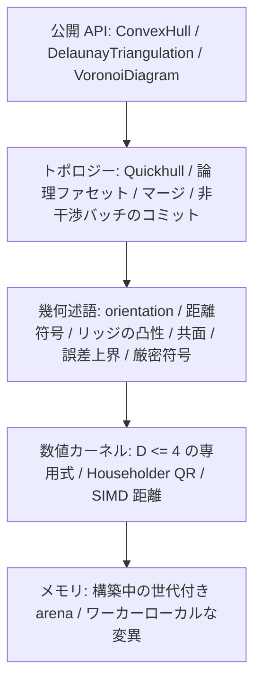
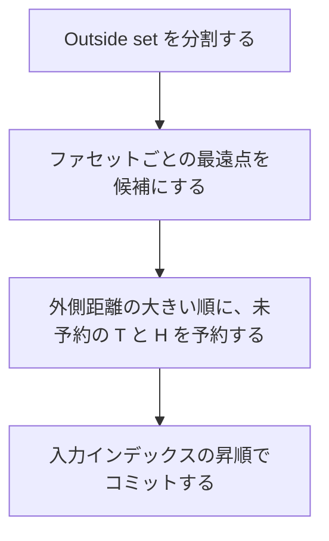

# convx 設計仕様

純 Rust の N 次元凸包、Delaunay 分割、Voronoi 図ライブラリ。正しさの順は、幾何述語の符号、その符号によるトポロジー判定、その判定に従った変異、である。公開結果は正規化した論理ファセットで比較する。

実装に入る前の仕様をここに固定する。倍率の目標値は、逐次コアができてから Qhull を測って定める。

---

## 1. 述語が符号を決める

入力の `f64` は、そのビット列が表す座標そのものとする。述語の前に平行移動もスケールもしない。丸めが入った変換は、厳密なゼロの位置を変える。

誤差は、その述語の式を評価したときの丸めに限る。各述語は正、負、ゼロを返す。フィルタは、実際に評価した式の絶対誤差の上界を持つ。計算値の絶対値が上界を超えるとき、その符号を採用する。超えないときは、同じ多項式の厳密符号に落とす。厳密評価のアルゴリズムは仕様で固定しない。返す符号がこの多項式の符号と一致すればよい。メモリを確保できないときは `ExactEvaluationExhausted` で失敗する。悪条件であること自体は失敗にしない。

公開 API に許容誤差のパラメータはない。共面の判定は、距離の厳密符号がゼロであることだけを使う。

符号の向きは次で固定する。

- $x \cdot n + \mathrm{offset} > 0$ なら、その点は平面の外側にある。
- 平面の式は $x \cdot n + \mathrm{offset} = 0$ とする。$n$ は外向きの単位法線である。
- 向きの判定は行列式で行う。法線を求めてから内積を取った符号を、トポロジー判定の本体にはしない。
- $D \le 4$ の向きは専用式で計算する。それ以外の法線と、専用式を持たない次元の向きは、Householder QR（`faer`）で計算する。

SIMD の距離走査は、Outside set を分ける速い経路として残す。走査で出た符号をトポロジーに使ってよいのは、その誤差上界を超えているときだけである。上界以内は述語に回す。

次元は述語の符号で決める。基底を一点ずつ広げ、新しい点が既存の基底に対して厳密符号ゼロなら、その方向は空間を張らない。

---

## 2. 層



距離の数値計算と、符号を確定する述語は分けておく。前者は速くてよく、後者がトポロジーを決める。

---

## 3. 入力を受け付ける条件

`dim == 0` は `NonPositiveDimension` で失敗する。この検査は除算や剰余の前に行う。$D \ge 1$ であり、上限は設けない。高次元では厳密評価のビット長と時間が伸びる。そのコストは呼び出し側の負担とし、次元だけでは拒否しない。

`points.len()` が D の倍数でなければ `LengthMismatch` で失敗する。座標は行優先の `&[f64]` で、点 `i` は `points[i*D .. (i+1)*D]` にある。非有限な座標が一つでもあれば `NonFiniteCoordinate { index }` で失敗し、その入力全体を棄てる。

その後の前処理は次の順である。

1. 非有限の拒否
2. 重複の集約
3. 個数の検査
4. ランクの検査
5. 構築

重複は `==` で判定する。`-0.0` と `+0.0` は同じ点である。`to_bits` では比べない。一致した点の代表は、最小の入力インデックスである。代表の個数が $D + 1$ 未満なら `InsufficientPoints { actual, required }` で失敗する。`actual` は代表の個数、`required` は $D + 1$ である。

代表が $D + 1$ 個以上あってもアフィン次元が $D$ 未満なら、`DegenerateDimension { actual_dim, spanning_points }` で失敗する。呼び出し側が射影するときは、返った `spanning_points` を使う。`spanning_points` はアフィン独立な代表点のインデックスで、長さは $\textit{actual\_dim} + 1$、辞書順で最小の列である。

```rust
pub enum ConvexHullError {
    NonPositiveDimension,
    LengthMismatch { len: usize, dim: usize },
    NonFiniteCoordinate { index: usize },
    InsufficientPoints { actual: usize, required: usize },
    DegenerateDimension {
        actual_dim: usize,
        spanning_points: Vec<u32>,
    },
    /// Voronoi の外心が、局所座標でも非有限だったとき。
    /// 凸包と Delaunay はこのエラーを返さない。
    NonFiniteCircumcenter,
    ExactEvaluationExhausted,
}
```

### インデックスの分割

成功した構築は、入力の各インデックスの行き先を一つに決める。

`representative` は長さ n の `Vec<u32>` である。`i` が代表なら `representative[i] == i`、重複なら代表のインデックスを指す。`representative[representative[i]] == representative[i]` が成り立つ。

代表の集合は、次の三つに分割する。いずれも昇順で、互いに素で、和が代表集合と一致する。

| リスト            | 中身                                                                           |
| :---------------- | :----------------------------------------------------------------------------- |
| `vertices`        | 凸包の極点。外すと凸包が変わる点                                               |
| `coplanar_points` | 境界上にあり、極点ではない点。インデックスだけを持ち、所属ファセットは持たない |
| `interior_points` | 凸包の内部                                                                     |

この三つのリストは `ConvexHull` が持つ。`representative` は凸包、Delaunay、Voronoi のすべてに付ける。

Delaunay と Voronoi のサイトは代表の集合全体である。内部点と、境界上の非頂点もサイトに含める。ビットが異なり `==` でもない近い点は、一つの点に吸着しない。

分類の規則は次のとおりである。

- ある論理ファセットへの距離が厳密に正なら、その点は外側にある。成功した結果に外側の点は残らない。
- すべてのファセットへの距離が厳密に負なら、内部点である。
- 距離ゼロのファセットがあり、残りは負またはゼロなら、境界上にある。現在の面の極点集合の凸結合で表せない点は、その論理ファセットの頂点に加える。表せる点は `coplanar_points` に入れる。
- 外側点の取り込みが終わったあと、距離ゼロの点をこの規則で分類する。

---

## 4. 単体とメモリ

$D$ 次元凸包のファセットは $(D-1)$-単体である。頂点は $D$ 個、隣接ファセットも $D$ 個、法線は $D$ 次元である。3 次元の面は、頂点 3 個の三角形である。

Delaunay を次元 $D$ で求めるときは、点を $D+1$ 次元へ持ち上げた凸包の下側ファセットを使う。そのファセットの頂点は $D+1$ 個になる。配列長の規則は変えず、エンジンの次元が一つ増える。

```rust
/// 構築中の単体ファセット。D はエンジンの次元。
struct Simplex {
    vertices: Vec<u32>,   // 長さ D
    neighbors: Vec<FacetId>, // 長さ D。各リッジの向こう側
    normal: Vec<f64>,     // 長さ D。構築中の作業用法線
    offset: f64,
    group: GroupId,       // 論理ファセット
    flags: u32,           // tombstone と予約ビット
}
```

公開後の番号は、削除済みを詰めた `u32` である。`FacetId` の世代は構築中にダングリングを防ぐためだけに使い、公開 API の番号は詰め済みの添字である。論理ファセットの平面はグループが持ち、単体ごとの作業用法線とは別に保存する。

arena はチャンク単位の世代付きインデックスである。逐次構築では単一スレッドが arena を伸ばす。並列構築では、ワーカーがローカルに変異を作り、バリアのあとで入力インデックスの昇順にグローバル arena へコミットする。論理グループの結び方は Union-Find でも、コミット時の再構築でもよい。

$D = 1$ では、ファセットは端点一つである。隣接リストは空にする。二つの端点が論理ファセットになり、体積は両端の座標差の絶対値 $|x_{\max} - x_{\min}|$ である。

---

## 5. 論理ファセット

マージしてよいのは、次をすべて満たすときだけである。

1. 共有リッジで隣接している。
2. 支持平面が一致する。互いの頂点が相手の平面上にあり、距離の厳密符号がゼロである。
3. そのリッジが非凸であるか、共面である。
4. マージ後も、外側に対して非凹である。

超体積がゼロになったことを理由に変異を巻き戻す規則は置かない。点が頂点になるか、境界上の非頂点になるか、内部になるかは、第3節の分類で決まる。

同一支持平面上の連結な境界は、一つの論理ファセットにまとめる。凸多面体の一つの支持平面が切る面は一つだからである。

公開形は全次元で共通である。

```rust
pub struct FacetPlane {
    pub normal: Vec<f64>, // 長さ D。外向き単位ベクトル
    pub offset: f64,      // 平面 x·n + offset = 0 の offset
}

pub struct LogicalFacet {
    pub vertices: Vec<u32>, // 昇順の極点
    pub plane: FacetPlane,
    pub neighbors: Vec<u32>, // 隣接ファセット番号。昇順
}
```

ファセット配列は、頂点列を辞書順に並べる。この順での番号が公開番号になる。隣接番号の昇順は、相手ファセットの頂点列の辞書順と一致する。

平面は、そのファセットの頂点から作る。インデックスの組を辞書順に見て、最初にアフィン独立になる $D$ 点を選ぶ。厳密符号がゼロの組は飛ばし、次の組へ進む。選んだ D 点から `f64` の法線を作り、凸包の内側が負になる向きへ揃え、単位長に正規化する。同一バイナリではこの手順で平面が決まる。版をまたいだ float のバイト一致までは約束しない。

$D \le 3$ では、保存した頂点集合と外向き法線から境界閉路を導出する。開始頂点は最小インデックス、進行方向は外向き法線に合う向き、である。閉路は保存形式の本体ではない。$D \ge 4$ の論理ファセットは $(D-1)$ 次元の多面体なので、閉路は定義しない。

`volume()` は多面体の体積を返す。同一バイナリでは、正規化した単体を辞書順に足した `f64` として決まる。他実装との一致は、フィクスチャごとの相対誤差で見る。

単体分割は別ビューで出す。安定性の約束には入れない。各単体の頂点は昇順に並べ、外向きになるよう末尾の 2 点だけを入れ替える。共面領域の切り方は幾何的に一意とは限らず、版が変わると変わり得る。同じバイナリの中では、逐次と並列で同じ分割になる。

初期単体にどの点を選ぶかは、仕様で固定しない。共面・共球の分割が版ごとに変わり得る要因として残す。

---

## 6. 構築と並列コミット

Quickhull で点を取り込む。ある点がファセットから厳密に外側なら、そのファセットは可視である。可視領域の境界リッジがホライズンである。ホライズンの向こう側で、隣接スロットを書き換える面を $N$ と呼ぶ。



点 $P$ について次の名前を使う。

- $V(P)$: 消す可視ファセット
- $H(P)$: ホライズンのリッジ
- $N(P)$: ホライズンの向こう側の面
- $T(P) = V(P) \cup N(P)$

一つのバッチに入れる二点 $P, Q$ は、次を満たす。

$$
T(P) \cap T(Q) = \emptyset, \quad H(P) \cap H(Q) = \emptyset
$$

可視面が重ならないだけでは足りない。一つの非可視面が、二つのホライズンの向こう側になることがある。予約は $V$ と $N$ の両方に取る。

バッチへ詰める順序は、外側距離の大きい点からである。適用する順序は、入力インデックスの昇順である。触る面が互いに素なので、この適用順はトポロジーを変えない。変えないことが、逐次版と結果を揃えるための条件になる。逐次版も、公開結果が並列版と一致するように点を処理する。論理ファセットは挿入順によらず多面体の面として一意である。Delaunay の対角は一意でないので、両経路で同じタイブレークを共有し、単体集合まで一致させる。

`parallel` の既定はオフである。オンのとき、入力点列は不変、ワーカーはローカルに変異を作り、バリアで上記の順にコミットする。

コミット後は、残っているどのファセットについても、どの入力点も厳密な外側に出ない。

公開結果が約束するのは、正規化のあとで、論理ファセットの頂点集合と隣接が一致することである。出力バイト列の完全一致は約束しない。

---

## 7. Delaunay

次元 $D$ の Delaunay は、次の持ち上げの下側凸包を、元の空間へ射影したものである。

$$
x_{D+1} = \|x\|^2
$$

入力配列は伸ばさない。式が定義である。実装が座標をキャッシュしてもよい。キャッシュの有無は、観測できる単体と符号を変えてはならない。

内外判定（insphere）は、この持ち上げの orientation として定義する。別の代数式を使ってよいのは、この定義と符号が一致するときだけである。

下側包は、$D+1$ 次元凸包の外向き法線について、最終成分が負であるファセットである。すなわち $n_{D+1} < 0$ である。最終成分の符号が未確定な面は捨てない。上側と確定した面の探索を打ち切る処理は、逐次コアが正しいあとに入れる最適化である。未実装でも、下側だけを出力する定義は同じである。

出力する単体は下側包の射影だけである。頂点は昇順に並べ、末尾 2 点の入れ替えで、元の空間の向きを正にする。厳密な向きがゼロのときは、昇順のままにする。

持ち上げた点の向きが厳密にゼロで、対角が複数あるときは、その版のアルゴリズムが選んだ分割を返す。サイトのうちどれが極点になるかは一意なので、極点集合は約束する。対角の一致は、同じバイナリの逐次と並列までに限る。

次元退化は、入力サイトのアフィン次元で報告する。報告に使うインデックスは元のサイトのものである。持ち上げ先の次元数では報告しない。

```rust
pub struct DelaunayTriangulation {
    pub dim: usize,
    pub representative: Vec<u32>,
    pub simplices: Vec<DelaunaySimplex>,
}

pub struct DelaunaySimplex {
    pub vertices: Vec<u32>, // 長さ D+1。向きは本文のとおり
    pub neighbors: Vec<u32>, // 長さ D+1。共有する面の向こう側。無ければ欠番
}
```

単体の並びは、向きを決める前の昇順頂点列の辞書順である。

---

## 8. Voronoi

Voronoi 図は、第7節の Delaunay の双対である。別のアルゴリズムでは作らない。退化、重複、共球の扱いは凸包および Delaunay と同じであり、Voronoi だけの規則は持たない。

有限な Voronoi 頂点は、Delaunay 単体の外心である。接続は、その単体のサイト集合と一致する。座標は `f64` であり、厳密値であることは保証しない。計算は、単体の一つの頂点を原点に平行移動してから行う。それでも非有限なら `NonFiniteCircumcenter` で失敗する。成功した図の頂点座標はすべて有限である。凸包と Delaunay は外心を計算しない。

サイト集合の凸包のファセットに載っている Delaunay の面は、双対が非有界レイになる。レイの起点は、その面を持つ単体の外心である。方向は、その論理ファセットの外向き単位法線である。成功した結果では起点は常にある。起点を持てない配置は、次元退化として構築の前に失敗している。

```rust
pub struct VoronoiDiagram {
    pub dim: usize,
    pub representative: Vec<u32>,
    pub vertices: Vec<VoronoiVertex>,
    pub cells: Vec<VoronoiCell>,
    pub interfaces: Vec<VoronoiInterface>,
}

pub struct VoronoiVertex {
    pub coords: Vec<f64>,  // 長さ D
    pub simplex: Vec<u32>, // 長さ D+1。昇順のサイト
}

pub struct VoronoiRay {
    pub apex: u32,             // vertices の番号
    pub direction: Vec<f64>,   // 長さ D。論理ファセットの外向き単位法線
    pub hull_facet: Vec<u32>,  // その論理ファセットの極点。昇順
}

pub struct VoronoiCell {
    pub site: u32,
    pub vertices: Vec<u32>, // 入射する有限頂点。昇順
    pub rays: Vec<VoronoiRay>,
}

pub struct VoronoiInterface {
    pub sites: [u32; 2], // 昇順。この境界面の双対は、この 2 サイトを結ぶ Delaunay 辺
    pub vertices: Vec<u32>,
    pub rays: Vec<VoronoiRay>,
}
```

並べ方は次で固定する。

- 有限頂点は、`simplex` の辞書順
- セルはサイトの昇順で、代表ごとに一つ
- 境界面は `sites` の辞書順
- レイは、起点の番号、次いで `hull_facet` の辞書順

内部サイトのセルにレイは付かない。凸包の境界上のサイトのセルには、少なくとも一つのレイが付く。

---

## 9. 公開 API

コアの入力は行優先の `&[f64]` である。Builder は次元と点列を受け取り、`parallel` を切り替え、`build` で結果を返す。既定は逐次である。

```rust
pub struct ConvexHullBuilder<'a> { /* dim, points, parallel */ }

impl<'a> ConvexHullBuilder<'a> {
    pub fn new(dim: usize, points: &'a [f64]) -> Self;
    pub fn parallel(self, enable: bool) -> Self;
    pub fn build(self) -> Result<ConvexHull, ConvexHullError>;
}
```

`DelaunayBuilder` と `VoronoiBuilder` も同じ形である。Delaunay の `dim` は元の空間の次元であり、持ち上げ後の次元ではない。

```rust
pub struct ConvexHull {
    pub dim: usize,
    pub representative: Vec<u32>,
    pub vertices: Vec<u32>,
    pub coplanar_points: Vec<u32>,
    pub interior_points: Vec<u32>,
    pub facets: Vec<LogicalFacet>,
}

impl ConvexHull {
    pub fn volume(&self) -> f64;
    /// 共面の切り方は、版をまたいだ安定性の約束に入らない。
    pub fn triangulation(&self) -> TriangulationView<'_>;
    /// D が 1, 2, 3 のときだけ定義される。
    pub fn boundary_cycle(&self, facet: usize) -> Option<Vec<u32>>;
}
```

静的 API は、スタック上の配列と単相化のためのラッパーである。ソルバーの切り替えとは別軸にする。専用式は $D \le 4$、それ以外は QR、である。静的凸包は $1 \le D \le 8$ である。静的 Delaunay と静的 Voronoi は $1 \le D \le 7$ とする。Delaunay の内部凸包が $D+1$ 次元になり、静的凸包の上限 $8$ に収まる範囲が $7$ だからである。

`[[f64; D]]` から `&[f64]` への変換は `as_flattened()` だけを使う。`unsafe` は置かない。MSRV は 1.80 である。D の範囲は、単一の `impl` に定数境界を書けない安定版の制約に合わせ、マクロか個別実装で 1 から上限までを出す。

依存は `faer`、`rayon`、`pulp`、`thiserror` で、実装言語は Rust である。並列は実行時の `parallel` フラグで切り替える。ビルドは `std` を前提にする。

距離カーネルは `pulp` による実行時 CPU 検出である。命令セットをさらに広げる作業は、逐次結果が正しいあとに行う。

---

## 10. 検証

デバッグビルドと CI で、次を検査する。

1. 単体複体の Euler 特性数。境界の $k$ 次元面の個数を $F_k$ とし、次が成り立つ。

$$
\sum_{k=0}^{D-1} (-1)^k F_k = 1 - (-1)^D
$$

2. マージ後の多面体複体について、同じ式が成り立つ。単体の個数と論理ファセットの個数を同じ $F_k$ に混ぜない。
3. 全入力点について、どの論理ファセットへの距離も厳密に正ではない。
4. 隣接の対称性。単体グラフと論理ファセットグラフの両方で、A がリッジ R を介して B に隣接するなら、B も R を介して A に隣接する。
5. インデックス分割。`representative` の不動点集合が、三つのリストの直和と一致する。

事前計算したオラクルは `tests/fixtures/` に置く。比較の規則は次のとおりである。

- 頂点集合は厳密に一致する。
- 論理ファセットは、正規化した頂点集合として厳密に一致する。
- 体積にグローバルな絶対誤差は置かない。各フィクスチャが次の相対誤差の許容を持つ。分母が潰れるほぼ退化のフィクスチャは、体積を見ず、位相の一致だけを見る。

$$
\frac{|V_a - V_b|}{\max(|V_a|, |V_b|)}
$$
- 包含は述語で判定する。

逐次と `parallel(true)` は、同じバイナリの上で、正規化後の論理ファセットと Delaunay 単体が一致する。

目標は次の欄に分けて測る。欄を置くことまでを今の仕様とし、倍率の数値は Phase 2 で Qhull を基準に測ってから書く。

| 欄     | 測るもの                                   |
| :----- | :----------------------------------------- |
| 性能   | 逐次コアの所要時間。基準は Qhull           |
| 正しさ | 上記の不変条件とオラクル                   |
| 頑健性 | 乱択、敵対的配置、近退化、巨大座標、高次元 |
| メモリ | 入力 1 点あたりのバイト数                  |
| 並列   | 1, 2, 4, 8, 16 スレッドでの所要時間        |

---

## 11. 実装順

Phase 1 は述語カーネルである。orientation、距離符号、リッジの凸性、共面、誤差上界、厳密符号へのフォールバック、を先に固定する。同じ段階で、単一スレッドの世代付き arena、SIMD 距離、$D \le 4$ の専用式と QR を置く。

Phase 2 は逐次 Quickhull である。初期単体、論理ファセット、第5節のマージ、インデックス分割、`volume()`、不変条件の検査を含む。

Phase 3 は並列である。Outside set の並列分割、第6節の予約、ワーカーローカルな変異、インデックス順のコミット、逐次結果との一致検査を含む。

Phase 4 は静的 API、Delaunay、Voronoi、オラクルである。

正しい逐次結果のあとでよいものは、次である。

- lock-free な確保
- AVX-512 を含む、より広い SIMD
- 持ち上げ座標のキャッシュ
- 上側包と確定した面の探索打ち切り

符号規約と、持ち上げを式で定義することは、Phase 4 の仕様に最初から含める。実装の省略として後へずらしてよいのは、探索の打ち切りと、座標のキャッシュである。
