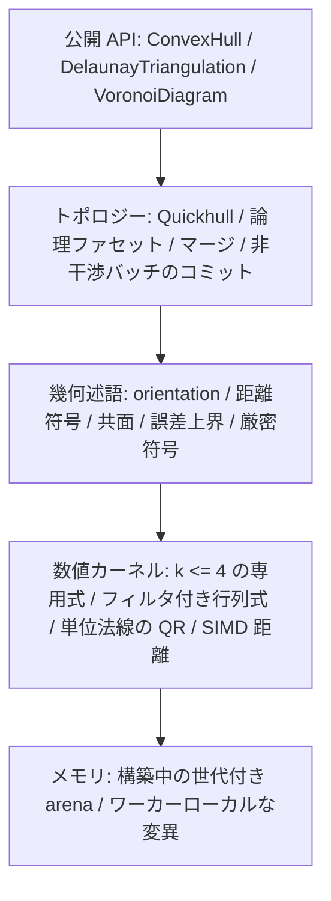
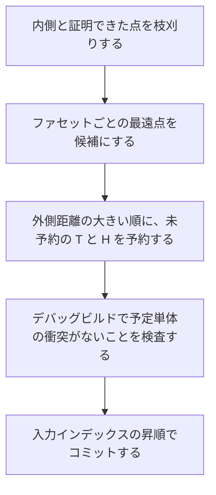

# convx 設計仕様

純 Rust の N 次元凸包、Delaunay 分割、Voronoi 図ライブラリ。正しさの順は、幾何述語の符号、その符号によるトポロジー判定、その判定に従った変異、である。公開結果は正規化した論理ファセットで比較する。

実装に入る前の仕様をここに固定する。倍率の目標値は、逐次コアができてから Qhull を測って定める。

---

## 1. 述語が符号を決める

入力の `f64` は、そのビット列が表す座標そのものとする。述語の前に平行移動もスケールもしない。丸めが入った変換は、厳密なゼロの位置を変える。

誤差は、その述語の式を評価したときの丸めに限る。各述語は `Sign` を返す。`f64` は返さない。

```rust
pub enum Sign {
    Negative,
    Zero,
    Positive,
}
```

共面は、orientation が `Zero` であることである。ファセットの側は、その面のアフィン独立な点と対象点の orientation である。共球は、持ち上げた orientation が `Zero` であることである。フィルタは、実際に行った加減乗の列に対する絶対誤差の上界を持つ。その上界が FMA の丸めを含まないなら、FMA への縮約は使わない。計算値の絶対値が上界を超えるとき、その符号を採用する。超えないときは、同じ多項式の厳密符号に落とす。計算値と上界がともに 0 で、式が恒等的に 0 でないときも、厳密符号へ落とす。アンダーフローで 0 になった値は、ゼロと確定しない。厳密評価のアルゴリズムは仕様で固定しない。自前のコードでも、依存リストにない追加クレートでもよい。返す符号がこの多項式の符号と一致すればよい。厳密評価の作業領域を確保できないときだけ、`ExactEvaluationExhausted` で失敗する。通常の `Vec` の確保失敗は、Rust の既定どおりアボートする。悪条件であること自体は失敗にしない。

公開 API に許容誤差のパラメータはない。共面の判定は、距離の厳密符号がゼロであることだけを使う。

符号の向きは次で固定する。

- $x \cdot n + \mathrm{offset} > 0$ なら、その点は平面の外側にある。
- 平面の式は $x \cdot n + \mathrm{offset} = 0$ とする。$n$ は外向きの単位法線である。
- 向きの判定は行列式の厳密符号で行う。`FacetPlane` の $x \cdot n + \mathrm{offset}$ は、この判定に使わない。
- 幾何次数 $k$ は、引数の点の数から 1 を引いた値である。包の次元 $D$ とは独立である。$k \le 4$、つまり点 5 個までを専用式で計算する。式の展開の仕方は実装に任せる。$k$ が 4 を超えるときは、フィルタ付きの浮動小数行列式で評価し、上界以内のときだけ厳密符号に落とす。
- Householder QR（`faer`）が作るのは、公開用の単位法線である。距離走査の作業用法線は、次に述べる余因子方向そのものであり、QR では作らない。QR は、ある辺がほかの辺の張る空間とほぼ平行なとき、残りの列ノルムが丸め誤差の水準の反射を省く。そのとき Q の最後の列は、丸め誤差の範囲でしか辺と直交せず、正しい側を向いたまま真の法線から大きく離れることがある。そこで公開用の QR の法線を、面の余因子ベクトル（辺の並びに単位行 $e_j$ を加えた行列式 $c_j$）の単位方向と比べる。この方向は、述語のフィルタで誤差上界とともに確定させる。上界が緩いときは厳密に計算する。ファセットの点が 5 個以上のときは、その個数を $n$ として、$(n-1) \times n$ の辺行列 $E$ を一度消去し、そこからすべての余因子を得る。最初の $n - 1$ 列について部分ピボット付きの Gauss 消去を行うと、$s$ 回の行交換のあとに $[T \mid u]$ が得られ、$T$ は上三角である。ある行の定数倍をほかの行に足しても $E$ の最大小行列式は変わらず、行交換はその符号を反転する。$T x = u$ なら $E$ は $(-x, 1)$ を零へ写し、Cramer の公式から $c = (-1)^s \det T \cdot (-x, 1)$ となる。フィルタは消去、$x$ の後退代入、$\det T$ との積の全体にわたって誤差上界を運ぶので、各 $c_j$ は、別々の行列式だったときと同じく自分の上界をもつ。上界が符号を確定できない除数に出会ったときは余因子を確定させず、方向を厳密に計算する。二つが、確定した誤差と小さな固定の許容量の和より離れるときは、余因子の方向を使う。法線の向きは、ファセットの頂点の並びで orientation が外向きの符号になる側である。この向きは誤差上界から証明し、行列式を評価しない。余因子の厳密な単位方向を $u = c/|c|$ とし、ベクトル $v$ が $|v - u| = e < 1$ を満たすとする。このとき $|v| \ge 1 - e$ であり、$v \cdot u = (|v|^2 + 1 - e^2)/2 \ge 1 - e > 0$ となる。向きの符号は $v \cdot c$ の符号なので、$v$ は正の側にある。確定した方向の誤差は $10^{-10}$ 以下、厳密計算では $D \cdot 2^{-49}$ なので、作業用法線にはこの証明が成り立つ。公開用の QR の法線は、二つの符号のうち余因子の方向に近い方をとる。その距離は $2\varepsilon + 10^{-8} < 1$ 以下なので、同じ証明が成り立つ。

SIMD の距離走査は、誤差上界によって厳密に内側と証明できる点を、述語の対象から外す枝刈りに使う。可視性と外側性を決めるファセットに対する点の側は、ファセットの頂点を外向きの順に並べ、その点を加えた orientation の厳密な符号である。作業用の距離は、orientation を評価する前にその符号を証明してよい。ただし証明できるのは厳密な符号だけである。計算した距離 $w$ が、保証付きのしきい値 $(\mathrm{slope} \cdot l + \mathrm{floor})(1 + 4u)$ をどちらかの側に越えるとき、厳密な平面までの真の距離は同じ厳密な符号をもち、orientation も同じ符号になる。それ以外は、符号がゼロの場合も含めて、orientation が決める。しきい値は枝刈りと同じものである。$|n - u^*| \le \tau$ と $w$ の丸めが $|w - (x - o) \cdot u^*|$ を絶対値で抑えるので、証明はどちらの向きにも成り立つ。持ち上げた Delaunay の包のファセットは、厳密な持ち上げに対して保証する。頂点と対象点は丸めた高さ $\hat h$ をもち、それぞれにフィルタが計算した上界 $e$ がある（§7）。丸めているのは最後の座標だけである。余因子は、丸めた点の余因子を、厳密な持ち上げの余因子を抑えるように広げたものである。最後以外の余因子は高さの差の列について線形であり、最後の余因子はその列を含まない。高さを厳密な値に動かすと、その列の第 $i$ 成分は高々 $\eta_i = e_i + e_0$ しか変わらないので、余因子 $j$ の変化は高々 $\sum_i \eta_i |M_{ij}|$ である。$M_{ij}$ はほかの辺の空間成分と単位行からなる行列式なので、Hadamard の不等式から $|M_{ij}| \le \prod_{k \ne i} |r_k|$ となる。$r_k$ は辺 $k$ の空間成分である。この上界により、$\tau$ は厳密に持ち上げた平面の単位法線 $u^*$ について $|n - u^*|$ を抑える。対象点 $x$ と原点 $o$ の丸めた高さを厳密な高さに置き換えると、$(x - o) \cdot u^*$ は高々 $(e_x + e_o)|u^*_{D+1}| \le e_x + e_o$ しか変わらない。よって持ち上げのしきい値は $\big((\mathrm{slope} \cdot l + \mathrm{floor}')(1 + 4u) + e_x\big)(1 + 4u)$ であり、$\mathrm{floor}' = (\mathrm{floor} + e_o)(1 + 4u)$ とする。各因子 $(1 + 4u)$ は、その前の和の丸めを覆う。保証付きの作業用法線をもたないファセットは、orientation だけを使う。どちらの経路でも符号は同じである。

次元は述語の符号で決める。基底を一点ずつ広げ、新しい点が既存の基底に対して厳密符号ゼロなら、その方向は空間を張らない。

---

## 2. 層



距離の数値計算と、符号を確定する述語は分けておく。前者は速くてよく、後者がトポロジーを決める。

---

## 3. 入力を受け付ける条件

`dim == 0` は `NonPositiveDimension` で失敗する。この検査は除算や剰余の前に行う。$D \ge 1$ であり、次元の上限は設けない。高次元では厳密評価のビット長と時間が伸びる。そのコストは呼び出し側の負担とし、次元だけでは拒否しない。入力点数は `u32::MAX` 以下とする。超えたら、重複を除く前に `TooManyPoints` で失敗する。公開インデックスは `u32` のままである。妥当な点番号は高々 `u32::MAX - 1` なので、`u32::MAX` は点番号と衝突しない欠番として使える。

`points.len()` が $D$ の倍数でなければ `LengthMismatch` で失敗する。座標は行優先の `&[f64]` で、検証を通ったあとは `chunks_exact(D)` で点を取る。点 `i` の範囲 `i*D .. (i+1)*D` は、スライス長の内側に収まる。非有限な座標が一つでもあれば `NonFiniteCoordinate { index }` で失敗し、その入力全体を棄てる。`index` は点番号である。入力順に見て、最初に非有限座標を持つ点を入れる。

その後の前処理は次の順である。

1. 非有限の拒否
2. 重複の集約
3. 個数の検査
4. ランクの検査
5. 構築

重複は `==` で判定する。`-0.0` と `+0.0` は同じ点である。`to_bits` でも `total_cmp` でも同値を判定しない。順序を付けて代表を選ぶ実装は、比較の前に符号付きゼロを `+0.0` へ揃える。一致した点の代表は、最小の入力インデックスである。代表の個数が $D + 1$ 未満なら `InsufficientPoints { actual, required }` で失敗する。`actual` は代表の個数、`required` は $D + 1$ である。

代表が $D + 1$ 個以上あってもアフィン次元が $D$ 未満なら、`DegenerateDimension { actual_dim, spanning_points }` で失敗する。呼び出し側が射影するときは、返った `spanning_points` を使う。`spanning_points` は、代表インデックスを昇順に見て、アフィン次元を厳密に増やす点だけを採用した列である。長さは $\textit{actual\_dim} + 1$ である。この列が、辞書順で最小の基底になる。

```rust
pub enum ConvexHullError {
    NonPositiveDimension,
    LengthMismatch { len: usize, dim: usize },
    /// 点番号。入力順で、最初に非有限座標を持つ点。
    NonFiniteCoordinate { index: usize },
    TooManyPoints { actual: usize },
    InsufficientPoints { actual: usize, required: usize },
    DegenerateDimension {
        actual_dim: usize,
        spanning_points: Vec<u32>,
    },
    /// 凸包のトポロジーが決まったあと、公開平面を有限な f64 にできなかったとき。
    /// この平面はトポロジーに使わない。
    NonFiniteFacetPlane,
    /// Delaunay のトポロジーが決まったあと、外心を有限な f64 にできなかったとき。
    /// 幾何の退化ではない。凸包と Delaunay はこのエラーを返さない。
    NonFiniteCircumcenter,
    /// 厳密評価の作業領域を確保できなかったとき。
    /// 通常の Vec の確保失敗は、Rust の既定どおりアボートする。
    ExactEvaluationExhausted,
}
```

### インデックスの分割

成功した構築は、入力の各インデックスの行き先を一つに決める。

`representative` は長さ n の `Vec<u32>` である。`i` が代表なら `representative[i] == i`、重複なら代表のインデックスを指す。`representative[representative[i]] == representative[i]` が成り立つ。

代表の集合は、次の三つに分割する。いずれも昇順で、互いに素で、和が代表集合と一致する。

| リスト            | 中身                                                                           |
| :---------------- | :----------------------------------------------------------------------------- |
| `vertices`        | 凸包の極点。外すと凸包が変わる点                                               |
| `coplanar_points` | 境界上にあり、極点ではない点。インデックスだけを持ち、所属ファセットは持たない |
| `interior_points` | 凸包の内部                                                                     |

この三つのリストは `ConvexHull` が持つ。`representative` は凸包、Delaunay、Voronoi のすべてに付ける。

Delaunay と Voronoi のサイトは代表の集合全体である。内部点と、境界上の非頂点もサイトに含める。ビットが異なり `==` でもない近い点は、一つの点に吸着しない。

分類は、外側の点を取り込み、共面で隣接する単体を一つの論理ファセットへまとめたあとに行う。ここでの距離の符号は、その面のアフィン独立な $D$ 点と対象点の orientation である。`FacetPlane` の内積は使わない。

- ある論理ファセットへの距離が厳密に正なら、その点は外側にある。成功した結果に外側の点は残らない。
- すべてのファセットへの距離が厳密に負なら、内部点である。
- 構築がこれを先に証明してよい。構築が点を落としたとき、調べた符号がすべて厳密に負なら、その点は内部点である。論理ファセットに対する符号は求めない。調べる面は二通りある。初期単体のすべてのファセットか、点が可視ファセットの外側集合にあったときの、その挿入で作るすべての新しい単体である。カリングで内側と証明された点は、厳密に負として数える（§6）。前者なら、点は初期単体の厳密な内部にあり、内部は凸包が大きくなっても内部のままである。後者では、挿入を計画した凸包を $P$、apex を $a$、$Q = \mathrm{conv}(P \cup \{a\})$ とする。新しい単体はすべて $a$ を含む。その支持平面は $a$ と地平線の稜を通る平面であり、それらの閉じた内側の共通部分は、$a$ から $P$ への錐である。点 $p$ はそのすべての厳密な内側にあるので、$a$ から $p$ への半直線は $P$ のある点 $y$ を通る。$p$ はある可視ファセット $f$ の厳密な外側にあった。apex も $f$ の厳密な外側にあり、$y$ は $P$ の点なので $f$ の平面の上か内側にある。半直線が一つの平面を横切るのは一度だけなので、$p$ は $a$ と $y$ を結ぶ開線分の上にあり、$p \in Q$ である。残るファセット $g$ に対しては、$a$（$g$ を見ない）と $y$ がともに $g$ の平面の上か内側にあるので、$p$ もそうである。$p$ がその平面に乗るのは、$a$ と $y$ がともに乗るときだけである。$a$ が $g$ の平面に乗るなら、その平面にある $Q$ の面は頂点 $a$ を含むので、同じ外側を持つ新しい単体がその平面にある。すると $p$ はその単体に対して符号 0 になり、仮定に反する。よって $p$ は $Q$ のすべてのファセット平面の厳密な内側、つまり $Q$ の内部にある。バッチは各領域をその回の開始時の凸包に対して計画し、最後の凸包は $Q$ を含むので、$p$ は最後の凸包の内部にある。符号に一つでも 0 があった点は、ここの規則で分類する。
- 距離が厳密にゼロのファセットがあり、残りが負またはゼロなら、境界上にある。距離ゼロの面が複数あるときは、面ごとに判定する。
- 距離ゼロの面では、頂点集合を $V$ とする。点が $\mathrm{conv}(V)$ の外側かどうかは、入力座標のままの orientation で決める。使うリッジは、その面の現在の単体分割のうち、この面の単体ただ一つに属するものである。その単体の、リッジに入らない頂点を $a$ とする。$q$ は、$V$ に入らない最小インデックスの極点である。点 $p$ がそのリッジの外側にあるのは、$\mathrm{orient}(R, p, q)$ と $\mathrm{orient}(R, a, q)$ の符号がどちらもゼロでなく、互いに逆のときである。$D = 1$ にこのリッジはなく、端点以外の境界点は出ない。一つ以上の面で外側なら、`vertices` に入れ、外側だった面すべての頂点集合に加える。どの面でも外側でなければ、`coplanar_points` に入れる。
- 単体複体の頂点も同じ基準で分類する。挿入したときには極点だった頂点が、あとの挿入で辺や面の相対内部に入ることがある。厳密な可視判定は共面な隣の単体を消さないからである。面の頂点集合は、その面の単体複体の頂点と距離ゼロの点を合わせた集合の極点である。極点でなくなった単体複体の頂点は `coplanar_points` に入れる。
- 頂点がすべて極点である単体ただ一つの面を除き、すべての面を、極点をインデックス順に置く placing triangulation で分割する。それまでに置いた点のアフィン次元を上げる点は、現在のすべての単体と結ぶ。上げない点は、それまでの点の凸包の外にある。極点だからである。その点は、自分が厳密に外側にある境界リッジすべてと結ぶ。外側かどうかは、現在のアフィン包の中での厳密な orientation で決める。リッジの残りの頂点とその点が、リッジの両側に厳密に分かれるときが外側である。隣接は、分割し直した単体から計算し直す。
- 二つの面が単体でない低次元の面を共有するとき、両側でその面の切り方が一致しないと、境界の単体複体は閉じない。placing triangulation を面へ制限すると、同じ順序でのその面の placing triangulation になる。そのため、すべての面で切り方が一致する。頂点を加えた面だけを辞書順最小の基底から分割し直す方法では、この一致が保証されない。

---

## 4. 単体とメモリ

$D$ 次元凸包のファセットは $(D-1)$-単体である。頂点は $D$ 個、隣接ファセットも $D$ 個、法線は $D$ 次元である。3 次元の面は、頂点 3 個の三角形である。

Delaunay を次元 $D$ で求めるときは、点を $D+1$ 次元へ持ち上げた凸包の下側ファセットを使う。そのファセットの頂点は $D+1$ 個になる。配列長の規則は変えず、エンジンの次元が一つ増える。

```rust
/// 構築中の単体ファセット。D はエンジンの次元。
struct Simplex {
    vertices: Vec<u32>,   // 長さ D
    neighbors: Vec<FacetId>, // 長さ D。各リッジの向こう側
    normal: Vec<f64>,     // 長さ D。構築中の作業用法線
    offset: f64,
    group: GroupId,       // 論理ファセット。構築中だけの u32
    flags: u32,           // tombstone と予約ビット
}
```

`GroupId` は構築中だけの `u32` である。公開型にはしない。

公開後の番号は、削除済みを詰めた `u32` である。`FacetId` の世代は構築中にダングリングを防ぐためだけに使い、公開 API の番号は詰め済みの添字である。論理ファセットの平面はグループが持ち、単体ごとの作業用法線とは別に保存する。

arena はチャンク単位の世代付きインデックスである。逐次構築では単一スレッドが arena を伸ばす。並列構築では、ワーカーがローカルに変異を作り、バリアのあとで入力インデックスの昇順にグローバル arena へコミットする。コミット時に、ワーカーローカルな `FacetId` をグローバルな番号へ付け替える。論理グループの結び方は Union-Find でも、コミット時の再構築でもよい。

$D = 1$ では、ファセットは端点一つである。隣接リストは空にする。二つの端点が論理ファセットになり、体積は両端の座標差の絶対値 $|x_{\max} - x_{\min}|$ である。

---

## 5. 論理ファセット

点の挿入中は、単体複体のまま進める。全点の挿入が終わったあと、共有リッジの両側が厳密に共面な単体だけを一つの論理ファセットにまとめる。挿入の途中ではマージしない。まとめたあとで、第3節の距離ゼロの分類を行う。単体でない面は、第3節の placing triangulation で分割する。

同一支持平面上の連結な境界は、一つの論理ファセットになる。凸多面体の一つの支持平面が切る面は一つだからである。点が頂点になるか、境界上の非頂点になるか、内部になるかは、第3節の分類で決まる。

公開形は全次元で共通である。

```rust
pub struct FacetPlane {
    pub normal: Vec<f64>, // 長さ D。外向き単位ベクトル
    pub offset: f64,      // 平面 x·n + offset = 0 の offset
}

pub struct LogicalFacet {
    pub vertices: Vec<u32>, // 昇順の極点
    pub plane: FacetPlane,
    pub neighbors: Vec<u32>, // 隣接ファセット番号の集合。昇順
}
```

ファセット配列は、頂点列を辞書順に並べる。この順での番号が公開番号になる。`neighbors` は隣接ファセットの番号の集合であり、配列の位置は共有リッジと対応しない。共有リッジは、両方の頂点集合の交差のうち、アフィン次元が $D-2$ の面である。リッジの頂点列は公開しない。隣接番号の昇順は、相手ファセットの頂点列の辞書順と一致する。

平面は、そのファセットの頂点から作る。インデックスの組を辞書順に見て、最初にアフィン独立になる $D$ 点を選ぶ。厳密符号がゼロの組は飛ばし、次の組へ進む。述語が見る座標は、入力のビット列のままである。公開平面だけ、次の順で作る。

1. 代表点へ平行移動する
2. 座標の幅で一様にスケールする
3. `f64` で法線を作る（第1節の余因子方向との照合を含む）
4. 単位長にする
5. 符号は exact orientation に合わせ、内側を負にする
6. offset は平行移動後の座標で計算し、元の座標へ戻す

公開する単位法線 $n$ は、平面を作った $D$ 点の余因子ベクトル $c$ を内側が負になる向きに合わせた単位方向 $\hat c = c / \lVert c \rVert$ から、ユークリッド距離で $10^{-8} + 2 \cdot 10^{-10}$ 以内にある（$D \le 56294$ のとき）。

$$
\lVert n - \hat c \rVert_2 \le 10^{-8} + 2 \cdot 10^{-10}
$$

この上限は、第1節の照合から出る。照合に使う方向は、真の $\hat c$ から誤差上界 $\varepsilon$ 以内にある。$\varepsilon$ は、フィルタで確定した方向では $10^{-10}$ 以下、厳密計算では $D \cdot 2^{-49}$ であり、$D \le 56294$ ならどちらも $10^{-10}$ 以下である。QR の法線は、その方向から $\varepsilon + 10^{-8}$ 以内のときだけ使い、そうでなければその方向そのものを使う。よって距離は $2\varepsilon + 10^{-8}$ 以下になる。平面のトポロジーへの影響はなく、版をまたいだ値の一致も約束しない。

このあと法線または offset が非有限なら、`NonFiniteFacetPlane` で失敗する。この失敗は、凸包のトポロジーが決まったあと、公開平面を有限な `f64` にできなかったことである。この平面はトポロジー判定に使わない。同一バイナリではこの手順で平面が決まる。版をまたいだ float のバイト一致までは約束しない。

$D \le 3$ では、保存した頂点集合と外向き法線から境界閉路を導出する。開始頂点は最小インデックス、進行方向は外向き法線に合う向き、である。閉路は保存形式の本体ではない。$D = 1$ の `boundary_cycle` は `Some` で、中身はその端点一つである。$D = 2$ は両端点、$D = 3$ は長さ 3 以上である。$D \ge 4$ の論理ファセットは $(D-1)$ 次元の多面体なので、閉路は定義しない。`boundary_cycle` は $D \ge 4$ で `None` を返す。

`triangulation()` が返すのは、境界の単体複体である。各単体の頂点は $D$ 個で、凸包の内部を $D$-単体へ分解したものではない。$D = 1$ の各単体は端点一つであり、入れ替えはしない。$D \ge 2$ では、頂点を昇順に並べ、外向きになるよう末尾の 2 点だけを入れ替える。共面領域の切り方は幾何的に一意とは限らず、版が変わると変わり得る。同じバイナリの中では、逐次と並列で同じ分割になる。

`volume()` は多面体の体積を返す。トポロジーには使わない。構築が成功しても、戻り値が有限であることは保証しない。$D = 1$ の体積は $|x_{\max} - x_{\min}|$ である。$D \ge 2$ では、最小インデックスの極点を $r$ とする。各境界単体は、`triangulation()` と同じく末尾 2 点を入れ替えた外向き順で、$r$ との符号付き `f64` 体積を計算する。$r$ を含む項は 0 になってよい。足す順序は、入れ替え前の昇順頂点列の辞書順である。その順に左から足し、最後に絶対値を返す。他実装との一致は、フィクスチャごとの相対誤差で見る。

初期単体にどの点を選ぶかは、一般には仕様で固定しない。例外は、持ち上げが平坦な Delaunay で、第7節の pulling triangulation が単体を決めるときだけである。単体でない面の分割は、第3節の placing triangulation が決める。逐次と並列は、同じ関数で初期単体を選ぶ。それ以外の初期単体の選び方は、共面・共球の分割が版ごとに変わり得る要因として残す。

---

## 6. 構築と並列コミット

Quickhull で点を取り込む。ある点がファセットから厳密に外側なら、そのファセットは可視である。外側かどうかは orientation の厳密な符号である。保証付きの作業用距離がその符号を先に証明してよく（第1節）、そうでなければ orientation を評価する。可視領域の境界リッジがホライズンである。ホライズンの向こう側で、隣接スロットを書き換える面を $N$ と呼ぶ。



点 $P$ について次の名前を使う。

- $V(P)$: 消す可視ファセット
- $H(P)$: ホライズンのリッジ
- $N(P)$: ホライズンの向こう側の面
- $T(P) = V(P) \cup N(P)$

一つのバッチに入れる二点 $P, Q$ は、次を満たす。

$$
T(P) \cap T(Q) = \emptyset, \quad H(P) \cap H(Q) = \emptyset
$$

$T$ と $H$ の非交差が、二点を同じバッチに入れる条件である。予定単体は、ホライズンのリッジにその点を足した頂点で、コミット前に分かる。$P$ の予定単体のいずれかに対して $Q$ が orientation で厳密に外側、またはその逆を、衝突と呼ぶ。$T$ と $H$ が交わらなければ、衝突は起きない。$P$ の予定単体はホライズンのリッジの上にあり、そのリッジはちょうど二つのファセット、つまり可視の一つと $N(P)$ の一つに載る。どちらも凸包の支持超平面である。予定単体の厳密な外側は、その二つのファセットの厳密な外側で覆われ、ファセットの超平面の厳密な外側にある点はそのファセットを見る。したがって $P$ の予定単体の厳密な外側にある $Q$ は $T(P)$ の面を見る。逆も同じである。可視領域の連結性は、ホライズンの向こう側の面がすべて $N(P)$ に入ることを保証する。$H$ の非交差は、二つのコミットが同じリッジを書かない条件として残る。デバッグビルドは、並列バッチの逐次適用を検査するのと同じく、すべてのバッチで衝突判定を検査する。リリースビルドは評価しない。バッチの大きさの二乗で費用が増え、しかもバッチを変えないからである。

バッチへ詰める順序は、外側距離の大きい点からである。可視領域をたどる途中で、すでに取った点の $T$ に入るファセットに出会った候補は、その時点で却下し、残りの領域は作らない。出発するファセットがすでに取られている候補は、たどらずに却下する。どちらもその領域が $T$ と交わることに変わりはないので、バッチは同じである。適用する順序は、入力インデックスの昇順である。逐次も並列も、この抽出とコミットを使う。逐次はそれを 1 スレッドで実行する。`parallel` の既定はオフである。オンのとき、入力点列は不変、ワーカーはローカルに変異を作り、バリアで上記の順にコミットする。デバッグビルドでは、同じバッチをインデックス順に逐次適用したトポロジーと、並列コミットのトポロジーが一致することを検査する。

論理ファセットは、挿入順によらず多面体の面として一意である。Delaunay の対角は一意でないので、両経路が同じバッチ手順を共有することで、単体集合まで一致させる。

コミット後は、残っているどのファセットについても、どの入力点も厳密な外側に出ない。

公開結果が約束するのは、正規化のあとで、論理ファセットの頂点集合と隣接が一致することである。出力バイト列の完全一致は約束しない。

---

## 7. Delaunay

次元 $D$ の Delaunay は、次の持ち上げの下側凸包を、元の空間へ射影したものである。

$$
x_{D+1} = \|x\|^2
$$

入力配列は伸ばさない。式が定義である。この高さは、入力座標の多項式 $\sum_i x_i^2$ として厳密符号へ渡す。`f64` の途中結果が非有限なら、フィルタを飛ばして厳密符号へ進む。その入力は拒否しない。実装が座標をキャッシュしてもよい。キャッシュの有無は、観測できる単体と符号を変えてはならない。

内外判定（insphere）は、この持ち上げの orientation として定義する。別の代数式を使ってよいのは、この定義と符号が一致するときだけである。

下側かどうかは、持ち上げた凸包がファセットに付けた外向きの頂点順で決める。内側の点に対する orientation は負である。試験点は、その順の先頭頂点から、持ち上げ座標だけ正の距離を動かした点である。上向きの移動なら符号は同じになる。動かす量は $+1$ に固定する。この試験点に対する orientation が負なら下側、正なら上側、ゼロならその $D+1$ 点は元の空間で体積ゼロである。インデックス順では判定しない。公開用法線の $n_{D+1}$ では判定しない。点 $(0,0)$、$(1,0)$、$(0,1)$、$(0.1,0.1)$ では、最初の三点が上側ファセットであり、外向きの順に対する直上点の orientation は正になる。

元のサイトが $\mathbb{R}^D$ を張るとき、持ち上げのアフィン次元が $D$ であることと、全点が一つの球面上にあることは同じである。このときは下側の符号を使わず、サイト凸包の内部を pulling triangulation で埋める。境界面は、Delaunay の内部で、元の $D$ 次元のサイトに対して凸包コアを呼んで得る。公開の `ConvexHullBuilder` は使わない。公開平面が作れなくても、この分割は失敗させない。最小インデックスの頂点を $v$ とする。$v$ を含まない境界面の頂点集合を、同じ規則で分割する。頂点集合が単体なら、そこで止まり、その単体を返す。それ以外は、再帰で得た各単体に $v$ を足す。一部の点だけが共球なときの対角は、通常の下側包の手順で決まる。版をまたいだ一意性は約束しない。

符号が未確定な面は捨てない。上側と確定した面の探索を打ち切る処理は、逐次コアが正しいあとに入れる最適化である。未実装でも、下側だけを出力する定義は同じである。

Delaunay が `DegenerateDimension` を返すのは、元のサイトのアフィン次元が $D$ 未満のときだけである。持ち上げた点が $R^{D+1}$ を張らなくても、そのアフィン包の中で下側包を作る。全体が共球で持ち上げが平坦なときも、サイト凸包の分割として成功する。この手順は Delaunay の内部に閉じ、`ConvexHullBuilder` には出さない。公開の凸包は、アフィン次元が $D$ 未満ならこれまでどおり失敗する。

出力する単体は下側包の射影だけである。頂点は昇順に並べ、末尾 2 点の入れ替えで、元の空間の向きを正にする。厳密な向きがゼロのときは、昇順のままにする。

持ち上げた点の向きが厳密にゼロで、対角が複数あるときは、その版のアルゴリズムが選んだ分割を返す。サイトのうちどれが極点になるかは一意なので、極点集合は約束する。対角の一致は、同じバイナリの逐次と並列までに限る。

次元退化は、入力サイトのアフィン次元で報告する。報告に使うインデックスは元のサイトのものである。持ち上げ先の次元数では報告しない。

```rust
pub struct DelaunayTriangulation {
    pub dim: usize,
    pub representative: Vec<u32>,
    pub simplices: Vec<DelaunaySimplex>,
}

pub struct DelaunaySimplex {
    pub vertices: Vec<u32>, // 長さ D+1。向きは本文のとおり
    pub neighbors: Vec<u32>, // 長さ D+1。共有する面の向こう側。無ければ u32::MAX
}
```

隣接が無いスロットには `u32::MAX` を入れる。点の番号は `u32::MAX` 未満なので、この値は点を指さない。単体の並びは、向きを決める前の昇順頂点列の辞書順である。

---

## 8. Voronoi

Voronoi 図は、対角を入れる前の Delaunay 複体の双対である。公開する `DelaunayTriangulation` は、その複体を単体に割ったものである。別のアルゴリズムでは作らない。退化、重複、共球の扱いは凸包および Delaunay と同じであり、Voronoi だけの規則は持たない。

有限な Voronoi 頂点は、持ち上げた凸包の下側論理ファセット一つである。共有リッジの両側が、持ち上げた orientation で厳密に共面な単体を、隣接をたどって一つにまとめる。外心の `f64` が近いかではまとめない。全体が平坦なときは下側ファセットが一つなので、Voronoi 頂点も一つである。pulling triangulation の各単体には分けない。入射サイトは、属する単体のサイトの和で、重複を除いた昇順列である。長さは $D+1$ 以上になる。座標は、属する単体のうち頂点列が辞書順で最小のものから、一つの頂点を原点へ移して外心を計算する。それが非有限なら、同じ辞書順で次の単体を試す。すべて非有限なら `NonFiniteCircumcenter` で失敗する。このエラーは幾何の退化ではない。Delaunay の単体と隣接は、まとめる前のまま公開する。成功した図の頂点座標はすべて有限である。凸包と Delaunay は外心を計算しない。外心の丸めは、トポロジーの決定に使わない。

`VoronoiInterface` は、二つのセルが次元 $D-1$ で接するときだけ作る。`vertices` が空の interface は作らない。二つの異なる Voronoi 頂点がどちらもサイト $a$ と $b$ を含み、辺 $ab$ が両方のセルの面であるとき、その interface は有限頂点を端に持つ。一つの頂点だけが $a$ と $b$ を含み、辺 $ab$ がサイト凸包の論理ファセット上にあるとき、その interface はレイを持つ。同じ頂点のサイト集合の内部にある対角は、interface にしない。$D = 1$ の有限な境界面は頂点一つで、`rays` は空でもよい。レイだけの interface は作らない。

レイは、まとめ後の Voronoi 頂点と、元の空間にあるサイト凸包の論理ファセットの組のうち、その頂点のグループの多面体が次元 $D-1$ の面をそのファセット上に持つ組ごとに一本である。方向は、その論理ファセットの外向き単位法線である。同じファセットでも起点が違えば、別のレイになる。セルは、サイトがその面、つまりグループのサイトのうちそのファセットの超平面上にあるものに含まれるとき、そのレイを持つ。ファセット上に極点でない境界サイトがなければ、これはサイトがそのファセットと頂点の両方に属することと同じである。境界面が複数のレイを持つとき、それらがその面の端である。隣り合う法線の間の方向は、別のオブジェクトにしない。成功した結果では起点は常にある。起点を持てない配置は、元のサイトの次元退化として構築の前に失敗している。$D \le 3$ では、境界面の境界閉路を有限頂点とレイから導出する。保存形式の本体は、頂点集合とレイの集合である。$D \ge 4$ では、頂点とレイの組は接続を表す。胞体としての完全な複体にはならない。

```rust
pub struct VoronoiDiagram {
    pub dim: usize,
    pub representative: Vec<u32>,
    pub vertices: Vec<VoronoiVertex>,
    pub cells: Vec<VoronoiCell>,
    pub interfaces: Vec<VoronoiInterface>,
}

pub struct VoronoiVertex {
    pub coords: Vec<f64>, // 長さ D
    pub sites: Vec<u32>,  // 昇順。長さは D+1 以上
}

pub struct VoronoiRay {
    pub apex: u32,             // vertices の番号
    pub direction: Vec<f64>,   // 長さ D。サイト凸包の外向き単位法線
    pub hull_facet: Vec<u32>,  // 元の空間のサイト凸包の極点。昇順
}

pub struct VoronoiCell {
    pub site: u32,
    pub vertices: Vec<u32>, // 入射する有限頂点。まとめ後の番号。昇順
    pub rays: Vec<VoronoiRay>,
}

pub struct VoronoiInterface {
    pub sites: [u32; 2], // 昇順。二つのセルが次元 D-1 で接するときだけ作る
    pub vertices: Vec<u32>,
    pub rays: Vec<VoronoiRay>,
}
```

セルと境界面の頂点番号は、まとめ後の `vertices` の番号である。同じ番号は一度だけ入れる。並べ方は次で固定する。

- 有限頂点は、`sites` の辞書順
- セルはサイトの昇順で、代表ごとに一つ
- 境界面は `sites` の辞書順
- レイは、起点の番号、次いで `hull_facet` を `u32` の列として辞書順に比較する

内部サイトのセルにレイは付かない。凸包の境界上のサイトのセルには、少なくとも一つのレイが付く。

---

## 9. 公開 API

コアの入力は行優先の `&[f64]` である。Builder は次元と点列を受け取り、`parallel` を切り替え、`build` で結果を返す。既定は逐次である。

```rust
pub struct ConvexHullBuilder<'a> { /* dim, points, parallel */ }

impl<'a> ConvexHullBuilder<'a> {
    pub fn new(dim: usize, points: &'a [f64]) -> Self;
    pub fn parallel(self, enable: bool) -> Self;
    pub fn build(self) -> Result<ConvexHull, ConvexHullError>;
}
```

`DelaunayBuilder` と `VoronoiBuilder` も同じ形である。失敗はどちらも `ConvexHullError` を返す。Delaunay の `dim` は元の空間の次元であり、持ち上げ後の次元ではない。

```rust
pub struct ConvexHull {
    pub dim: usize,
    pub representative: Vec<u32>,
    pub vertices: Vec<u32>,
    pub coplanar_points: Vec<u32>,
    pub interior_points: Vec<u32>,
    pub facets: Vec<LogicalFacet>,
}

impl ConvexHull {
    /// トポロジーには使わない。有限であることは保証しない。
    pub fn volume(&self) -> f64;
    /// 共面の切り方は、版をまたいだ安定性の約束に入らない。
    pub fn triangulation(&self) -> TriangulationView<'_>;
    /// D が 1, 2, 3 のときだけ定義される。facet は公開ファセット番号。範囲外の番号には None を返す。
    pub fn boundary_cycle(&self, facet: u32) -> Option<Vec<u32>>;
}
```

`ConvexHull` は境界の単体複体を非公開のフィールドに持つ。そのため、クレートの外では構造体リテラルで作れない。`triangulation()` は、この複体を借用するビューを返す。

```rust
pub struct TriangulationView<'a> { /* ConvexHull を借用する */ }

pub struct BoundarySimplex<'a> {
    pub vertices: &'a [u32], // 長さ D。第5節のとおり末尾二点を入れ替えた外向きの順
    pub facet: u32,          // この単体を含む論理ファセットの公開番号
}

impl<'a> TriangulationView<'a> {
    pub fn len(&self) -> usize;
    pub fn is_empty(&self) -> bool;
    pub fn get(&self, index: usize) -> Option<BoundarySimplex<'a>>;
    pub fn iter(&self) -> impl ExactSizeIterator<Item = BoundarySimplex<'a>> + 'a;
}
```

単体の順序は、入れ替える前の昇順頂点列の辞書順である。第5節で `volume()` が項を足す順序と同じにする。`boundary_cycle(facet)` は、`facet` が公開ファセット番号でないとき、次元によらず `None` を返す。パニックはしない。

静的 API は、スタック上の配列と単相化のためのラッパーである。ソルバーの切り替えとは別軸にする。向きの専用式は幾何次数 $k \le 4$ で、引数は $k + 1$ 個である。それを超える向きはフィルタ付き行列式である。QR が作るのは単位法線だけである。

```rust
pub struct StaticConvexHull<const D: usize>;
pub struct StaticDelaunay<const D: usize>;
pub struct StaticVoronoi<const D: usize>;

impl StaticConvexHull<D> {
    pub fn build(points: &[[f64; D]]) -> Result<ConvexHull, ConvexHullError>;
}
```

`StaticConvexHull` は $1 \le D \le 8$ である。`StaticDelaunay` と `StaticVoronoi` は $1 \le D \le 7$ とし、`build` の形は同じである。返す型は、それぞれ `ConvexHull`、`DelaunayTriangulation`、`VoronoiDiagram` である。Delaunay の内部凸包が $D+1$ 次元になり、静的凸包の上限 $8$ に収まる範囲が $7$ だからである。`build` は `&[[f64; D]]` を受け、`as_flattened()` をコアへ渡す。並列は動的 Builder が受け持つ。

`[[f64; D]]` から `&[f64]` への変換は `as_flattened()` だけを使う。`unsafe` は置かない。MSRV は 1.89 である。`pulp` の AVX-512 段（`x86-v4` 機能）は AVX-512 の組み込み関数を使い、それが安定版になったのが 1.89 だからである。QR に使う `faer` は 0.21 以降が `rust-version` 1.84 を宣言しており、1.80 で使える最後の版は保守されていない 0.19 系である。D の範囲は、単一の `impl` に定数境界を書けない安定版の制約に合わせ、マクロか個別実装で 1 から上限までを出す。

依存は `faer`、`rayon`、`pulp`、`thiserror` で、実装言語は Rust である。並列は実行時の `parallel` フラグで切り替える。ビルドは `std` を前提にする。

距離カーネルは `pulp` による実行時 CPU 検出で、AVX-512（`x86-v4`）まで使う。どの命令セットの段も同じ除外集合を返す。

---

## 10. 検証

デバッグビルドと CI で、次を検査する。

1. 単体複体の Euler 特性数。$F_k$ は、その複体の境界に現れる $k$ 次元面を、頂点集合で一意にして数えた個数である。入力の生の点、`coplanar_points`、Delaunay の単体は、$F_k$ に数えない。次が成り立つ。

$$
\sum_{k=0}^{D-1} (-1)^k F_k = 1 - (-1)^D
$$

2. 論理ファセット複体についても、同じ式が成り立つ。この複体の $k$-面は、一つ以上の論理ファセットの頂点集合の交差のうち、空でなく、アフィン次元が $k$ のものである。頂点集合で一意に数える。単体複体の面と混ぜない。
3. 全入力点について、どの論理ファセットへの距離も厳密に正ではない。
4. 隣接の対称性。単体グラフと論理ファセットグラフの両方で、A がリッジ R を介して B に隣接するなら、B も R を介して A に隣接する。
5. インデックス分割。`representative` の不動点集合が、三つのリストの直和と一致する。

事前計算したオラクルは `tests/fixtures/` に置く。比較の規則は次のとおりである。

- 頂点集合は厳密に一致する。
- 論理ファセットは、正規化した頂点集合として厳密に一致する。
- 体積にグローバルな絶対誤差は置かない。各フィクスチャが相対誤差の許容を持つ。分母が潰れるほぼ退化のフィクスチャは、体積を見ず、位相の一致だけを見る。許容は次の比である。

$$
\frac{|V_a - V_b|}{\max(|V_a|, |V_b|)}
$$

- 包含は述語で判定する。

逐次と `parallel(true)` は、同じバイナリの上で、正規化後の論理ファセットと Delaunay 単体が一致する。Phase 3 のデバッグビルドでは、同じバッチをインデックス順に逐次適用したトポロジーと、並列コミットのトポロジーが一致することも検査する。

完了条件にする入力は、次のとおりである。

述語は Phase 1 の完了条件である。厳密なゼロ、そこから 1 ulp だけ離れた値、巨大座標、微小座標、巨大と微小の混在、桁落ちする行列式を含む。加えて、隣り合う 2 頂点の交換で符号が反転すること、頂点の重複でゼロになること、全点を同じ有限値だけ平行移動しても符号が不変であること、を検査する。有限な入力は、途中の浮動小数行列式がオーバーフローしても失敗してはならない。そのときは厳密符号へ落とす。座標の指数は $2^{-1022}$ から $2^{1023}$ までを含める。

凸包は Phase 2 の完了条件である。$D = 1$ の 2 点、重複、`-0.0` と `+0.0` を含み、隣接リストが空であることも検査する。$D = 1$ の `boundary_cycle` は端点一つを返す。$D = 2$ では三角形、正方形、辺上の点、内部点、重複の多い入力を成功させ、一直線は `DegenerateDimension` で失敗する。正方形では、第四の頂点は極点になり、辺の内部にある点は `coplanar_points` になる。$D = 3$ では四面体、立方体、面上の内部点、辺上の点、ほぼ共面を成功させ、全体が一つの平面に載る入力は `DegenerateDimension` で失敗する。点数が `u32::MAX` を超える入力は `TooManyPoints` で失敗する。平行移動、正の一様スケール、座標軸の入れ替えのあとでは、論理ファセットの頂点集合が一致する。負の一様スケールでも、頂点集合は一致する。向き付きの頂点列は、変換後の座標で正規化し直したものを比べる。入力順を変えたときは、代表インデックスを対応させた論理ファセットの頂点集合だけを比べる。

Delaunay は Phase 4 の完了条件である。次が通るまで Phase 4 は完了にしない。$D = 1$ の 2 点、$D = 2$ の 3 点、正方形（全体が共円）、一部だけ共円な入力、$D = 3$ の 4 点、全体が共球な入力。ちょうど $D + 1$ 点と、全体が共球な入力は成功する。元のサイトが $D$ 次元を張らない入力は失敗する。全体が共円な正方形の Voronoi 頂点は一つである。Delaunay の対角が二つあっても、頂点は対角の選び方に依らない。対角の両端を結ぶ `VoronoiInterface` は作らない。持ち上げの `f64` が非有限になっても、有限な入力は失敗しない。平行移動、正の一様スケール、座標軸の入れ替えのあとでは、向きを正規化した Delaunay 単体が一致する。負の一様スケールでは、単体の頂点集合を比べ、向き付きの列は変換後の座標で正規化し直す。入力順の入れ替えでは、共球な対角の一致を要求しない。

目標は次の欄に分けて測る。欄を置くことまでを今の仕様とし、倍率の数値は Phase 2 で Qhull を基準に測ってから書く。性能の基準にする Qhull は、ジョグルも入力の摂動も無し、同じ次元で動かす。比べるのは論理ファセットであり、三角形分割された出力や、ジョグル後の出力ではない。

| 欄     | 測るもの                                   |
| :----- | :----------------------------------------- |
| 性能   | 逐次コアの所要時間。基準は Qhull           |
| 正しさ | 上記の不変条件とオラクル                   |
| 頑健性 | 乱択、敵対的配置、近退化、巨大座標、高次元 |
| メモリ | 入力 1 点あたりのバイト数                  |
| 並列   | 1, 2, 4, 8, 16 スレッドでの所要時間        |

---

## 11. 実装順

Phase 1 は述語カーネルである。orientation、距離符号、共面、誤差上界、厳密符号へのフォールバック、を先に固定する。同じ段階で、単一スレッドの世代付き arena、SIMD 距離、幾何次数 $k \le 4$ の専用式、フィルタ付き行列式、単位法線のための QR を置く。上の述語の入力が通るまで、Phase 1 は完了にしない。

Phase 2 は逐次 Quickhull である。挿入中は単体のまま進め、完了後に共面な単体をまとめ、そのあとで距離ゼロの点を分類する。インデックス分割、`volume()`、不変条件、上の凸包の入力を含む。

Phase 3 は並列である。逐次と同じバッチ抽出、第6節の予約とデバッグビルドでの予定単体の衝突検査、ワーカーローカルな変異、インデックス順のコミット、逐次結果との一致検査を含む。初期単体は逐次と並列が同じ関数で選ぶ。デバッグビルドでは、同じバッチの逐次適用と並列コミットを比べる。

Phase 4 は静的 API、Delaunay、Voronoi、オラクルである。上の Delaunay の入力が通るまで、Phase 4 は完了にしない。持ち上げが平坦なときの pulling triangulation と、共球な単体を一つの Voronoi 頂点へまとめる手順は、この段階の内部手順である。

正しい逐次結果のあとでよいものは、次である。

- 持ち上げ座標のキャッシュ
- 上側包と確定した面の探索打ち切り

符号規約と、持ち上げを式で定義することは、Phase 4 の仕様に最初から含める。実装の省略として後へずらしてよいのは、探索の打ち切りと、座標のキャッシュである。
