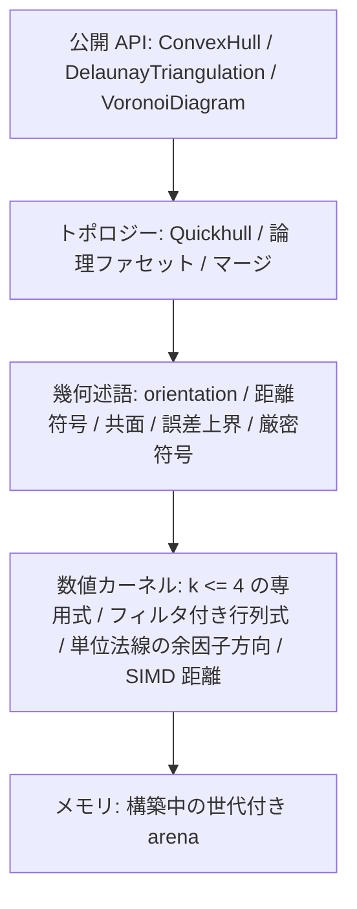

# convx 設計仕様

純 Rust の N 次元凸包、Delaunay 分割、Voronoi 図ライブラリ。正しさの順は、幾何述語の符号、その符号によるトポロジー判定、その判定に従った変異、である。公開結果は正規化した論理ファセットで比較する。

実装に入る前の仕様をここに固定する。倍率の目標値は、逐次コアができてから Qhull を測って定める。

---

## 1. 述語が符号を決める

入力の `f64` は、そのビット列が表す座標そのものとする。述語の前に平行移動もスケールもしない。丸めが入った変換は、厳密なゼロの位置を変える。

誤差は、その述語の式を評価したときの丸めに限る。各述語は `Sign` を返す。`f64` は返さない。

```rust
pub enum Sign {
    Negative,
    Zero,
    Positive,
}
```

共面は、orientation が `Zero` であることである。ファセットの側は、その面のアフィン独立な点と対象点の orientation である。共球は、持ち上げた orientation が `Zero` であることである。フィルタは、実際に行った加減乗の列に対する絶対誤差の上界を持つ。その上界が FMA の丸めを含まないなら、FMA への縮約は使わない。計算値の絶対値が上界を超えるとき、その符号を採用する。超えないときは、同じ多項式の厳密符号に落とす。計算値と上界がともに 0 で、式が恒等的に 0 でないときも、厳密符号へ落とす。アンダーフローで 0 になった値は、ゼロと確定しない。厳密評価のアルゴリズムは仕様で固定しない。自前のコードでも、依存リストにない追加クレートでもよい。返す符号がこの多項式の符号と一致すればよい。厳密評価の作業領域を確保できないときだけ、`ExactEvaluationExhausted` で失敗する。通常の `Vec` の確保失敗は、Rust の既定どおりアボートする。悪条件であること自体は失敗にしない。

公開 API に許容誤差のパラメータはない。共面の判定は、距離の厳密符号がゼロであることだけを使う。

符号の向きは次で固定する。

- $x \cdot n + \mathrm{offset} > 0$ なら、その点は平面の外側にある。
- 平面の式は $x \cdot n + \mathrm{offset} = 0$ とする。$n$ は外向きの単位法線である。
- 向きの判定は行列式の厳密符号で行う。公開平面（第5節）による $x \cdot n + \mathrm{offset}$ は、この判定に使わない。
- 幾何次数 $k$ は、引数の点の数から 1 を引いた値である。包の次元 $D$ とは独立である。$k \le 4$、つまり点 5 個までを専用式で計算する。式の展開の仕方は実装に任せる。$k$ が 4 を超えるときは、フィルタ付きの浮動小数行列式で評価し、上界以内のときだけ厳密符号に落とす。
- 公開用の単位法線は、点の個数によらず、ファセットの余因子ベクトル（辺の並びに単位行 $e_j$ を加えた行列式 $c_j$）の単位方向を外向きに合わせたものである。距離走査の作業用法線も同じ方向である。この方向は、述語のフィルタで誤差上界とともに確定させる。上界が $10^{-10}$ を超えるときは厳密に計算し、単位化で一度だけ丸める。Householder QR は使わない。確定した方向は、QR の法線より正確であり、誤差上界も保証される（ADR 0002）。ファセットの点が 5 個以上のときは、その個数を $n$ として、$(n-1) \times n$ の辺行列 $E$ を一度消去し、そこからすべての余因子を得る。最初の $n - 1$ 列について部分ピボット付きの Gauss 消去を行うと、$s$ 回の行交換のあとに $[T \mid u]$ が得られ、$T$ は上三角である。ある行の定数倍をほかの行に足しても $E$ の最大小行列式は変わらず、行交換はその符号を反転する。$T x = u$ なら $E$ は $(-x, 1)$ を零へ写し、Cramer の公式から $c = (-1)^s \det T \cdot (-x, 1)$ となる。フィルタは消去、$x$ の後退代入、$\det T$ との積の全体にわたって誤差上界を運ぶので、各 $c_j$ は、別々の行列式だったときと同じく自分の上界をもつ。上界が符号を確定できない除数に出会ったときは余因子を確定させず、方向を厳密に計算する。法線の向きは、ファセットの頂点の並びで orientation が外向きの符号になる側である。この向きは誤差上界から証明し、行列式を評価しない。余因子の厳密な単位方向を $u = c/|c|$ とし、ベクトル $v$ が $|v - u| = e < 1$ を満たすとする。このとき $|v| \ge 1 - e$ であり、$v \cdot u = (|v|^2 + 1 - e^2)/2 \ge 1 - e > 0$ となる。向きの符号は $v \cdot c$ の符号なので、$v$ は正の側にある。確定した方向の誤差は $10^{-10}$ 以下、厳密計算では $D \cdot 2^{-49}$ なので、作業用法線にも公開用の法線にもこの証明が成り立つ。

SIMD の距離走査は、誤差上界によって厳密に内側と証明できる点を、述語の対象から外す枝刈りに使う。可視性と外側性を決めるファセットに対する点の側は、ファセットの頂点を外向きの順に並べ、その点を加えた orientation の厳密な符号である。作業用の距離は、orientation を評価する前にその符号を証明してよい。ただし証明できるのは厳密な符号だけである。計算した距離 $w$ が、保証付きのしきい値 $(\mathrm{slope} \cdot l + \mathrm{floor})(1 + 4u)$ をどちらかの側に越えるとき、厳密な平面までの真の距離は同じ厳密な符号をもち、orientation も同じ符号になる。それ以外は、符号がゼロの場合も含めて、orientation が決める。しきい値は枝刈りと同じものである。$|n - u^*| \le \tau$ と $w$ の丸めが $|w - (x - o) \cdot u^*|$ を絶対値で抑えるので、証明はどちらの向きにも成り立つ。保証付きの作業用法線をもたないファセットは、orientation だけを使う。どちらの経路でも符号は同じである。

次元は述語の符号で決める。基底を一点ずつ広げ、新しい点が既存の基底に対して厳密符号ゼロなら、その方向は空間を張らない。

---

## 2. 層



距離の数値計算と、符号を確定する述語は分けておく。前者は速くてよく、後者がトポロジーを決める。

---

## 3. 入力を受け付ける条件

`dim == 0` は `NonPositiveDimension` で失敗する。この検査は除算や剰余の前に行う。$D \ge 1$ であり、次元の上限は設けない。高次元では厳密評価のビット長と時間が伸びる。そのコストは呼び出し側の負担とし、次元だけでは拒否しない。入力点数は `u32::MAX` 以下とする。超えたら、重複を除く前に `TooManyPoints` で失敗する。公開インデックスは `u32` のままである。妥当な点番号は高々 `u32::MAX - 1` なので、`u32::MAX` は点番号と衝突しない欠番として使える。

`points.len()` が $D$ の倍数でなければ `LengthMismatch` で失敗する。座標は行優先の `&[f64]` で、検証を通ったあとは `chunks_exact(D)` で点を取る。点 `i` の範囲 `i*D .. (i+1)*D` は、スライス長の内側に収まる。非有限な座標が一つでもあれば `NonFiniteCoordinate { index }` で失敗し、その入力全体を棄てる。`index` は点番号である。入力順に見て、最初に非有限座標を持つ点を入れる。

その後の前処理は次の順である。

1. 非有限の拒否
2. 重複の集約
3. 個数の検査
4. ランクの検査
5. 構築

重複は `==` で判定する。`-0.0` と `+0.0` は同じ点である。`to_bits` でも `total_cmp` でも同値を判定しない。順序を付けて代表を選ぶ実装は、比較の前に符号付きゼロを `+0.0` へ揃える。一致した点の代表は、最小の入力インデックスである。代表の個数が $D + 1$ 未満なら `InsufficientPoints { actual, required }` で失敗する。`actual` は代表の個数、`required` は $D + 1$ である。

代表が $D + 1$ 個以上あってもアフィン次元が $D$ 未満なら、`DegenerateDimension { actual_dim, spanning_points }` で失敗する。呼び出し側が射影するときは、返った `spanning_points` を使う。`spanning_points` は、代表インデックスを昇順に見て、アフィン次元を厳密に増やす点だけを採用した列である。長さは $\textit{actual\_dim} + 1$ である。この列が、辞書順で最小の基底になる。

```rust
pub enum ConvexHullError {
    NonPositiveDimension,
    LengthMismatch { len: usize, dim: usize },
    /// 点番号。入力順で、最初に非有限座標を持つ点。
    NonFiniteCoordinate { index: usize },
    TooManyPoints { actual: usize },
    InsufficientPoints { actual: usize, required: usize },
    DegenerateDimension {
        actual_dim: usize,
        spanning_points: Vec<u32>,
    },
    /// 凸包のトポロジーが決まったあと、公開平面を有限な f64 にできなかったとき。
    /// build() ではなく ConvexHull::planes() が返す。この平面はトポロジーに使わない。
    NonFiniteFacetPlane,
    /// Delaunay のトポロジーが決まったあと、外心を有限な f64 にできなかったとき。
    /// 幾何の退化ではない。凸包と Delaunay はこのエラーを返さない。
    NonFiniteCircumcenter,
    /// 厳密評価の作業領域を確保できなかったとき。
    /// 通常の Vec の確保失敗は、Rust の既定どおりアボートする。
    ExactEvaluationExhausted,
}
```

### インデックスの分割

成功した構築は、入力の各インデックスの行き先を一つに決める。

`representative` は長さ n の `Vec<u32>` である。`i` が代表なら `representative[i] == i`、重複なら代表のインデックスを指す。`representative[representative[i]] == representative[i]` が成り立つ。

代表の集合は、次の三つに分割する。いずれも昇順で、互いに素で、和が代表集合と一致する。

| リスト            | 中身                                                                           |
| :---------------- | :----------------------------------------------------------------------------- |
| `vertices`        | 凸包の極点。外すと凸包が変わる点                                               |
| `coplanar_points` | 境界上にあり、極点ではない点。インデックスだけを持ち、所属ファセットは持たない |
| `interior_points` | 凸包の内部                                                                     |

この三つのリストは `ConvexHull` が持つ。`representative` は凸包、Delaunay、Voronoi のすべてに付ける。

Delaunay と Voronoi のサイトは代表の集合全体である。内部点と、境界上の非頂点もサイトに含める。ビットが異なり `==` でもない近い点は、一つの点に吸着しない。

分類は、外側の点を取り込み、共面で隣接する単体を一つの論理ファセットへまとめたあとに行う。ここでの距離の符号は、その面のアフィン独立な $D$ 点と対象点の orientation である。公開平面の内積は使わない。

- ある論理ファセットへの距離が厳密に正なら、その点は外側にある。成功した結果に外側の点は残らない。
- すべてのファセットへの距離が厳密に負なら、内部点である。
- 構築がこれを先に証明してよい。構築が点を落としたとき、調べた符号がすべて厳密に負なら、その点は内部点である。論理ファセットに対する符号は求めない。調べる面は二通りある。初期単体のすべてのファセットか、点が可視ファセットの外側集合にあったとき、または可視ファセットだけの頂点だったときの、その挿入で作るすべての新しい単体である。カリングで内側と証明された点は、厳密に負として数える（§6）。前者なら、点は初期単体の厳密な内部にあり、内部は凸包が大きくなっても内部のままである。後者では、挿入を計画した凸包を $P$、apex を $a$、$Q = \mathrm{conv}(P \cup \{a\})$ とする。新しい単体はすべて $a$ を含む。その支持平面は $a$ と地平線の稜を通る平面であり、それらの閉じた内側の共通部分は、$a$ から $P$ への錐である。点 $p$ はそのすべての厳密な内側にあるので、$a$ から $p$ への半直線は $P$ のある点 $y$ を通る。$p$ はある可視ファセット $f$ の厳密な外側にあった。apex も $f$ の厳密な外側にあり、$y$ は $P$ の点なので $f$ の平面の上か内側にある。半直線が一つの平面を横切るのは一度だけなので、$p$ は $a$ と $y$ を結ぶ開線分の上にあり、$p \in Q$ である。残るファセット $g$ に対しては、$a$（$g$ を見ない）と $y$ がともに $g$ の平面の上か内側にあるので、$p$ もそうである。$p$ がその平面に乗るのは、$a$ と $y$ がともに乗るときだけである。$a$ が $g$ の平面に乗るなら、その平面にある $Q$ の面は頂点 $a$ を含むので、同じ外側を持つ新しい単体がその平面にある。すると $p$ はその単体に対して符号 0 になり、仮定に反する。よって $p$ は $Q$ のすべてのファセット平面の厳密な内側、つまり $Q$ の内部にある。挿入はその時点の凸包に対して計画し、最後の凸包は $Q$ を含むので、$p$ は最後の凸包の内部にある。第三に、$P$ の頂点 $v$ で、それを含む単体がすべて可視のものは、挿入のあと複体の頂点でなくなる。$v$ も、その挿入のすべての新しい単体に対して符号が厳密に負なら内部である。$v \in P$ なので、残るファセット $g$ に対して $v$ は $g$ の平面上か内側にある。平面上だとすると、$P$ のその平面での面は $v$ を含み、その面は同じ平面の境界単体で覆われる。境界は単体複体なので、$v$ を含む単体は $v$ を頂点にもつ。その単体は $g$ と同じ平面と外側をもつので、頂点 $a$ に対する符号も $g$ と同じであり、残る。すると $v$ は残る単体の頂点であり、仮定に反する。よって $v$ は $Q$ のすべてのファセットの平面に対して厳密に内側であり、$Q$ の内部にある。第二の場合と同じく、最後の凸包は $Q$ を含むので、$v$ は最後の凸包の内部にある。符号に一つでも 0 があった点は、ここの規則で分類する。
- 距離が厳密にゼロのファセットがあり、残りが負またはゼロなら、境界上にある。距離ゼロの面が複数あるときは、面ごとに判定する。
- 構築は、点が平面に乗ることを記録してよい。どの単体も平面番号を持つ。新しい単体は、ホライズンのリッジの向こう側のファセットに対する apex の厳密な符号がゼロなら、そのファセットの番号を受け継ぐ。そうでなければ新しい番号を取る。初期単体のファセットは新しい番号を取る。受け継ぐ場合、ホライズンのリッジと apex は向こう側のファセットの支持平面にあり、新しい単体はアフィン独立な $D$ 個の頂点を持つので、その平面は新しい単体の支持平面でもある。挿入前の凸包はどちらの単体に対しても内側にあり、その平面には含まれないので、外側も同じである。したがって、同じ番号の単体はすべて同じ支持平面と同じ外側を持ち、一つの点がそれらに対して持つ符号は一つである。点の単体に対する厳密な符号がゼロのとき、その点と単体の番号の組を記録する。その点が同じ番号の単体に対して後で持つ符号はゼロであり、評価しない。同じ平面にある二つの単体が違う番号を持つことはある。記録のない組は、これまでどおり評価する。記録はどの符号も変えないので、外側集合も、内部点の証明も、公開する値も変えない。 分類が共面の面のために作る部分凸包も通常の構築なので、同じように記録する。$D = 1$ と $D = 2$ は挿入で単体を作らないので、何も記録しない。
- 分類は記録から始めてよい。点 $p$ に、最後の複体の単体が持つ番号の記録があるとし、その単体の論理ファセットを $F$ とする。$p$ から $F$ への距離はゼロである。$p$ は凸包の点なので、$p$ からの距離がゼロのファセットは $p$ を含むファセットであり、それは $p$ を含む凸包の最小の面 $G$ を含むファセットである。$G$ を含む面の全体は、ある多面体の面束になる。多面体のファセットはリッジを通じて連結なので、$G$ を含む二つのファセットは、$G$ を含むファセットの列でつながり、列の隣どうしはリッジを共有する。リッジを共有する二つの論理ファセットは隣接する。そのリッジを覆う境界単体のそれぞれが、二つのファセットの単体に一つずつ載るからである。よって、$F$ から始めて、$p$ からの距離がゼロの隣接論理ファセットだけへ進めば、距離ゼロのファセットすべてに届く。それ以外のファセットへの距離は厳密に負であり、その符号は評価しない。最後の複体の単体が持つ番号の記録がない点は、すべての論理ファセットに対して調べる。
- 距離ゼロの面では、頂点集合を $V$ とする。点が $\mathrm{conv}(V)$ の外側かどうかは、入力座標のままの orientation で決める。使うリッジは、その面の現在の単体分割のうち、この面の単体ただ一つに属するものである。その単体の、リッジに入らない頂点を $a$ とする。$q$ は、$V$ に入らない最小インデックスの極点である。点 $p$ がそのリッジの外側にあるのは、$\mathrm{orient}(R, p, q)$ と $\mathrm{orient}(R, a, q)$ の符号がどちらもゼロでなく、互いに逆のときである。$D = 1$ にこのリッジはなく、端点以外の境界点は出ない。一つ以上の面で外側なら、`vertices` に入れ、外側だった面すべての頂点集合に加える。どの面でも外側でなければ、`coplanar_points` に入れる。
- 単体複体の頂点も同じ基準で分類する。挿入したときには極点だった頂点が、あとの挿入で辺や面の相対内部に入ることがある。厳密な可視判定は共面な隣の単体を消さないからである。面の頂点集合は、その面の単体複体の頂点と距離ゼロの点を合わせた集合の極点である。極点でなくなった単体複体の頂点は `coplanar_points` に入れる。
- 頂点がすべて極点である単体ただ一つの面を除き、すべての面を、極点をインデックス順に置く placing triangulation で分割する。それまでに置いた点のアフィン次元を上げる点は、現在のすべての単体と結ぶ。上げない点は、それまでの点の凸包の外にある。極点だからである。その点は、自分が厳密に外側にある境界リッジすべてと結ぶ。外側かどうかは、現在のアフィン包の中での厳密な orientation で決める。リッジの残りの頂点とその点が、リッジの両側に厳密に分かれるときが外側である。隣接は、分割し直した単体から計算し直す。
- 二つの面が単体でない低次元の面を共有するとき、両側でその面の切り方が一致しないと、境界の単体複体は閉じない。placing triangulation を面へ制限すると、同じ順序でのその面の placing triangulation になる。そのため、すべての面で切り方が一致する。頂点を加えた面だけを辞書順最小の基底から分割し直す方法では、この一致が保証されない。

---

## 4. 単体とメモリ

$D$ 次元凸包のファセットは $(D-1)$-単体である。頂点は $D$ 個、隣接ファセットも $D$ 個、法線は $D$ 次元である。3 次元の面は、頂点 3 個の三角形である。

Delaunay は、第7節の逐次挿入で、次元 $D$ の頂点 $D+1$ 個の単体を直接作る。凸包のファセットの規則は使わない。

```rust
/// 構築中の単体ファセット。D はエンジンの次元。
struct Simplex {
    vertices: Vec<u32>,   // 長さ D
    neighbors: Vec<FacetId>, // 長さ D。各リッジの向こう側
    normal: Vec<f64>,     // 長さ D。構築中の作業用法線
    offset: f64,
    group: GroupId,       // 論理ファセット。構築中だけの u32
    flags: u32,           // tombstone と予約ビット
}
```

`GroupId` は構築中だけの `u32` である。公開型にはしない。

公開後の番号は、削除済みを詰めた `u32` である。`FacetId` の世代は構築中にダングリングを防ぐためだけに使い、公開 API の番号は詰め済みの添字である。論理ファセットの平面はグループが持ち、単体ごとの作業用法線とは別に保存する。

arena はチャンク単位の世代付きインデックスである。構築は単一スレッドが一点ずつ挿入し、その場で書き換える（第6節）。論理グループの結び方は Union-Find でも、構築後の再構築でもよい。

$D = 1$ では、ファセットは端点一つである。隣接リストは空にする。二つの端点が論理ファセットになり、体積は両端の座標差の絶対値 $|x_{\max} - x_{\min}|$ である。

---

## 5. 論理ファセット

点の挿入中は、単体複体のまま進める。全点の挿入が終わったあと、共有リッジの両側が厳密に共面な単体だけを一つの論理ファセットにまとめる。挿入の途中ではマージしない。まとめたあとで、第3節の距離ゼロの分類を行う。単体でない面は、第3節の placing triangulation で分割する。

同一支持平面上の連結な境界は、一つの論理ファセットになる。凸多面体の一つの支持平面が切る面は一つだからである。点が頂点になるか、境界上の非頂点になるか、内部になるかは、第3節の分類で決まる。

公開形は全次元で共通である。論理ファセットは要素ごとの `Vec` を持たない。`ConvexHull` がすべてのファセットの頂点列と隣接を平坦な配列にまとめて持ち、ファセットごとには借用ビューで公開する（第9節）。ファセットの平面は、もう一つのビュー `planes()` で公開する。番号はファセットと同じで、最初に使うときに計算する。

```rust
pub struct Facets<'a> { /* ConvexHull を借用する */ }

impl<'a> Facets<'a> {
    pub fn len(&self) -> usize;
    pub fn is_empty(&self) -> bool;
    /// 公開ファセット番号で引く。範囲外の番号には None を返す。
    pub fn get(&self, facet: u32) -> Option<Facet<'a>>;
    /// 公開番号の順。
    pub fn iter(&self) -> impl ExactSizeIterator<Item = Facet<'a>> + 'a;
}

#[derive(Clone, Copy)]
pub struct Facet<'a> { /* ConvexHull を借用する */ }

impl<'a> Facet<'a> {
    /// 昇順の極点。
    pub fn vertices(&self) -> &'a [u32];
    /// 隣接ファセット番号の集合。昇順。
    pub fn neighbors(&self) -> &'a [u32];
}

pub struct Planes<'a> { /* ConvexHull を借用する */ }

impl<'a> Planes<'a> {
    pub fn len(&self) -> usize;
    pub fn is_empty(&self) -> bool;
    /// 公開ファセット番号で引く。範囲外の番号には None を返す。
    pub fn get(&self, facet: u32) -> Option<Plane<'a>>;
    /// 公開ファセット番号の順。
    pub fn iter(&self) -> impl ExactSizeIterator<Item = Plane<'a>> + 'a;
}

#[derive(Clone, Copy)]
pub struct Plane<'a> { /* ConvexHull を借用する */ }

impl<'a> Plane<'a> {
    /// 長さ D。外向き単位ベクトル。
    pub fn normal(&self) -> &'a [f64];
    /// 平面 x·n + offset = 0 の offset。
    pub fn offset(&self) -> f64;
}
```

$D = 1$ と $D \ge 3$ では、ファセットを頂点列の辞書順に並べ、この順での番号を公開番号とする。$D = 2$ のファセットは、境界の巡回の辺である。巡回は最小の頂点から反時計回りに進み、ファセット $i$ はその $i$ 番目と $i+1$ 番目の頂点を結ぶ。最後のファセットは最後の頂点と最初の頂点を結ぶ。第6節の構築は、始点を除いてこの巡回のまま凸包を残すので、この番号付けにソートは要らない。ファセットの頂点列は、どの次元でも昇順である。`neighbors()` は隣接ファセットの番号の集合で、昇順である。配列の位置は共有リッジと対応しない。共有リッジは、両方の頂点集合の交差のうち、アフィン次元が $D-2$ の面である。リッジの頂点列は公開しない。$D \ge 3$ では、隣接番号の昇順は、相手ファセットの頂点列の辞書順と一致する。$D = 2$ では、ファセット $i$ の隣接は、ファセット数を法としたファセット $i - 1$ と $i + 1$ である。

`build()` が計算するものと、最初に使うときに計算するものは、それぞれの値が何を必要とするかで決める。

- `build()` は、代表点、点の頂点・頂点でない境界点・内部点への分割、各ファセットの頂点列、境界単体、頂点の座標を計算する。分割には入力の座標が要るが、結果は入力の座標を持たない。共面なファセットの頂点列には、その上の点が要る。分割し直すファセットの境界単体には、厳密符号が要る（第3節）。
- $D = 2$ では、境界の巡回を一度たどり、公開順のまま、各ファセットの頂点の組と隣接の組、各境界単体を書く。どれも長さが決まっているので、リストに開始位置は要らない。何も並べ替えない。
- $D = 1$ と $D \ge 3$ では、`build()` は、分類が残した順と番号のままファセットとその隣接を持つ。公開番号は最初に使うときに計算する。ファセット番号を読む最初の呼び出しが、頂点列を並べ、隣接リストと各境界単体のファセットの番号を付け替え、凸包はその結果を保持する。その呼び出しは `facets()`、`planes()`、`triangulation()`、`volume()`、`boundary_cycle()`、比較である。番号付けは、`build()` が計算したものの並べ替えと付け替えなので、失敗せず、`Result` を返さない。
- 平面（下記）と境界の単体複体の公開順（`triangulation()`）は、これまでどおり最初に使うときに計算する。

すべての値を読む呼び出し側は、これまで `build()` が計算していたものを一度だけ払う。

平面は、そのファセットの頂点から作る。インデックスの組を辞書順に見て、最初にアフィン独立になる $D$ 点を選ぶ。厳密符号がゼロの組は飛ばし、次の組へ進む。述語が見る座標は、入力のビット列のままである。公開平面だけ、次の順で作る。

1. 第1節の確定した余因子方向を法線とする。厳密に計算するときだけ、座標を 2 の冪で一様にスケールしてから求める。方向はスケールで変わらない
2. 単位長にする
3. 符号は誤差上界から証明した orientation に合わせ、内側を負にする
4. offset は、基底の最初の点 $r$ から $-n \cdot r$ とする

公開する単位法線 $n$ は、平面を作った $D$ 点の余因子ベクトル $c$ を内側が負になる向きに合わせた単位方向 $\hat c = c / \lVert c \rVert$ から、ユークリッド距離で $10^{-10}$ 以内にある（$D \le 56294$ のとき）。

$$
\lVert n - \hat c \rVert_2 \le \varepsilon \le 10^{-10}
$$

この上限は第1節から出る。公開する法線は確定した方向そのものであり、真の $\hat c$ から誤差上界 $\varepsilon$ 以内にある。$\varepsilon$ は、フィルタで確定した方向では $10^{-10}$ 以下、厳密計算では $D \cdot 2^{-49}$ であり、$D \le 56294$ ならどちらも $10^{-10}$ 以下である。法線は平面を作った $D$ 点だけで決まり、構築中の単体の頂点の並びには依らない。平面のトポロジーへの影響はなく、版をまたいだ値の一致も約束しない。

`build()` は平面を計算しない。`planes()` の最初の呼び出しが、すべてのファセットの平面を計算して凸包の中に保持し、以後の呼び出しは保持したものを返す。複数のスレッドから呼んでも、返るのは同じ保持済みの平面である。法線または offset が非有限なら、`planes()` はその呼び出しでも以後の呼び出しでも `NonFiniteFacetPlane` を返し、平面は一つも公開しない。この失敗は入力で決まるので、平面と同じく保持する。`planes()` は、厳密評価の作業領域を確保できないときに `ExactEvaluationExhausted`（第3節）も返し得る。こちらは保持せず、次の呼び出しで平面を計算し直す。`NonFiniteFacetPlane` は、凸包のトポロジーが決まったあと、公開平面を有限な `f64` にできなかったことである。`build()` は成功しており、ファセット、分割、境界の単体複体は使える。この平面はトポロジー判定に使わない。同一バイナリではこの手順で平面が決まる。版をまたいだ float のバイト一致までは約束しない。

$D \le 3$ では、保存した頂点集合と、境界単体の外向きの順から境界閉路を導出する。開始頂点は最小インデックス、進行方向は外向き法線に合う向き、である。閉路は保存形式の本体ではない。$D = 1$ の `boundary_cycle` は `Some` で、中身はその端点一つである。$D = 2$ は両端点、$D = 3$ は長さ 3 以上である。$D \ge 4$ の論理ファセットは $(D-1)$ 次元の多面体なので、閉路は定義しない。`boundary_cycle` は $D \ge 4$ で `None` を返す。

`triangulation()` が返すのは、境界の単体複体である。平面と同じく、単体の公開順は最初に使うときに決める。複体を順に読む最初の呼び出し（`triangulation()` または `volume()`）が単体を並べ、凸包はその順を保持する。並べる処理は失敗しない。`boundary_cycle()` はこの順を必要としない。各単体の頂点は $D$ 個で、凸包の内部を $D$-単体へ分解したものではない。$D = 1$ の各単体は端点一つであり、入れ替えはしない。$D \ge 2$ では、頂点を昇順に並べ、外向きになるよう末尾の 2 点だけを入れ替える。共面領域の切り方は幾何的に一意とは限らず、版が変わると変わり得る。同じバイナリの中では、挿入順によらず同じ分割になる（第6節）。

`volume()` は多面体の体積を返す。トポロジーには使わない。構築が成功しても、戻り値が有限であることは保証しない。$D = 1$ の体積は $|x_{\max} - x_{\min}|$ である。$D \ge 2$ では、最小インデックスの極点を $r$ とする。各境界単体は、`triangulation()` と同じく末尾 2 点を入れ替えた外向き順で、$r$ との符号付き `f64` 体積を計算する。$r$ を含む項は 0 になってよい。足す順序は、入れ替え前の昇順頂点列の辞書順である。その順に左から足し、最後に絶対値を返す。他実装との一致は、フィクスチャごとの相対誤差で見る。

初期単体にどの点を選ぶかは、一般には仕様で固定しない。例外は、持ち上げが平坦な Delaunay で、第7節の pulling triangulation が単体を決めるときだけである。単体でない面の分割は、第3節の placing triangulation が決めるので、凸包の公開結果は初期単体にも挿入順にもよらない。初期単体の選び方は、Delaunay の共球な分割が版ごとに変わり得る要因として残す。

---

## 6. 構築

$D = 1$ の凸包は両端点である。$D = 2$ の凸包は、厳密な左折だけを残す極点鎖である。鎖を作る前に、内側と証明できる点を除く。8 方向（$\pm x$、$\pm y$、$\pm x \pm y$）のそれぞれで最も遠い代表点を取り、同じ値なら入力インデックスの小さい点を取る。その点たちの極点鎖を、除外に使う多角形とする。フィルタ付きの orientation が、この多角形のすべての辺の厳密な左側にあると証明した点は、凸包の内部点である。多角形の頂点は入力点なので、多角形の厳密な内側は凸包の厳密な内側に含まれる。証明できなかった点は残し、残った点の極点鎖が凸包になる。多角形の頂点が 3 個に満たないときは、どの点も除かない。除外が得にならない入力でも、どの点も除かない。代表点を入力順に等間隔で最大 1024 個取り、そのうち内側と証明できる点が 32 個に 1 個に満たなければ、そう判断する。除かなかった点は極点鎖と分類が扱うので、この判断は凸包も分割も変えない。8 方向の値は `f64` の和と差で比べる。その丸めが変えるのはどの入力点を多角形に選ぶかだけで、凸包も分割も変えない。$D \ge 3$ は Quickhull で点を取り込む。ある点がファセットから厳密に外側なら、そのファセットは可視である。外側かどうかは orientation の厳密な符号である。保証付きの作業用距離がその符号を先に証明してよく（第1節）、そうでなければ orientation を評価する。ただし、第3節の記録がゼロを与えるときは評価しない。可視領域の境界リッジがホライズンである。ホライズンの向こう側で、隣接スロットを書き換える面を $N$ と呼ぶ。

逐次構築は、外側点を一点ずつ挿入し、凸包をその場で書き換える。挿入する点は、その時点の凸包のあるファセットから厳密に外側にある点である。どの点をどの順に挿入するかは実装が決める決定的な順で、入力の値と並びだけから決まる。可視領域を消し、ホライズンの各リッジにその点を足した新しい単体を置き、消えたファセットの外側集合を新しい単体へ割り当て直してから、次の点へ進む。各点はその時点の凸包に対して計画し、ただちに反映する。予約もラウンドも置かない。

凸包の公開結果は挿入順によらない。論理ファセットは多面体の面として一意で、その平面は第5節の手順で頂点集合だけから決まる。単体でない面は第3節の placing triangulation が切り、単体の面はそれ自身である。インデックス分割も、点が極点か、境界上の非極点か、内部かで決まる。`volume()` はその三角形分割から決まった順で足す。したがって、同じ凸包に達する構築ならどれも同じ公開結果を返す。並列の構築方式は、この一意性に頼って選んでよい。

凸包の構築は逐次だけである。Builder に並列の切り替えは置かない。

以前の版の並列構築は、ラウンドごとのバッチ抽出（外側距離順の先頭 $K = 64$ 個の候補、可視ファセットとホライズンの予約）と、入力インデックス順のコミットで点を取り込んだ。測定では、4 スレッドでも逐次構築をばらつきを超えて上回らなかった。抽出とコミットが直列で、ラウンドの計画作業がスレッドの起床費用に見合わなかったからである（`docs/adr/0004-sequential-hull-only.md`）。この方式と、それを選ぶ `parallel` フラグは仕様から外した。並列の凸包構築は、測定で逐次構築を上回る方式が Grill を経て決まったときに、その公開 API とともにこの節へ戻る。

Delaunay と Voronoi も、第7節の逐次挿入を一本で実行する。持ち上げが平坦なときに呼ぶ凸包コアも同じ逐次構築である。

構築後は、残っているどのファセットについても、どの入力点も厳密な外側に出ない。

版をまたいで公開結果が約束するのは、正規化のあとで、論理ファセットの頂点集合と隣接が一致することである。版をまたいだ出力バイト列の完全一致は約束しない。

---

## 7. Delaunay

次元 $D$ の Delaunay は、次の持ち上げの下側凸包を、元の空間へ射影したものである。

$$
x_{D+1} = \|x\|^2
$$

入力配列は伸ばさない。式が定義である。この高さは、入力座標の多項式 $\sum_i x_i^2$ として厳密符号へ渡す。`f64` の途中結果が非有限なら、フィルタを飛ばして厳密符号へ進む。その入力は拒否しない。実装が座標をキャッシュしてもよい。キャッシュの有無は、観測できる単体と符号を変えてはならない。

内外判定（insphere）は、この持ち上げの orientation として定義する。別の代数式を使ってよいのは、この定義と符号が一致するときだけである。

構築は逐次挿入である。代表サイトを、実装が決める決定的な順に一つずつ加える。その順は入力の値と並びだけから決まる。各時点の複体は、それまでに加えたサイトの持ち上げの下側包を射影したものである。サイト凸包の外側は、凸包の各ファセットに無限遠の頂点を一つ加えた外側単体で表す。新しいサイト $q$ を加えるときは、$q$ と衝突する単体の集まり（空洞）を取り除き、空洞の境界の各面と $q$ を結んだ単体で埋める。衝突は次の厳密符号で決める。

- 有限な単体とは、$q$ がその外接球の厳密な内側にあるとき衝突する。内側かどうかは、その単体の頂点を正の向きに並べ $q$ を加えた持ち上げの orientation の符号が、単体の内部の点に対する符号と同じかで決める。ゼロ（共球）は衝突ではない。
- 外側単体とは、$q$ がそのファセットの支持超平面の厳密な外側にあるとき衝突する。$q$ が支持超平面の上にあるときは、その超平面の中でファセットの外接球の厳密な内側にあるときだけ衝突する。この判定も厳密符号で決め、射影の丸めは使わない。

空洞は連結であり、取り除いて埋めたあとの複体は、$q$ を加えたサイトの持ち上げの下側包の射影である。

逐次挿入は次元ごとに特殊化してよい。手続きは一つである。$D = 2$ と $D = 3$ は、座標を固定長の行に持ち、述語の式を直接呼ぶ形で、それぞれ別にコンパイルする。それ以外の次元は一つにまとめてコンパイルする。どの特殊化も、同じ挿入順を使い、すべての衝突と向きを同じ厳密符号で決める。そのため、共球なサイトのあいだの対角も含めて、同じ分割を公開する。特殊化は公開 API には現れない（`docs/adr/0005-specialize-the-delaunay-insertion.md`）。

元のサイトが $\mathbb{R}^D$ を張るとき、持ち上げのアフィン次元が $D$ であることと、全点が一つの球面上にあることは同じである。このときは逐次挿入の衝突を判定せず、サイト凸包の内部を pulling triangulation で埋める。境界面は、Delaunay の内部で、元の $D$ 次元のサイトに対して凸包コアを呼んで得る。公開の `ConvexHullBuilder` は使わない。公開平面が作れなくても、この分割は失敗させない。最小インデックスの頂点を $v$ とする。$v$ を含まない境界面の頂点集合を、同じ規則で分割する。頂点集合が単体なら、そこで止まり、その単体を返す。それ以外は、再帰で得た各単体に $v$ を足す。この場合は逐次挿入を使わない。持ち上げのアフィン次元は構築の前に分かる。一部の点だけが共球なときの対角は、逐次挿入で決まる。版をまたいだ一意性は約束しない。

Delaunay が `DegenerateDimension` を返すのは、元のサイトのアフィン次元が $D$ 未満のときだけである。元のサイトが $\mathbb{R}^D$ を張り、持ち上げた点が $\mathbb{R}^{D+1}$ を張らないのは、全体が共球で持ち上げが平坦なときである。そのときも、サイト凸包の分割として成功する。この手順は Delaunay の内部に閉じ、`ConvexHullBuilder` には出さない。公開の凸包は、アフィン次元が $D$ 未満ならこれまでどおり失敗する。

出力する単体は下側包の射影だけである。頂点は昇順に並べ、末尾 2 点の入れ替えで、元の空間の向きを正にする。厳密な向きがゼロのときは、昇順のままにする。

持ち上げた点の向きが厳密にゼロで、対角が複数あるときは、その版の挿入順が選んだ分割を返す。サイトのうちどれが極点になるかは一意なので、極点集合は約束する。同じバイナリと同じ入力なら同じ対角を返す。版をまたいだ対角の一致は約束しない。

次元退化は、入力サイトのアフィン次元で報告する。報告に使うインデックスは元のサイトのものである。持ち上げ先の次元数では報告しない。

```rust
pub struct DelaunayTriangulation { /* 非公開 */ }

impl DelaunayTriangulation {
    pub fn dim(&self) -> usize;
    pub fn representative(&self) -> &[u32];
    pub fn simplices(&self) -> Simplices<'_>;
}

pub struct Simplices<'a> { /* DelaunayTriangulation を借用する */ }

impl<'a> Simplices<'a> {
    pub fn len(&self) -> usize;
    pub fn is_empty(&self) -> bool;
    /// 単体番号で引く。範囲外の番号には None を返す。
    pub fn get(&self, simplex: u32) -> Option<DelaunaySimplex<'a>>;
    pub fn iter(&self) -> impl ExactSizeIterator<Item = DelaunaySimplex<'a>> + 'a;
}

#[derive(Clone, Copy)]
pub struct DelaunaySimplex<'a> { /* DelaunayTriangulation を借用する */ }

impl<'a> DelaunaySimplex<'a> {
    /// 長さ D+1。向きは本文のとおり。
    pub fn vertices(&self) -> &'a [u32];
    /// 長さ D+1。共有する面の向こう側の単体番号。無ければ u32::MAX。
    pub fn neighbors(&self) -> &'a [u32];
}
```

単体の頂点と隣接は、どちらも長さ $D+1$ の行を並べた平坦な配列に持つ。単体番号は、その並びでの位置である。隣接が無いスロットには `u32::MAX` を入れる。点の番号は `u32::MAX` 未満なので、この値は点を指さない。単体の並びは、向きを決める前の昇順頂点列の辞書順である。

---

## 8. Voronoi

Voronoi 図は、対角を入れる前の Delaunay 複体の双対である。公開する `DelaunayTriangulation` は、その複体を単体に割ったものである。別のアルゴリズムでは作らない。退化、重複、共球の扱いは凸包および Delaunay と同じであり、Voronoi だけの規則は持たない。

有限な Voronoi 頂点は、持ち上げた凸包の下側論理ファセット一つである。共有リッジの両側が、持ち上げた orientation で厳密に共面な単体を、隣接をたどって一つにまとめる。このまとめ方は、複体をどの順に挿入して作ったかに依らない。外心の `f64` が近いかではまとめない。全体が平坦なときは下側ファセットが一つなので、Voronoi 頂点も一つである。pulling triangulation の各単体には分けない。入射サイトは、属する単体のサイトの和で、重複を除いた昇順列である。長さは $D+1$ 以上になる。座標は、属する単体のうち頂点列が辞書順で最小のものから、一つの頂点を原点へ移して外心を計算する。それが非有限なら、同じ辞書順で次の単体を試す。すべて非有限なら `NonFiniteCircumcenter` で失敗する。このエラーは幾何の退化ではない。Delaunay の単体と隣接は、まとめる前のまま公開する。成功した図の頂点座標はすべて有限である。凸包と Delaunay は外心を計算しない。外心の丸めは、トポロジーの決定に使わない。

`VoronoiInterface` は、二つのセルが次元 $D-1$ で接するときだけ作る。`vertices` が空の interface は作らない。二つの異なる Voronoi 頂点がどちらもサイト $a$ と $b$ を含み、辺 $ab$ が両方のセルの面であるとき、その interface は有限頂点を端に持つ。一つの頂点だけが $a$ と $b$ を含み、辺 $ab$ がサイト凸包の論理ファセット上にあるとき、その interface はレイを持つ。同じ頂点のサイト集合の内部にある対角は、interface にしない。$D = 1$ の有限な境界面は頂点一つで、`rays()` は空でもよい。レイだけの interface は作らない。

レイは、まとめ後の Voronoi 頂点と、元の空間にあるサイト凸包の論理ファセットの組のうち、その頂点のグループの多面体が次元 $D-1$ の面をそのファセット上に持つ組ごとに一本である。方向は、その論理ファセットの外向き単位法線である。同じファセットでも起点が違えば、別のレイになる。セルは、サイトがその面、つまりグループのサイトのうちそのファセットの超平面上にあるものに含まれるとき、そのレイを持つ。ファセット上に極点でない境界サイトがなければ、これはサイトがそのファセットと頂点の両方に属することと同じである。境界面が複数のレイを持つとき、それらがその面の端である。隣り合う法線の間の方向は、別のオブジェクトにしない。成功した結果では起点は常にある。起点を持てない配置は、元のサイトの次元退化として構築の前に失敗している。$D \le 3$ では、境界面の境界閉路を有限頂点とレイから導出する。保存形式の本体は、頂点集合とレイの集合である。$D \ge 4$ では、頂点とレイの組は接続を表す。胞体としての完全な複体にはならない。

```rust
pub struct VoronoiDiagram { /* 非公開 */ }

impl VoronoiDiagram {
    pub fn dim(&self) -> usize;
    pub fn representative(&self) -> &[u32];
    pub fn vertices(&self) -> VoronoiVertices<'_>;
    pub fn rays(&self) -> VoronoiRays<'_>;
    pub fn cells(&self) -> VoronoiCells<'_>;
    pub fn interfaces(&self) -> VoronoiInterfaces<'_>;
}

pub struct VoronoiVertices<'a> { /* VoronoiDiagram を借用する */ }
pub struct VoronoiRays<'a> { /* 同上 */ }
pub struct VoronoiCells<'a> { /* 同上 */ }
pub struct VoronoiInterfaces<'a> { /* 同上 */ }

// VoronoiVertices、VoronoiRays、VoronoiCells、VoronoiInterfaces は同じ形である。
// Item はそれぞれ VoronoiVertex、VoronoiRay、VoronoiCell、VoronoiInterface。
impl<'a> VoronoiVertices<'a> {
    pub fn len(&self) -> usize;
    pub fn is_empty(&self) -> bool;
    /// 番号で引く。範囲外の番号には None を返す。
    pub fn get(&self, index: u32) -> Option<VoronoiVertex<'a>>;
    pub fn iter(&self) -> impl ExactSizeIterator<Item = VoronoiVertex<'a>> + 'a;
}

#[derive(Clone, Copy)]
pub struct VoronoiVertex<'a> { /* VoronoiDiagram を借用する */ }

impl<'a> VoronoiVertex<'a> {
    /// 長さ D。
    pub fn coords(&self) -> &'a [f64];
    /// 昇順。長さは D+1 以上。
    pub fn sites(&self) -> &'a [u32];
}

#[derive(Clone, Copy)]
pub struct VoronoiRay<'a> { /* VoronoiDiagram を借用する */ }

impl<'a> VoronoiRay<'a> {
    /// vertices() の番号。
    pub fn apex(&self) -> u32;
    /// 長さ D。サイト凸包の外向き単位法線。
    pub fn direction(&self) -> &'a [f64];
    /// 元の空間のサイト凸包の極点。昇順。
    pub fn hull_facet(&self) -> &'a [u32];
}

#[derive(Clone, Copy)]
pub struct VoronoiCell<'a> { /* VoronoiDiagram を借用する */ }

impl<'a> VoronoiCell<'a> {
    pub fn site(&self) -> u32;
    /// 入射する有限頂点。まとめ後の番号。昇順。
    pub fn vertices(&self) -> &'a [u32];
    /// このセルのレイの rays() での番号。昇順。
    pub fn ray_numbers(&self) -> &'a [u32];
    /// ray_numbers() の順のレイ。
    pub fn rays(&self) -> impl ExactSizeIterator<Item = VoronoiRay<'a>> + 'a;
}

#[derive(Clone, Copy)]
pub struct VoronoiInterface<'a> { /* VoronoiDiagram を借用する */ }

impl<'a> VoronoiInterface<'a> {
    /// 昇順。二つのセルが次元 D-1 で接するときだけ作る。
    pub fn sites(&self) -> [u32; 2];
    pub fn vertices(&self) -> &'a [u32];
    pub fn ray_numbers(&self) -> &'a [u32];
    pub fn rays(&self) -> impl ExactSizeIterator<Item = VoronoiRay<'a>> + 'a;
}
```

頂点の座標とサイト、レイの方向と `hull_facet`、セルと境界面の頂点とレイは、それぞれ平坦な配列に持つ。レイは図全体で一つの表にまとめ、セルと境界面はその番号を持つ。同じレイを共有するセルと境界面は、同じ番号を指す。

`VoronoiInterface::sites()` は、長さがコンパイル時に 2 と決まっているので、配列 `[u32; 2]` を値で返す。番号や座標のほかのリストは長さが実行時に決まるので、スライスで返す。

セルと境界面の頂点番号は、まとめ後の `vertices` の番号である。同じ番号は一度だけ入れる。並べ方は次で固定する。

- 有限頂点は、`sites` の辞書順
- セルはサイトの昇順で、代表ごとに一つ
- 境界面は `sites` の辞書順
- レイは、起点の番号、次いで `hull_facet` を `u32` の列として辞書順に比較する。`rays()` の番号はこの順での位置であり、各セルと境界面の `ray_numbers()` も、この番号の昇順である

内部サイトのセルにレイは付かない。凸包の境界上のサイトのセルには、少なくとも一つのレイが付く。

---

## 9. 公開 API

コアの入力は行優先の `&[f64]` である。Builder は次元と点列を受け取り、`build` で結果を返す。構築は逐次である（第6節）。

```rust
pub struct ConvexHullBuilder<'a> { /* dim, points */ }

impl<'a> ConvexHullBuilder<'a> {
    pub fn new(dim: usize, points: &'a [f64]) -> Self;
    pub fn build(self) -> Result<ConvexHull, ConvexHullError>;
}
```

`DelaunayBuilder` と `VoronoiBuilder` も同じ形である。失敗はどちらも `ConvexHullError` を返す。Delaunay の `dim` は元の空間の次元であり、持ち上げ後の次元ではない。

```rust
pub struct ConvexHull { /* 非公開 */ }

impl ConvexHull {
    pub fn dim(&self) -> usize;
    pub fn representative(&self) -> &[u32];
    pub fn vertices(&self) -> &[u32];
    pub fn coplanar_points(&self) -> &[u32];
    pub fn interior_points(&self) -> &[u32];
    /// 第5節の論理ファセット。
    pub fn facets(&self) -> Facets<'_>;
    /// ファセットの平面（第5節）。最初の呼び出しで計算し、保持する。
    /// 法線または offset が有限でないときは NonFiniteFacetPlane。この失敗も保持する。
    /// ExactEvaluationExhausted は保持しない。
    pub fn planes(&self) -> Result<Planes<'_>, ConvexHullError>;
    /// トポロジーには使わない。有限であることは保証しない。
    pub fn volume(&self) -> f64;
    /// 共面の切り方は、版をまたいだ安定性の約束に入らない。
    pub fn triangulation(&self) -> TriangulationView<'_>;
    /// D が 1, 2, 3 のときだけ定義される。facet は公開ファセット番号。範囲外の番号には None を返す。
    pub fn boundary_cycle(&self, facet: u32) -> Option<Vec<u32>>;
}
```

三つの結果型 `ConvexHull`、`DelaunayTriangulation`、`VoronoiDiagram` のフィールドはすべて非公開である。要素ごとの `Vec` は持たず、各リストを平坦な配列（値の配列と開始位置の配列、長さが決まっているときは固定の幅）に持ち、借用ビューで公開する。そのため、クレートの外では構造体リテラルで作れない。結果型は `Clone`、`Debug`、`PartialEq` を実装し、ビューは `Clone`、`Copy`、`Debug` を実装する。ビューの `Debug` は、そのアクセサが返す値を出力する。`ConvexHull` は、最初に使うときに計算して非公開のフィールドに保持するものを三つ持つ。`planes()` の平面、`triangulation()` と `volume()` が使う境界の単体複体の公開順、そして $D = 1$ と $D \ge 3$ でのファセットの公開番号とその隣接リストである（第5節）。どれも、`build()` が計算したものから決まる。二つの `ConvexHull` の等値比較は、平面を除くすべての公開値を比べる。次元、代表点、分割、ファセットとその隣接、頂点の座標、そして境界の単体複体を、公開順に単体ごとに比べる。比較は、どちらかのファセットに番号を付け、境界の単体複体を並べることがある。平面は計算しない。比較の前に平面を計算済みだったか、ファセットに番号を付け済みだったか、複体を並べ済みだったかで、結果は変わらない。平面はファセットと頂点の座標から決まるので、等しい二つの凸包は、同じバイナリで等しい平面を公開する。一方が平面を公開できないなら、他方も公開できない。`Debug` はどれも計算しない。`Clone` は計算済みのものを複製する。`triangulation()` は、複体と保持した順を借用するビューを返す。

```rust
pub struct TriangulationView<'a> { /* ConvexHull を借用する */ }

pub struct BoundarySimplex<'a> {
    pub vertices: &'a [u32], // 長さ D。第5節のとおり末尾二点を入れ替えた外向きの順
    pub facet: u32,          // この単体を含む論理ファセットの公開番号
}

impl<'a> TriangulationView<'a> {
    pub fn len(&self) -> usize;
    pub fn is_empty(&self) -> bool;
    pub fn get(&self, index: usize) -> Option<BoundarySimplex<'a>>;
    pub fn iter(&self) -> impl ExactSizeIterator<Item = BoundarySimplex<'a>> + 'a;
}
```

単体の順序は、入れ替える前の昇順頂点列の辞書順である。第5節で `volume()` が項を足す順序と同じにする。`boundary_cycle(facet)` は、`facet` が公開ファセット番号でないとき、次元によらず `None` を返す。パニックはしない。

静的 API は、スタック上の配列と単相化のためのラッパーである。ソルバーの切り替えとは別軸にする。向きの専用式は幾何次数 $k \le 4$ で、引数は $k + 1$ 個である。それを超える向きはフィルタ付き行列式である。

```rust
pub struct StaticConvexHull<const D: usize>;
pub struct StaticDelaunay<const D: usize>;
pub struct StaticVoronoi<const D: usize>;

impl StaticConvexHull<D> {
    pub fn build(points: &[[f64; D]]) -> Result<ConvexHull, ConvexHullError>;
}
```

`StaticConvexHull` は $1 \le D \le 8$ である。`StaticDelaunay` と `StaticVoronoi` も $1 \le D \le 8$ とし、`build` の形は同じである。返す型は、それぞれ `ConvexHull`、`DelaunayTriangulation`、`VoronoiDiagram` である。三つの静的型は同じ範囲をもつ。Delaunay は逐次挿入（第7節）で作り、内部に $D+1$ 次元の凸包を使わないので、Delaunay と Voronoi の範囲を凸包より狭くする理由はない。`build` は `&[[f64; D]]` を受け、`as_flattened()` をコアへ渡す。

`[[f64; D]]` から `&[f64]` への変換は `as_flattened()` だけを使う。`unsafe` は置かない。MSRV は 1.89 である。`pulp` の AVX-512 段（`x86-v4` 機能）は AVX-512 の組み込み関数を使い、それが安定版になったのが 1.89 だからである。Voronoi の連立方程式に使う `faer` は 0.21 以降が `rust-version` 1.84 を宣言しており、1.80 で使える最後の版は保守されていない 0.19 系である。D の範囲は、単一の `impl` に定数境界を書けない安定版の制約に合わせ、マクロか個別実装で 1 から上限までを出す。

依存は `faer`、`pulp`、`thiserror` で、実装言語は Rust である。ビルドは `std` を前提にする。

距離カーネルは `pulp` による実行時 CPU 検出で、AVX-512（`x86-v4`）まで使う。どの命令セットの段も同じ除外集合を返す。5 点から 9 点のファセットの余因子の消去は、CPU が AVX2 をもつとき、`pulp` の AVX2（`x86-v3`）のベクトルの 1 レーンに 1 ファセットを置いて 4 ファセットを同時に行い、もたないときは 1 ファセットずつ行う。各レーンは単独の消去と同じ演算を同じ順で行うので、余因子とその上界はどの CPU でもビットごとに一致する。

---

## 10. 検証

デバッグビルドと CI で、次を検査する。

1. 単体複体の Euler 特性数。$F_k$ は、その複体の境界に現れる $k$ 次元面を、頂点集合で一意にして数えた個数である。入力の生の点、`coplanar_points`、Delaunay の単体は、$F_k$ に数えない。次が成り立つ。

$$
\sum_{k=0}^{D-1} (-1)^k F_k = 1 - (-1)^D
$$

2. 論理ファセット複体についても、同じ式が成り立つ。この複体の $k$-面は、一つ以上の論理ファセットの頂点集合の交差のうち、空でなく、アフィン次元が $k$ のものである。頂点集合で一意に数える。単体複体の面と混ぜない。
3. 全入力点について、どの論理ファセットへの距離も厳密に正ではない。
4. 隣接の対称性。単体グラフと論理ファセットグラフの両方で、A がリッジ R を介して B に隣接するなら、B も R を介して A に隣接する。
5. インデックス分割。`representative` の不動点集合が、三つのリストの直和と一致する。

事前計算したオラクルは `tests/fixtures/` に置く。比較の規則は次のとおりである。

- 頂点集合は厳密に一致する。
- 論理ファセットは、正規化した頂点集合として厳密に一致する。
- 体積にグローバルな絶対誤差は置かない。各フィクスチャが相対誤差の許容を持つ。分母が潰れるほぼ退化のフィクスチャは、体積を見ず、位相の一致だけを見る。許容は次の比である。

$$
\frac{|V_a - V_b|}{\max(|V_a|, |V_b|)}
$$

- 包含は述語で判定する。

構築は逐次だけなので（第6節）、同じバイナリと同じ入力では、凸包の公開結果と Delaunay 単体が毎回一致する。

完了条件にする入力は、次のとおりである。

述語は Phase 1 の完了条件である。厳密なゼロ、そこから 1 ulp だけ離れた値、巨大座標、微小座標、巨大と微小の混在、桁落ちする行列式を含む。加えて、隣り合う 2 頂点の交換で符号が反転すること、頂点の重複でゼロになること、全点を同じ有限値だけ平行移動しても符号が不変であること、を検査する。有限な入力は、途中の浮動小数行列式がオーバーフローしても失敗してはならない。そのときは厳密符号へ落とす。座標の指数は $2^{-1022}$ から $2^{1023}$ までを含める。

凸包は Phase 2 の完了条件である。$D = 1$ の 2 点、重複、`-0.0` と `+0.0` を含み、隣接リストが空であることも検査する。$D = 1$ の `boundary_cycle` は端点一つを返す。$D = 2$ では三角形、正方形、辺上の点、内部点、重複の多い入力を成功させ、一直線は `DegenerateDimension` で失敗する。正方形では、第四の頂点は極点になり、辺の内部にある点は `coplanar_points` になる。$D = 3$ では四面体、立方体、面上の内部点、辺上の点、ほぼ共面を成功させ、全体が一つの平面に載る入力は `DegenerateDimension` で失敗する。点数が `u32::MAX` を超える入力は `TooManyPoints` で失敗する。平行移動、正の一様スケール、座標軸の入れ替えのあとでは、論理ファセットの頂点集合が一致する。負の一様スケールでも、頂点集合は一致する。向き付きの頂点列は、変換後の座標で正規化し直したものを比べる。入力順を変えたときは、代表インデックスを対応させた論理ファセットの頂点集合だけを比べる。

Delaunay は Phase 4 の完了条件である。次が通るまで Phase 4 は完了にしない。$D = 1$ の 2 点、$D = 2$ の 3 点、正方形（全体が共円）、一部だけ共円な入力、$D = 3$ の 4 点、全体が共球な入力。ちょうど $D + 1$ 点と、全体が共球な入力は成功する。元のサイトが $D$ 次元を張らない入力は失敗する。全体が共円な正方形の Voronoi 頂点は一つである。Delaunay の対角が二つあっても、頂点は対角の選び方に依らない。対角の両端を結ぶ `VoronoiInterface` は作らない。持ち上げの `f64` が非有限になっても、有限な入力は失敗しない。平行移動、正の一様スケール、座標軸の入れ替えのあとでは、向きを正規化した Delaunay 単体が一致する。負の一様スケールでは、単体の頂点集合を比べ、向き付きの列は変換後の座標で正規化し直す。入力順の入れ替えでは、共球な対角の一致を要求しない。

目標は次の欄に分けて測る。欄を置くことまでを今の仕様とし、倍率の数値は Phase 2 で Qhull を基準に測ってから書く。性能の基準にする Qhull は、ジョグルも入力の摂動も無し、同じ次元で動かす。比べるのは論理ファセットであり、三角形分割された出力や、ジョグル後の出力ではない。

| 欄     | 測るもの                                   |
| :----- | :----------------------------------------- |
| 性能   | 逐次コアの所要時間。基準は Qhull           |
| 正しさ | 上記の不変条件とオラクル                   |
| 頑健性 | 乱択、敵対的配置、近退化、巨大座標、高次元 |
| メモリ | 入力 1 点あたりのバイト数                  |

並列の欄は置かない。並列構築が第6節に戻るときに、1, 2, 4, 8, 16 スレッドでの所要時間の欄を置く。決定的な並列挿入（Delaunay）はロードマップの行で扱う。

---

## 11. 実装順

Phase 1 は述語カーネルである。orientation、距離符号、共面、誤差上界、厳密符号へのフォールバック、を先に固定する。同じ段階で、単一スレッドの世代付き arena、SIMD 距離、幾何次数 $k \le 4$ の専用式、フィルタ付き行列式、単位法線のための余因子方向を置く。上の述語の入力が通るまで、Phase 1 は完了にしない。

Phase 2 は逐次 Quickhull である。$D = 2$ は第6節の極点鎖で作る。挿入中は単体のまま進め、完了後に共面な単体をまとめ、そのあとで距離ゼロの点を分類する。インデックス分割、`volume()`、不変条件、上の凸包の入力を含む。

Phase 3 は並列であった。バッチ抽出、予約とデバッグビルドでの予定単体の衝突検査、ワーカーローカルな変異、インデックス順のコミット、逐次構築の公開結果との一致検査を含んだ。逐次構築はこの抽出を使わず、一点ずつその場で挿入する（`docs/adr/0003-sequential-hull-in-place.md`）。測定で並列構築が逐次構築を上回らなかったため、この抽出と `parallel` フラグは仕様から外した（`docs/adr/0004-sequential-hull-only.md`）。

Phase 4 は静的 API、Delaunay、Voronoi、オラクルである。上の Delaunay の入力が通るまで、Phase 4 は完了にしない。持ち上げが平坦なときの pulling triangulation と、共球な単体を一つの Voronoi 頂点へまとめる手順は、この段階の内部手順である。

符号規約と、持ち上げを式で定義することは、Phase 4 の仕様に最初から含める。Phase 4 は当初、持ち上げた点に凸包コアを適用して Delaunay を作った。逐次挿入（第7節）への切り替えの理由は `docs/adr/0001-incremental-delaunay.md` にある。
