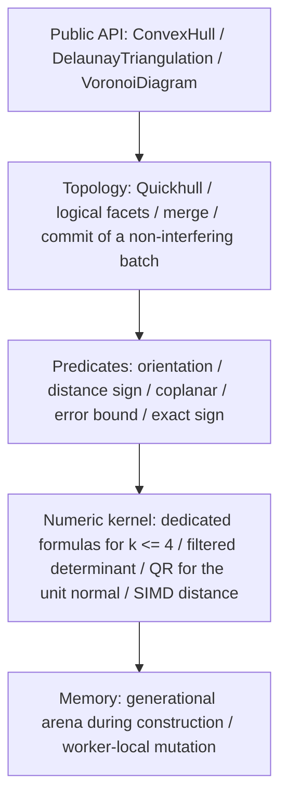
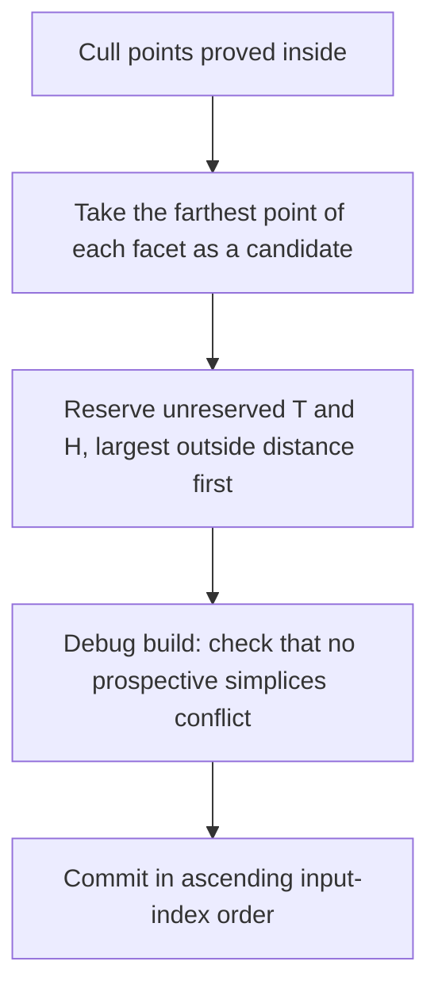

# convx design

A pure Rust library for n-dimensional convex hulls, Delaunay triangulations, and Voronoi diagrams. Correctness is ordered as the sign of a geometric predicate, the topological decision from that sign, and the mutation that follows the decision. Public results are compared as normalized logical facets.

The specification is fixed here before implementation. Speedup targets are set after the sequential core exists, by measuring Qhull.

This file and [design.ja.md](design.ja.md) both carry the full specification. When they differ, follow `design.ja.md`.

---

## 1. Predicates decide the sign

An input `f64` is the coordinate its bit pattern names. Predicates do not translate or scale first. A rounded transform moves the exact zero.

Error is only the rounding of evaluating that predicate's expression. Each predicate returns `Sign`. It does not return `f64`.

```rust
pub enum Sign {
    Negative,
    Zero,
    Positive,
}
```

Coplanar means the orientation is `Zero`. Which side of a facet a point is on is the orientation of an affinely independent set of points of that face and the query point. Cospherical means the lifted orientation is `Zero`. The filter carries an absolute error bound for the sequence of additions, subtractions, and multiplications actually performed. If that bound does not include FMA rounding, the evaluation does not contract to an FMA. When the absolute value of the computed value exceeds the bound, that sign is kept. Otherwise the predicate falls back to the exact sign of the same polynomial. The same fallback applies when the computed value and the bound are both 0 and the expression is not identically 0. A value that became 0 by underflow is not decided to be zero. The exact-evaluation algorithm is not fixed by this specification. Own code is allowed, and so is an extra crate that is not on the dependency list. The returned sign must match the sign of this polynomial. The build fails with `ExactEvaluationExhausted` only when the work space for exact evaluation cannot be allocated. An ordinary `Vec` allocation failure aborts, as Rust does by default. Ill-conditioning itself is not a failure.

The public API has no tolerance parameter. Coplanar uses only that the exact sign of the distance is zero.

The orientation of the sign is fixed as follows.

- If $x \cdot n + \mathrm{offset} > 0$, the point is outside the plane.
- The plane is $x \cdot n + \mathrm{offset} = 0$. $n$ is the outward unit normal.
- Orientation is the exact sign of a determinant. `FacetPlane`'s $x \cdot n + \mathrm{offset}$ is not used for this decision.
- Geometric degree $k$ is one less than the number of argument points. It is independent of the hull dimension $D$. $k \le 4$, that is up to five points, is computed with a dedicated formula. How the formula is expanded is left to the implementation. When $k$ exceeds 4, the predicate evaluates a filtered floating-point determinant and falls back to the exact sign only when the value lies inside the bound.
- Householder QR produces the public unit normal. In every dimension it is this crate's own factorization, of the scaled edge matrix held in one buffer. The working normal used by distance scans is the cofactor direction below, and it is not produced by QR. When an edge is nearly parallel to the span of the others, QR skips a reflector whose remaining column norm is at rounding level. The last column of Q is then orthogonal to the edges only up to rounding, and it can be far from the true normal while still on the correct side. So the published QR normal is compared with the unit direction of the facet's cofactor vector, whose entry $c_j$ is the determinant of the edges followed by the unit row $e_j$. That direction is certified with an error bound by the predicate filter, or computed exactly when the bound is loose. When a facet has $n \ge 5$ points, the filter evaluates every cofactor from one elimination of the $(n-1) \times n$ edge matrix $E$. Gaussian elimination with partial pivoting over its first $n - 1$ columns gives $[T \mid u]$ with $T$ upper triangular, after $s$ row swaps. Adding a multiple of one row to another leaves every maximal minor of $E$ unchanged, and a swap flips its sign. If $T x = u$, then $E$ maps $(-x, 1)$ to zero, and Cramer's rule gives $c = (-1)^s \det T \cdot (-x, 1)$. The filter carries a running bound through the elimination, the back substitution for $x$, and the products with $\det T$, so each $c_j$ has its own bound, as when it was a separate determinant. A divisor whose sign the bound does not certify leaves the cofactors uncertified, and the direction is computed exactly. When the two differ by more than the certified error plus a small fixed tolerance, the cofactor direction is used. The normal points to the side where the orientation of the ordered facet vertices has the outward sign. That side is proved from the error bound, and no determinant is evaluated. Let $u = c/|c|$ be the exact unit cofactor direction and let $|v - u| = e < 1$. Then $|v| \ge 1 - e$ and $v \cdot u = (|v|^2 + 1 - e^2)/2 \ge 1 - e > 0$. The orientation sign is the sign of $v \cdot c$, so $v$ lies on the positive side. The certified error is at most $10^{-10}$, or $D \cdot 2^{-49}$ when computed exactly, so the proof holds for the working normal. The published QR normal takes whichever of its two signs lies nearer the cofactor direction. That distance is at most $2\varepsilon + 10^{-8} < 1$, so the same proof holds.

A SIMD distance scan culls points the error bound proves strictly inside, removing them from the predicate's inputs. The side of a point against a facet, which decides visibility and outsideness, is the exact orientation sign of the facet's vertices, in outward order, and the point. The working distance may prove that sign before the orientation is evaluated, but only a strict one. When the computed distance $w$ is beyond the certified threshold $(\mathrm{slope} \cdot l + \mathrm{floor})(1 + 4u)$ on either side, the true distance to the exact plane has the same strict sign, and so does the orientation. Every other case, including a sign of zero, is decided by the orientation. The threshold is the one the cull uses: $|n - u^*| \le \tau$ and the rounding of $w$ bound $|w - (x - o) \cdot u^*|$ in absolute value, so the proof holds in both directions. A facet of a lifted Delaunay hull is certified against the exact lift. Its vertices and the query carry rounded heights $\hat h$, each with the bound $e$ that the filter computed for it (§7), and only the last coordinate is rounded. Its cofactors are those of the rounded points, widened to bound the cofactors of the exact lift. Every cofactor but the last is linear in the column of height differences, and the last does not contain it. Moving the heights to their exact values changes entry $i$ of that column by at most $\eta_i = e_i + e_0$, so cofactor $j$ moves by at most $\sum_i \eta_i |M_{ij}|$. $M_{ij}$ is a determinant of the spatial parts of the other edges and a unit row, so Hadamard's inequality gives $|M_{ij}| \le \prod_{k \ne i} |r_k|$, with $r_k$ the spatial part of edge $k$. With those bounds, $\tau$ bounds $|n - u^*|$ for the unit normal $u^*$ of the exact lifted plane. Replacing the rounded heights of the query $x$ and the origin $o$ by the exact ones changes $(x - o) \cdot u^*$ by at most $(e_x + e_o)|u^*_{D+1}| \le e_x + e_o$. So the lifted threshold is $\big((\mathrm{slope} \cdot l + \mathrm{floor}')(1 + 4u) + e_x\big)(1 + 4u)$, with $\mathrm{floor}' = (\mathrm{floor} + e_o)(1 + 4u)$, where each factor $(1 + 4u)$ covers the roundings of the sum before it. A facet without a certified working normal uses the orientation only. The result is the same sign either way.

Dimension is decided by predicate signs. The basis grows one point at a time. If the new point has exact sign zero against the existing basis, that direction does not span the space.

---

## 2. Layers



Numeric distance and the predicate that settles the sign stay separate. The former may be fast. The latter decides topology.

---

## 3. Conditions for accepting input

`dim == 0` fails with `NonPositiveDimension`. This check runs before any division or remainder. $D \ge 1$, and there is no upper bound on dimension. In high dimensions the bit length and the time of exact evaluation grow. That cost is the caller's. Dimension alone does not reject the input. The number of input points is at most `u32::MAX`. Above that, `TooManyPoints` fails before duplicate removal. Public indices stay `u32`. A valid point number is at most `u32::MAX - 1`, so `u32::MAX` can be used as a missing index that does not collide with a point number.

If `points.len()` is not a multiple of $D$, the call fails with `LengthMismatch`. Coordinates are row-major `&[f64]`. After validation, points are taken with `chunks_exact(D)`. The range of point `i`, `i*D .. (i+1)*D`, lies inside the slice. One non-finite coordinate fails the whole input with `NonFiniteCoordinate { index }`. `index` is the point number. Walking the input in order, it is the first point that has a non-finite coordinate.

Preprocessing after that is in this order.

1. Reject non-finite coordinates
2. Aggregate duplicates
3. Check the count
4. Check the rank
5. Construct

Duplicates are decided by `==`. `-0.0` and `+0.0` are the same point. Equality is not `to_bits` and not `total_cmp`. An implementation that orders points before choosing a representative canonicalizes signed zero to `+0.0` before the comparison. The representative of coincident points is the smallest input index. Fewer than $D + 1$ representatives fails with `InsufficientPoints { actual, required }`. `actual` is the number of representatives. `required` is $D + 1$.

If there are at least $D + 1$ representatives and the affine dimension is still below $D$, the call fails with `DegenerateDimension { actual_dim, spanning_points }`. A caller that projects uses the returned `spanning_points`. `spanning_points` is the sequence obtained by walking representative indices in ascending order and keeping only the points that strictly raise the affine dimension. Its length is $\textit{actual\_dim} + 1$. This sequence is the lexicographically minimum basis.

```rust
pub enum ConvexHullError {
    NonPositiveDimension,
    LengthMismatch { len: usize, dim: usize },
    /// Point number. The first point, in input order, that has a non-finite coordinate.
    NonFiniteCoordinate { index: usize },
    TooManyPoints { actual: usize },
    InsufficientPoints { actual: usize, required: usize },
    DegenerateDimension {
        actual_dim: usize,
        spanning_points: Vec<u32>,
    },
    /// The hull topology was decided, and the public plane could not be made a finite f64.
    /// This plane is not used for topology.
    NonFiniteFacetPlane,
    /// The Delaunay topology was decided, and a circumcenter could not be made a finite f64.
    /// This is not a geometric degeneracy. The hull and the Delaunay triangulation do not return this error.
    NonFiniteCircumcenter,
    /// The work space for exact evaluation could not be allocated.
    /// An ordinary Vec allocation failure aborts, as Rust does by default.
    ExactEvaluationExhausted,
}
```

### Index partition

A successful build assigns every input index one destination.

`representative` is a `Vec<u32>` of length n. If `i` is a representative, `representative[i] == i`. If it is a duplicate, the entry points at the representative's index. `representative[representative[i]] == representative[i]`.

The representative set splits into the following three lists. Each is ascending. They are pairwise disjoint. Their union is the representative set.

| List              | Contents                                                                        |
| :---------------- | :------------------------------------------------------------------------------ |
| `vertices`        | Extreme points of the convex hull. Removing one changes the hull                |
| `coplanar_points` | Points on the boundary that are not extreme. Indices only, with no owning facet |
| `interior_points` | The interior of the convex hull                                                 |

`ConvexHull` owns these three lists. `representative` is attached to the hull, the Delaunay triangulation, and the Voronoi diagram.

Delaunay and Voronoi sites are the entire representative set. Interior points and non-vertex boundary points are sites. Nearby points that differ in bits and fail `==` are not snapped to one point.

Classification runs after outside points have been absorbed and adjacent coplanar simplices have been merged into one logical facet. The distance sign here is the orientation of $D$ affinely independent points of that face and the query point. The inner product of `FacetPlane` is not used.

- If the distance to some logical facet is strictly positive, the point is outside. A successful result contains no outside point.
- If the distance to every facet is strictly negative, the point is interior.
- Construction may prove this first. A point that construction drops while every sign it tested was strictly negative is interior, and needs no sign against the logical facets. The facets tested are every facet of the initial simplex, or, when the point was in the outside set of a visible facet or was a vertex of only visible facets, every new simplex of that insertion. A point the cull proves inside counts as strictly negative (§6). In the first case the point is strictly inside the initial simplex, and the interior stays interior as the hull grows. In the second case, let $P$ be the hull the insertion is planned against, $a$ its apex, and $Q = \mathrm{conv}(P \cup \{a\})$. Every new simplex contains $a$. Their supporting planes are the planes through $a$ and the horizon ridges, and the intersection of their closed inner sides is the cone from $a$ over $P$. The point $p$ is strictly inside all of them, so the ray from $a$ through $p$ meets $P$ at some point $y$. The point $p$ was strictly outside a visible facet $f$. The apex is strictly outside $f$ too, and $y$, being in $P$, is on or inside the plane of $f$. A ray crosses one plane once, so $p$ lies on the open segment from $a$ to $y$, and $p \in Q$. Against a kept facet $g$, both $a$ (which does not see $g$) and $y$ are on or inside the plane of $g$, so $p$ is too, and $p$ is on that plane only when $a$ and $y$ both are. If $a$ is on the plane of $g$, the face of $Q$ in that plane contains the vertex $a$, so a new simplex lies in that plane with the same outer side, and $p$ would have sign zero against it. So $p$ is strictly inside every facet plane of $Q$: it is in the interior of $Q$. A batch plans each region against the hull at the start of its round, and the final hull contains $Q$, so $p$ is in the interior of the final hull. Third, a vertex $v$ of $P$ whose every incident simplex is visible stops being a vertex of the complex after the insertion. It is interior too when its sign against every new simplex of that insertion is strictly negative. Since $v \in P$, it is on or inside the plane of every kept facet $g$. Suppose it is on that plane. The face of $P$ in that plane contains $v$ and is covered by boundary simplices in that plane. The boundary is a simplicial complex, so a simplex that contains $v$ has $v$ as a vertex. That simplex has the plane and outer side of $g$, so its sign against $a$ is that of $g$, and it is kept. Then $v$ is a vertex of a kept simplex, against the assumption. So $v$ is strictly inside every facet plane of $Q$, and it is in the interior of $Q$. As in the second case, a batch plans each region against the hull at the start of its round, and the final hull contains $Q$, so $v$ is in the interior of the final hull. A point with any zero sign is classified by the rules here.
- If some facet has distance exactly zero and the rest are negative or zero, the point is on the boundary. When several faces have distance zero, the test is per face.
- On a face of distance zero, let the vertex set be $V$. Whether the point is outside $\mathrm{conv}(V)$ is decided by orientation on the input coordinates as they are. The ridges used are those that, in the face's current triangulation, belong to exactly one simplex of this face. Let $a$ be the vertex of that simplex that is not on the ridge. $q$ is the extreme point of smallest index that is not in $V$. Point $p$ is outside that ridge when the signs of $\mathrm{orient}(R, p, q)$ and $\mathrm{orient}(R, a, q)$ are both nonzero and opposite each other. For $D = 1$ there is no such ridge, and no boundary point other than the endpoints appears. If the point is outside on one or more faces, it goes into `vertices` and is added to the vertex set of every face where it was outside. If it is outside on no face, it goes into `coplanar_points`.
- Vertices of the simplicial complex are classified by the same rule. A vertex that was extreme when it was inserted can later fall in the relative interior of an edge or a face, because strict visibility leaves a coplanar neighboring simplex in place. A face's vertex set is the set of extreme points of its simplicial vertices together with its distance-zero points. A simplicial vertex that is no longer extreme goes into `coplanar_points`.
- Every face except a single simplex whose vertices are all extreme is triangulated by placing its extreme points in index order. A point that raises the affine dimension of the points placed so far is joined to every current simplex. A point that does not is outside the hull of the points placed so far, because it is extreme. It is joined to every boundary ridge it is strictly beyond. Being beyond is decided by exact orientation within the current affine span: the ridge's remaining vertex and the point lie strictly on opposite sides of the ridge. Neighbors are recomputed from the new simplices.
- When two faces share a lower face that is not a simplex, both must split it the same way, or the boundary simplicial complex does not close. The placing triangulation restricted to a face is the placing triangulation of that face in the same order, so every face agrees. Re-triangulating only the faces that gained a vertex, each from its own lexicographically minimum basis, does not guarantee this agreement.

---

## 4. Simplices and memory

A facet of a $D$-dimensional convex hull is a $(D-1)$-simplex. It has $D$ vertices, $D$ neighboring facets, and a $D$-dimensional normal. A face in 3D is a triangle of three vertices.

Delaunay in dimension $D$ uses the lower facets of the hull of the points lifted to dimension $D+1$. Those facets have $D+1$ vertices. The array-length rule does not change. The engine's dimension increases by one.

```rust
/// A simplicial facet during construction. D is the engine dimension.
struct Simplex {
    vertices: Vec<u32>,   // length D
    neighbors: Vec<FacetId>, // length D. The far side of each ridge
    normal: Vec<f64>,     // length D. Working normal during construction
    offset: f64,
    group: GroupId,       // Logical facet. A u32 that exists only during construction
    flags: u32,           // tombstone and reserved bits
}
```

`GroupId` is a `u32` that exists only during construction. It is not a public type.

Numbers after publication are `u32` values packed after deletions. The generation on `FacetId` is used only to prevent dangling references during construction. Public API numbers are packed indices. A logical facet's plane is owned by the group and stored apart from each simplex's working normal.

The arena is a generational index in chunks. Sequential construction has one thread growing the arena. Parallel construction has workers building mutations locally and, after a barrier, committing them to the global arena in ascending input-index order. At commit, a worker-local `FacetId` is renumbered to a global number. Linking logical groups may be Union-Find, or a rebuild at commit.

For $D = 1$, a facet is a single endpoint. The neighbor list is empty. The two endpoints are the logical facets, and the volume is the absolute difference of the endpoint coordinates $|x_{\max} - x_{\min}|$.

---

## 5. Logical facets

While points are being inserted, the complex stays simplicial. After every point has been inserted, only simplices that are exactly coplanar across a shared ridge are merged into one logical facet. There is no merge during insertion. After the merge, the distance-zero classification of §3 runs. A face that is not a simplex is triangulated by the placing procedure in §3.

A connected boundary on one supporting plane is one logical facet, because one supporting plane of a convex polyhedron cuts one face. Whether a point becomes a vertex, a non-vertex on the boundary, or an interior point is decided by the classification in §3.

The public shape is the same in every dimension.

```rust
pub struct FacetPlane {
    pub normal: Vec<f64>, // length D. Outward unit vector
    pub offset: f64,      // offset of the plane x·n + offset = 0
}

pub struct LogicalFacet {
    pub vertices: Vec<u32>, // extreme points, ascending
    pub plane: FacetPlane,
    pub neighbors: Vec<u32>, // set of neighbor facet numbers, ascending
}
```

The facet array is ordered by lexicographic vertex lists. The number in that order is the public number. `neighbors` is the set of neighbor facet numbers. A slot's position does not correspond to a shared ridge. A shared ridge is a face of affine dimension $D-2$ in the intersection of the two vertex sets. The ridge's vertex list is not public. Ascending neighbor numbers agree with the lexicographic order of the other facet's vertex list.

The plane is built from that facet's vertices. Walking index tuples in lexicographic order, the first $D$ points that are affinely independent are chosen. A tuple whose exact sign is zero is skipped, and the walk continues to the next tuple. The coordinates the predicate sees are the input bit patterns as they are. Only the public plane is built in the following order.

1. Translate to a representative point
2. Scale uniformly by the coordinate width
3. Form the normal in `f64`, including the check against the cofactor direction of §1
4. Make it unit length
5. Match the sign to the exact orientation, with inside negative
6. Compute the offset in the translated coordinates, then map it back to the original coordinates

The published unit normal $n$ lies within Euclidean distance $10^{-8} + 2 \cdot 10^{-10}$ of $\hat c = c / \lVert c \rVert$, the unit direction of the cofactor vector $c$ of the $D$ points the plane is built from, oriented so that the inside is negative (for $D \le 56294$).

$$
\lVert n - \hat c \rVert_2 \le 10^{-8} + 2 \cdot 10^{-10}
$$

The bound follows from the check of §1. The direction used for the check is within its error bound $\varepsilon$ of the true $\hat c$. $\varepsilon$ is at most $10^{-10}$ for a direction certified by the filter, and $D \cdot 2^{-49}$ when it is computed exactly. Both are at most $10^{-10}$ when $D \le 56294$. The QR normal is kept only when it is within $\varepsilon + 10^{-8}$ of that direction, and otherwise that direction itself is used. So the distance is at most $2\varepsilon + 10^{-8}$. The bound does not affect topology, and values across versions are still not promised to agree.

If the normal or the offset is then non-finite, the build fails with `NonFiniteFacetPlane`. That failure means the hull topology was already decided and the public plane could not be made a finite `f64`. This plane is not used for the topology decision. The same binary decides the plane by this procedure. Bit-identical floats across versions are not promised.

For $D \le 3$, the boundary cycle is derived from the stored vertex set and the outward normal. The start vertex is the minimum index. The direction agrees with the outward normal. The cycle is not the stored form itself. For $D = 1$, `boundary_cycle` is `Some` and contains that single endpoint. For $D = 2$ it is the two endpoints. For $D = 3$ its length is at least 3. A logical facet for $D \ge 4$ is a $(D-1)$-dimensional polyhedron, so a cycle is not defined. `boundary_cycle` returns `None` for $D \ge 4$.

`triangulation()` returns the boundary simplicial complex. Each simplex has $D$ vertices. It is not a decomposition of the hull interior into $D$-simplices. For $D = 1$ each simplex is one endpoint, and there is no swap. For $D \ge 2$, vertices are stored in ascending order and only the last two points are swapped so that the order is outward. The split of a coplanar region need not be geometrically unique, and it may change when the version changes. Within the same binary, sequential and parallel builds produce the same split.

`volume()` returns the volume of the polyhedron. It is not used for topology. A successful build does not promise that the return value is finite. For $D = 1$ the volume is $|x_{\max} - x_{\min}|$. For $D \ge 2$, let $r$ be the extreme point of minimum index. Each boundary simplex, in the outward order that swaps the last two points as `triangulation()` does, contributes its signed `f64` volume with $r$. A term that includes $r$ may be 0. The addition order is the lexicographic order of the ascending vertex lists before the swap. The terms are added from the left in that order, and the absolute value is returned at the end. Agreement with other implementations is judged by the relative error of each fixture.

Which points form the initial simplex is not fixed by the specification in general. The exception is flat-lift Delaunay, where the pulling triangulation of §7 decides the simplices. The triangulation of a face that is not a simplex is decided by the placing procedure in §3. Sequential and parallel builds choose the initial simplex with the same function. Any other choice of initial simplex remains a reason that coplanar and cospherical splits may change across versions.

---

## 6. Construction and the parallel commit

Points are absorbed by Quickhull. If a point is strictly outside a facet, that facet is visible. Outsideness is the strict sign of the orientation. The certified working distance may prove that sign first (§1); otherwise the orientation is evaluated. The boundary ridges of the visible region are the horizon. The face across the horizon whose neighbor slot is rewritten is called $N$.



For a point $P$ the following names are used.

- $V(P)$: the visible facets to delete
- $H(P)$: the horizon ridges
- $N(P)$: the faces across the horizon
- $T(P) = V(P) \cup N(P)$

Two points $P, Q$ that share a batch satisfy

$$
T(P) \cap T(Q) = \emptyset, \quad H(P) \cap H(Q) = \emptyset
$$

Disjoint $T$ and $H$ are the condition for two points to share a batch. A horizon ridge lies in exactly two facets, one visible and one in $N$, so if $H(P)$ and $H(Q)$ meet, $T(P)$ and $T(Q)$ meet too. The $H$ condition therefore follows from the $T$ condition, and the implementation may decide by $T$ alone. Debug builds check that $H$ is disjoint. A prospective simplex is the vertices of a horizon ridge with that point added, known before commit. Two points conflict if $Q$ is strictly outside a prospective simplex of $P$ by orientation, or the reverse. Once $T$ and $H$ are disjoint, no conflict can occur. A prospective simplex of $P$ sits on a horizon ridge, and that ridge lies on exactly two facets: a visible one and one of $N(P)$, both supporting hyperplanes of the convex hull. The strict outer side of the prospective simplex is covered by the strict outer sides of those two facets, and a point strictly outside a facet's hyperplane sees that facet. So a $Q$ strictly outside a prospective simplex of $P$ sees a facet of $T(P)$, and the reverse holds the same way. The connectivity of the visible region is what puts every facet across the horizon into $N(P)$. Disjoint $H$ remains the condition that two commits do not write the same ridge. A debug build checks the conflict test on every batch, as it checks the sequential application of a parallel batch. A release build does not evaluate it, because its cost grows with the square of the batch size and it never changes a batch.

The order of packing into a batch is largest outside distance first. A candidate whose walk of its visible region meets a facet already in the $T$ of a taken candidate is rejected there, and the rest of its region is not built; a candidate whose starting facet is already taken is rejected without a walk. Its region would meet that $T$ anyway, so the batch is the same. The order of applying the batch is ascending input index. Sequential and parallel builds both use this extraction and this commit. The sequential build runs it on one thread. `parallel` defaults to off. When it is on, the input point slice is immutable, workers build mutations locally, and a barrier commits them in the order above. A debug build checks that the topology of applying the same batch sequentially in index order agrees with the topology of the parallel commit.

A logical facet is unique as a face of the polyhedron, independent of insertion order. Delaunay diagonals are not unique, so both paths share the same batch procedure in order to agree on the simplex set as well.

After commit, no remaining facet has any input point strictly outside it.

What the public result promises, after normalization, is that logical-facet vertex sets and neighbor sets agree. Identical output bytes are not promised.

---

## 7. Delaunay

The Delaunay triangulation in dimension $D$ is the lower convex hull of the following lift, projected back to the original space.

$$
x_{D+1} = \|x\|^2
$$

The input array is not extended. The formula is the definition. This height is passed to the exact sign as the polynomial $\sum_i x_i^2$ in the input coordinates. If an intermediate `f64` is non-finite, the filter is skipped and evaluation continues to the exact sign. That input is not rejected. An implementation may cache the coordinates. Whether a cache exists must not change the observable simplices or signs.

Insphere is defined as the orientation of this lift. Another algebraic expression is allowed only when its sign agrees with this definition.

Which side is the lower side is decided by the outward vertex order that the lifted hull attached to the facet. The orientation of an interior point is negative. The test point is the first vertex of that order, moved by a positive distance in the lifted coordinate only. An upward move keeps the sign the same. The distance moved is fixed at $+1$. If the orientation of this test point is negative, the facet is on the lower side. If positive, it is on the upper side. If zero, those $D+1$ points have zero volume in the original space. The decision is not made by index order. It is not made by the public normal's $n_{D+1}$. For the points $(0,0)$, $(1,0)$, $(0,1)$, $(0.1,0.1)$, the first three form an upper facet, and the orientation of the point directly above them, against the outward order, is positive.

When the original sites span $\mathbb{R}^D$, the lifted affine dimension being $D$ is the same statement as every point lying on one sphere. In that case the lower-side sign is not used, and the interior of the site hull is filled by a pulling triangulation. The boundary is obtained inside Delaunay by calling the hull core on the original $D$-dimensional sites. The public `ConvexHullBuilder` is not used. Failure to build a public plane does not fail this split. Let $v$ be the vertex of minimum index. The vertex set of a boundary face that does not contain $v$ is split by the same rule. If that vertex set is already a simplex, the procedure stops and returns that simplex. Otherwise $v$ is added to each simplex obtained by recursion. When only some points are cospherical, the diagonal is decided by the ordinary lower-hull procedure. Uniqueness across versions is not promised.

A face whose sign is not yet decided is not discarded. Cutting off the search of faces already known to be on the upper side is an optimization added after the sequential core is correct. Even if that optimization is not implemented, the definition that publishes only the lower side is the same.

Delaunay returns `DegenerateDimension` only when the affine dimension of the original sites is below $D$. Lifted points that do not span $R^{D+1}$ still receive a lower hull inside their affine span. When every point is cospherical and the lift is flat, the build still succeeds as a triangulation of the site hull. This procedure stays inside Delaunay and is not exposed on `ConvexHullBuilder`. The public convex hull still fails, as before, when the affine dimension is below $D$.

Published simplices are only the projection of the lower hull. Vertices are stored in ascending order, and a swap of the last two points makes the orientation positive in the original space. When the exact orientation is zero, the ascending order is kept.

When the orientation of the lifted points is exactly zero and several diagonals exist, the build returns the split chosen by that version's algorithm. Which of the sites are extreme is unique, so the extreme set is promised. Agreement of diagonals is limited to the sequential and parallel paths of the same binary.

Dimension degeneracy is reported from the affine dimension of the input sites. The indices used in the report are those of the original sites. The report does not use the dimension count of the lift.

```rust
pub struct DelaunayTriangulation {
    pub dim: usize,
    pub representative: Vec<u32>,
    pub simplices: Vec<DelaunaySimplex>,
}

pub struct DelaunaySimplex {
    pub vertices: Vec<u32>, // length D+1. Orientation is as in the text
    pub neighbors: Vec<u32>, // length D+1. The far side of the shared face. u32::MAX if none
}
```

A slot with no neighbor holds `u32::MAX`. Point numbers are below `u32::MAX`, so this value does not name a point. Simplex order is the lexicographic order of the ascending vertex lists before orientation is fixed.

---

## 8. Voronoi

The Voronoi diagram is the dual of the Delaunay complex before diagonals are inserted. The published `DelaunayTriangulation` is that complex cut into simplices. It is not built by another algorithm. Degeneracy, duplicates, and cospherical points are handled as for the hull and for Delaunay. Voronoi has no rule of its own.

A finite Voronoi vertex is one lower logical facet of the lifted convex hull. Simplices that are exactly coplanar across a shared ridge, by the lifted orientation, are merged into one by walking neighbors. Closeness of the `f64` circumcenter is not the reason to merge. When the whole set is flat there is one lower facet, so there is one Voronoi vertex. It is not split per simplex of the pulling triangulation. The incident sites are the union of the sites of the member simplices, duplicates removed, in ascending order. The length is at least $D+1$. The coordinates are computed by taking the member simplex whose vertex list is lexicographically minimum, translating one vertex to the origin, and computing the circumcenter. If that value is non-finite, the next simplex in the same lexicographic order is tried. If every one is non-finite, the build fails with `NonFiniteCircumcenter`. This error is not a geometric degeneracy. Delaunay simplices and neighbors are published as they were before the merge. Every vertex coordinate of a successful diagram is finite. The hull and the Delaunay triangulation do not compute a circumcenter. Circumcenter rounding is not used to decide topology.

A `VoronoiInterface` is built only when two cells meet in dimension $D-1$. An interface whose `vertices` are empty is not built. When two distinct Voronoi vertices both contain sites $a$ and $b$, and the edge $ab$ is a face of both cells, that interface has finite vertices as its ends. When only one vertex contains $a$ and $b$, and the edge $ab$ lies on a logical facet of the site hull, that interface carries a ray. A diagonal interior to the site set of the same vertex is not an interface. A finite boundary face in $D = 1$ is a single vertex, and `rays` may be empty. An interface that is only rays is not built.

There is one ray for each pair of a merged Voronoi vertex and a logical facet of the site hull in the original space such that the vertex's group polytope has a face of dimension $D-1$ lying in that facet. The direction is the outward unit normal of that logical facet. The same facet with a different apex is a different ray. A cell holds that ray when its site lies on that face, that is, when it is one of the group's sites on the facet's hyperplane. When the facet has no boundary site that is not extreme, this is the same as the site belonging to both the facet and the vertex. When a boundary face has several rays, those rays are the ends of that face. A direction between adjacent normals is not a separate object. A successful result always has an apex. A configuration that cannot have an apex has already failed, before construction, as a dimension degeneracy of the original sites. For $D \le 3$, the boundary cycle of a boundary face is derived from the finite vertices and the rays. The stored form itself is the vertex set and the ray set. For $D \ge 4$, pairs of vertices and rays record incidence. They are not a complete complex of cells.

```rust
pub struct VoronoiDiagram {
    pub dim: usize,
    pub representative: Vec<u32>,
    pub vertices: Vec<VoronoiVertex>,
    pub cells: Vec<VoronoiCell>,
    pub interfaces: Vec<VoronoiInterface>,
}

pub struct VoronoiVertex {
    pub coords: Vec<f64>, // length D
    pub sites: Vec<u32>,  // ascending. Length at least D+1
}

pub struct VoronoiRay {
    pub apex: u32,             // index into vertices
    pub direction: Vec<f64>,   // length D. Outward unit normal of the site hull
    pub hull_facet: Vec<u32>,  // extreme points of the site hull in the original space. Ascending
}

pub struct VoronoiCell {
    pub site: u32,
    pub vertices: Vec<u32>, // incident finite vertices. Numbers after the merge. Ascending
    pub rays: Vec<VoronoiRay>,
}

pub struct VoronoiInterface {
    pub sites: [u32; 2], // ascending. Built only when two cells meet in dimension D-1
    pub vertices: Vec<u32>,
    pub rays: Vec<VoronoiRay>,
}
```

Vertex numbers on cells and on boundary faces are numbers in `vertices` after the merge. The same number is stored once. Order is fixed as follows.

- Finite vertices are in lexicographic order of `sites`
- Cells are in ascending site order, one per representative
- Boundary faces are in lexicographic order of `sites`
- Rays are compared by apex number, then by `hull_facet` as a sequence of `u32`, lexicographically

An interior site's cell has no ray. A cell of a site on the boundary of the convex hull has at least one ray.

---

## 9. Public API

The core input is row-major `&[f64]`. A builder takes a dimension and a point slice, switches `parallel`, and returns the result from `build`. The default is sequential.

```rust
pub struct ConvexHullBuilder<'a> { /* dim, points, parallel */ }

impl<'a> ConvexHullBuilder<'a> {
    pub fn new(dim: usize, points: &'a [f64]) -> Self;
    pub fn parallel(self, enable: bool) -> Self;
    pub fn build(self) -> Result<ConvexHull, ConvexHullError>;
}
```

`DelaunayBuilder` and `VoronoiBuilder` have the same shape. Both return `ConvexHullError` on failure. Delaunay's `dim` is the dimension of the original space, not the dimension after the lift.

```rust
pub struct ConvexHull {
    pub dim: usize,
    pub representative: Vec<u32>,
    pub vertices: Vec<u32>,
    pub coplanar_points: Vec<u32>,
    pub interior_points: Vec<u32>,
    pub facets: Vec<LogicalFacet>,
}

impl ConvexHull {
    /// Not used for topology. Finiteness is not guaranteed.
    pub fn volume(&self) -> f64;
    /// The coplanar split is not part of the stability promise across versions.
    pub fn triangulation(&self) -> TriangulationView<'_>;
    /// Defined only when D is 1, 2, or 3. facet is the public facet number. An out-of-range number returns None.
    pub fn boundary_cycle(&self, facet: u32) -> Option<Vec<u32>>;
}
```

`ConvexHull` keeps the boundary simplicial complex in a private field, so it cannot be built by a struct literal outside the crate. `triangulation()` returns a view that borrows that complex.

```rust
pub struct TriangulationView<'a> { /* borrows the ConvexHull */ }

pub struct BoundarySimplex<'a> {
    pub vertices: &'a [u32], // length D. Outward order, last two swapped as in §5
    pub facet: u32,          // public number of the logical facet that contains this simplex
}

impl<'a> TriangulationView<'a> {
    pub fn len(&self) -> usize;
    pub fn is_empty(&self) -> bool;
    pub fn get(&self, index: usize) -> Option<BoundarySimplex<'a>>;
    pub fn iter(&self) -> impl ExactSizeIterator<Item = BoundarySimplex<'a>> + 'a;
}
```

Simplex order is the lexicographic order of the ascending vertex lists before the swap. It is the same order in which §5 adds the terms of `volume()`. `boundary_cycle(facet)` returns `None` when `facet` is not a public facet number, in every dimension. It does not panic.

The static API is a wrapper for stack arrays and monomorphization. It is a separate axis from swapping a solver. Dedicated orientation formulas are for geometric degree $k \le 4$, with $k + 1$ arguments. Orientations beyond that are filtered determinants. QR produces only the unit normal.

```rust
pub struct StaticConvexHull<const D: usize>;
pub struct StaticDelaunay<const D: usize>;
pub struct StaticVoronoi<const D: usize>;

impl StaticConvexHull<D> {
    pub fn build(points: &[[f64; D]]) -> Result<ConvexHull, ConvexHullError>;
}
```

`StaticConvexHull` covers $1 \le D \le 8$. `StaticDelaunay` and `StaticVoronoi` cover $1 \le D \le 7$, and `build` has the same shape. The return types are `ConvexHull`, `DelaunayTriangulation`, and `VoronoiDiagram` respectively. The range is 7 because the internal Delaunay hull has dimension $D+1$ and must fit inside the static hull's limit of 8. `build` takes `&[[f64; D]]` and passes `as_flattened()` to the core. Parallelism is the dynamic builder's responsibility.

The only conversion from `[[f64; D]]` to `&[f64]` is `as_flattened()`. There is no `unsafe`. The MSRV is 1.89. The AVX-512 level of `pulp` (its `x86-v4` feature) uses the AVX-512 intrinsics, which are stable from 1.89. `faer`, which provides the Voronoi linear solve, declares `rust-version` 1.84 from 0.21 on, and the last release usable on 1.80 is the unmaintained 0.19 series. The range of $D$ is emitted by a macro or by separate implementations, matching the stable-Rust constraint that a single `impl` cannot carry a constant bound.

Dependencies are `faer`, `rayon`, `pulp`, and `thiserror`. The implementation language is Rust. Parallelism is switched by the runtime `parallel` flag. The build assumes `std`.

The distance kernel is runtime CPU detection through `pulp`, up to AVX-512 (`x86-v4`). Every instruction-set level returns the same cull set.

---

## 10. Verification

Debug builds and CI check the following.

1. The Euler characteristic of the simplicial complex. $F_k$ is the number of $k$-dimensional faces that appear on the boundary of that complex, counted uniquely by vertex set. Raw input points, `coplanar_points`, and Delaunay simplices are not counted in $F_k$. The following holds.

$$
\sum_{k=0}^{D-1} (-1)^k F_k = 1 - (-1)^D
$$

2. The same identity holds for the logical-facet complex. A $k$-face of this complex is a nonempty intersection of the vertex sets of one or more logical facets whose affine dimension is $k$. Faces are counted uniquely by vertex set. They are not mixed with faces of the simplicial complex.
3. For every input point, the distance to every logical facet is not strictly positive.
4. Neighbor symmetry. On both the simplex graph and the logical-facet graph, if A is adjacent to B across ridge R, then B is adjacent to A across R.
5. The index partition. The fixed-point set of `representative` equals the disjoint union of the three lists.

Precomputed oracles live in `tests/fixtures/`. The comparison rules are as follows.

- Vertex sets agree exactly.
- Logical facets agree exactly as normalized vertex sets.
- There is no global absolute tolerance on volume. Each fixture has its own relative tolerance. A near-degenerate fixture whose denominator collapses is not checked for volume, only for topological agreement. The tolerance is the ratio

$$
\frac{|V_a - V_b|}{\max(|V_a|, |V_b|)}
$$

- Containment is decided by a predicate.

Sequential and `parallel(true)` agree, on the same binary, on normalized logical facets and on Delaunay simplices. A Phase 3 debug build also checks that the topology of applying the same batch sequentially in index order agrees with the topology of the parallel commit.

The inputs that are completion criteria are as follows.

Predicates are the completion criterion of Phase 1. They include an exact zero, a value 1 ulp away from it, huge coordinates, tiny coordinates, a mix of huge and tiny, and a determinant that cancels. Also checked: swapping two adjacent vertices reverses the sign, a repeated vertex yields zero, and translating every point by the same finite value leaves the sign unchanged. A finite input must not fail when an intermediate floating-point determinant overflows. In that case the predicate falls back to the exact sign. Coordinate exponents from $2^{-1022}$ through $2^{1023}$ are included.

The convex hull is the completion criterion of Phase 2. It includes two points in $D = 1$, duplicates, and `-0.0` with `+0.0`, and it checks that the neighbor list is empty. `boundary_cycle` in $D = 1$ returns the single endpoint. In $D = 2$, a triangle, a square, a point on an edge, an interior point, and an input with many duplicates succeed, and a collinear input fails with `DegenerateDimension`. On a square, the fourth vertex is extreme, and a point in the interior of an edge is in `coplanar_points`. In $D = 3$, a tetrahedron, a cube, an interior point of a face, a point on an edge, and a near-coplanar input succeed, and an input that lies on one plane fails with `DegenerateDimension`. An input whose point count exceeds `u32::MAX` fails with `TooManyPoints`. After a translation, a positive uniform scale, or a swap of coordinate axes, logical-facet vertex sets agree. They also agree under a negative uniform scale. Oriented vertex lists are compared after renormalizing on the transformed coordinates. When the input order changes, only the logical-facet vertex sets are compared, after corresponding the representative indices.

Delaunay is the completion criterion of Phase 4. Phase 4 is not complete until the following pass. Two points in $D = 1$, three points in $D = 2$, a square (entirely cocircular), an input that is only partly cocircular, four points in $D = 3$, and an input that is entirely cospherical. An input of exactly $D + 1$ points, and an input that is entirely cospherical, succeed. An input whose original sites do not span dimension $D$ fails. A square that is entirely cocircular has one Voronoi vertex. Even when the Delaunay triangulation has two diagonals, the vertices do not depend on which diagonal is chosen. A `VoronoiInterface` joining the two ends of a diagonal is not built. A finite input does not fail when the lifted `f64` is non-finite. After a translation, a positive uniform scale, or a swap of coordinate axes, Delaunay simplices agree once orientation is normalized. Under a negative uniform scale, simplex vertex sets are compared, and oriented lists are renormalized on the transformed coordinates. A change of input order does not require cospherical diagonals to agree.

Targets are measured in the following columns. Placing the columns is the specification for now. Numeric speedups are written after Phase 2 measures them against Qhull. The Qhull used as the performance reference runs with no joggling and no input perturbation, in the same dimension. The comparison is logical facets, not a triangulated output and not an output after joggling.

| Column      | What is measured                                                       |
| :---------- | :--------------------------------------------------------------------- |
| Performance | Time of the sequential core. The reference is Qhull                    |
| Correctness | The invariants above, and the oracles                                  |
| Robustness  | Random, adversarial, near-degenerate, huge coordinates, high dimension |
| Memory      | Bytes per input point                                                  |
| Parallel    | Time at 1, 2, 4, 8, and 16 threads                                     |

---

## 11. Implementation order

Phase 1 is the predicate kernel. Orientation, the distance sign, coplanar, the error bound, and the fallback to the exact sign are fixed first. The same phase places a single-threaded generational arena, SIMD distance, the dedicated formulas for geometric degree $k \le 4$, the filtered determinant, and the QR for the unit normal. Phase 1 is not complete until the predicate inputs above pass.

Phase 2 is sequential Quickhull. Insertion proceeds with simplices. After completion, coplanar simplices are merged, and then the distance-zero points are classified. This phase includes the index partition, `volume()`, the invariants, and the convex-hull inputs above.

Phase 3 is parallel. It includes the same batch extraction as the sequential build, the reservation of §6 with its debug check of prospective-simplex conflicts, worker-local mutation, commit in index order, and the check of agreement with the sequential result. Sequential and parallel builds choose the initial simplex with the same function. A debug build compares sequential application of the same batch with the parallel commit.

Phase 4 is the static API, Delaunay, Voronoi, and the oracles. Phase 4 is not complete until the Delaunay inputs above pass. The pulling triangulation for a flat lift, and the procedure that merges cospherical simplices into one Voronoi vertex, are internal procedures of this phase.

What may wait until a correct sequential result exists is the following.

- A cache of lifted coordinates
- Cutting off the search of the upper hull and of faces already decided

The sign convention, and defining the lift by the formula, are part of the Phase 4 specification from the start. What may be postponed as an implementation omission is the search cutoff and the coordinate cache.
