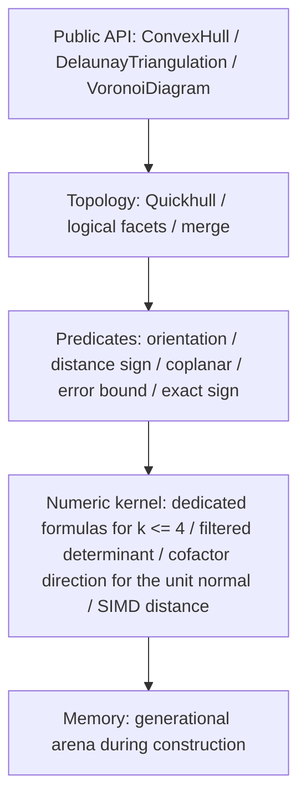

# convx design

A pure Rust library for n-dimensional convex hulls, Delaunay triangulations, and Voronoi diagrams. Correctness is ordered as the sign of a geometric predicate, the topological decision from that sign, and the mutation that follows the decision. Public results are compared as normalized logical facets.

The specification is fixed here before implementation. Speedup targets are set after the sequential core exists, by measuring Qhull.

This file and [design.ja.md](design.ja.md) both carry the full specification. When they differ, follow `design.ja.md`.

---

## 1. Predicates decide the sign

An input `f64` is the coordinate its bit pattern names. Predicates do not translate or scale first. A rounded transform moves the exact zero.

Error is only the rounding of evaluating that predicate's expression. Each predicate returns `Sign`. It does not return `f64`.

```rust
pub enum Sign {
    Negative,
    Zero,
    Positive,
}
```

Coplanar means the orientation is `Zero`. Which side of a facet a point is on is the orientation of an affinely independent set of points of that face and the query point. Cospherical means the lifted orientation is `Zero`. The filter carries an absolute error bound for the sequence of additions, subtractions, and multiplications actually performed. If that bound does not include FMA rounding, the evaluation does not contract to an FMA. When the absolute value of the computed value exceeds the bound, that sign is kept. Otherwise the predicate falls back to the exact sign of the same polynomial. The same fallback applies when the computed value and the bound are both 0 and the expression is not identically 0. A value that became 0 by underflow is not decided to be zero. The exact-evaluation algorithm is not fixed by this specification. Own code is allowed, and so is an extra crate that is not on the dependency list. The returned sign must match the sign of this polynomial. The build fails with `ExactEvaluationExhausted` only when the work space for exact evaluation cannot be allocated. An ordinary `Vec` allocation failure aborts, as Rust does by default. Ill-conditioning itself is not a failure.

The public API has no tolerance parameter. Coplanar uses only that the exact sign of the distance is zero.

The orientation of the sign is fixed as follows.

- If $x \cdot n + \mathrm{offset} > 0$, the point is outside the plane.
- The plane is $x \cdot n + \mathrm{offset} = 0$. $n$ is the outward unit normal.
- Orientation is the exact sign of a determinant. The $x \cdot n + \mathrm{offset}$ of a published plane (§5) is not used for this decision.
- Geometric degree $k$ is one less than the number of argument points. It is independent of the hull dimension $D$. For $k \le 6$, that is up to seven points, the sign is decided in stages.
  - The first stage evaluates the determinant in `f64`. For $k \le 5$ it is a dedicated formula, with an error bound derived for that formula in advance. For $k = 6$ it is the filtered floating-point determinant with its running bound, which was measured faster than a dedicated formula there (#350).
  - When the first stage does not certify the sign, a second stage evaluates a dedicated formula in double-double arithmetic, with its own bound derived in advance. A double-double value is the unevaluated sum of two `f64`. A product is split exactly by Dekker's method, so no FMA is needed and the result does not depend on the target's instructions. The stage takes only coordinates in a range where its proof holds with no underflow or overflow; it leaves any other input to the exact sign.
  - Only when neither stage certifies does the predicate fall back to the exact sign. No other stage runs between them.
  - Before the second stage, and before the running filter wherever it runs, a matrix with a coordinate column of zeros decides zero: every point has the origin's coordinate there, and a direction row, if any, is zero there. This is exact, since `a - b` is zero in `f64` exactly when `a == b`. No bound can certify a zero, and on inputs on hyperplanes parallel to the axes most zero signs are of this kind (#368).

  How a formula is expanded is left to the implementation. Each bound is proved where it is implemented, overflow and underflow included, and no product on the common path has a subnormal factor. When $k$ exceeds 6, the predicate evaluates a filtered floating-point determinant and falls back to the exact sign only when the value lies inside the bound.
- The public unit normal of a facet, for any number of points, is the unit direction of the facet's cofactor vector, whose entry $c_j$ is the determinant of the edges followed by the unit row $e_j$, oriented outward. The working normal used by distance scans is the same direction. That direction is certified with an error bound by the predicate filter. When the bound exceeds $10^{-10}$, it is computed exactly and rounded once when it is made unit. Householder QR is not used. The certified direction is more accurate than the QR normal was, and its error bound is guaranteed (ADR 0002). When a facet has $n \ge 5$ points, the filter evaluates every cofactor from one elimination of the $(n-1) \times n$ edge matrix $E$. Gaussian elimination with partial pivoting over its first $n - 1$ columns gives $[T \mid u]$ with $T$ upper triangular, after $s$ row swaps. Adding a multiple of one row to another leaves every maximal minor of $E$ unchanged, and a swap flips its sign. If $T x = u$, then $E$ maps $(-x, 1)$ to zero, and Cramer's rule gives $c = (-1)^s \det T \cdot (-x, 1)$. The filter carries a running bound through the elimination, the back substitution for $x$, and the products with $\det T$, so each $c_j$ has its own bound, as when it was a separate determinant. A divisor whose sign the bound does not certify leaves the cofactors uncertified, and the direction is computed exactly. The normal points to the side where the orientation of the ordered facet vertices has the outward sign. That side is proved from the error bound, and no determinant is evaluated. Let $u = c/|c|$ be the exact unit cofactor direction and let $|v - u| = e < 1$. Then $|v| \ge 1 - e$ and $v \cdot u = (|v|^2 + 1 - e^2)/2 \ge 1 - e > 0$. The orientation sign is the sign of $v \cdot c$, so $v$ lies on the positive side. The certified error is at most $10^{-10}$, or $D \cdot 2^{-49}$ when computed exactly, so the proof holds for the working normal and for the public normal.

A SIMD distance scan culls points the error bound proves strictly inside, removing them from the predicate's inputs. The side of a point against a facet, which decides visibility and outsideness, is the exact orientation sign of the facet's vertices, in outward order, and the point. The working distance may prove that sign before the orientation is evaluated, but only a strict one. When the computed distance $w$ is beyond the certified threshold $(\mathrm{slope} \cdot l + \mathrm{floor})(1 + 4u)$ on either side, the true distance to the exact plane has the same strict sign, and so does the orientation. Every other case, including a sign of zero, is decided by the orientation. The threshold is the one the cull uses: $|n - u^*| \le \tau$ and the rounding of $w$ bound $|w - (x - o) \cdot u^*|$ in absolute value, so the proof holds in both directions. $\tau$ comes from what certified the working normal. When the filtered cofactors certified it, they certify $\tau$ too. When the normal is the exact direction rounded once, its error bound $D \cdot 2^{-49}$ is $\tau$. So a facet whose filtered elimination cannot certify a pivot, as on integer edges with a pivot that is exactly zero, has a cull plane too. Every certified working normal therefore has a cull threshold. A facet without a certified working normal uses the orientation only. The result is the same sign either way.

Dimension is decided by predicate signs. The basis grows one point at a time. If the new point has exact sign zero against the existing basis, that direction does not span the space.

---

## 2. Layers



Numeric distance and the predicate that settles the sign stay separate. The former may be fast. The latter decides topology.

---

## 3. Conditions for accepting input

`dim == 0` fails with `NonPositiveDimension`. This check runs before any division or remainder. $D \ge 1$, and there is no upper bound on dimension. In high dimensions the bit length and the time of exact evaluation grow. That cost is the caller's. Dimension alone does not reject the input. The number of input points is at most `u32::MAX`. Above that, `TooManyPoints` fails before duplicate removal. Public indices stay `u32`. A valid point number is at most `u32::MAX - 1`, so `u32::MAX` can be used as a missing index that does not collide with a point number.

If `points.len()` is not a multiple of $D$, the call fails with `LengthMismatch`. Coordinates are row-major `&[f64]`. After validation, points are taken with `chunks_exact(D)`. The range of point `i`, `i*D .. (i+1)*D`, lies inside the slice. One non-finite coordinate fails the whole input with `NonFiniteCoordinate { index }`. `index` is the point number. Walking the input in order, it is the first point that has a non-finite coordinate.

Preprocessing after that is in this order.

1. Reject non-finite coordinates
2. Aggregate duplicates
3. Check the count
4. Check the rank
5. Construct

Duplicates are decided by `==`. `-0.0` and `+0.0` are the same point. Equality is not `to_bits` and not `total_cmp`. An implementation that orders points before choosing a representative canonicalizes signed zero to `+0.0` before the comparison. The representative of coincident points is the smallest input index. Fewer than $D + 1$ representatives fails with `InsufficientPoints { actual, required }`. `actual` is the number of representatives. `required` is $D + 1$.

If there are at least $D + 1$ representatives and the affine dimension is still below $D$, the call fails with `DegenerateDimension { actual_dim, spanning_points }`. A caller that projects uses the returned `spanning_points`. `spanning_points` is the sequence obtained by walking representative indices in ascending order and keeping only the points that strictly raise the affine dimension. Its length is $\textit{actual\_dim} + 1$. This sequence is the lexicographically minimum basis.

```rust
pub enum ConvexHullError {
    NonPositiveDimension,
    LengthMismatch { len: usize, dim: usize },
    /// Point number. The first point, in input order, that has a non-finite coordinate.
    NonFiniteCoordinate { index: usize },
    TooManyPoints { actual: usize },
    InsufficientPoints { actual: usize, required: usize },
    DegenerateDimension {
        actual_dim: usize,
        spanning_points: Vec<u32>,
    },
    /// The hull topology was decided, and a public plane could not be made a finite f64.
    /// Returned by ConvexHull::planes(), not by build(). The plane is not used for topology.
    NonFiniteFacetPlane,
    /// The Delaunay topology was decided, and a circumcenter could not be made a finite f64.
    /// This is not a geometric degeneracy. The hull and the Delaunay triangulation do not return this error.
    NonFiniteCircumcenter,
    /// The work space for exact evaluation could not be allocated.
    /// An ordinary Vec allocation failure aborts, as Rust does by default.
    ExactEvaluationExhausted,
}
```

### Index partition

A successful build assigns every input index one destination.

`representative` is a `Vec<u32>` of length n. If `i` is a representative, `representative[i] == i`. If it is a duplicate, the entry points at the representative's index. `representative[representative[i]] == representative[i]`.

The representative set splits into the following three lists. Each is ascending. They are pairwise disjoint. Their union is the representative set.

| List              | Contents                                                                        |
| :---------------- | :------------------------------------------------------------------------------ |
| `vertices`        | Extreme points of the convex hull. Removing one changes the hull                |
| `coplanar_points` | Points on the boundary that are not extreme. Indices only, with no owning facet |
| `interior_points` | The interior of the convex hull                                                 |

`ConvexHull` owns these three lists. `representative` is attached to the hull, the Delaunay triangulation, and the Voronoi diagram.

Delaunay and Voronoi sites are the entire representative set. Interior points and non-vertex boundary points are sites. Nearby points that differ in bits and fail `==` are not snapped to one point.

Classification runs after outside points have been absorbed and adjacent coplanar simplices have been merged into one logical facet. The distance sign here is the orientation of $D$ affinely independent points of that face and the query point. The inner product of the public plane is not used.

- If the distance to some logical facet is strictly positive, the point is outside. A successful result contains no outside point.
- If the distance to every facet is strictly negative, the point is interior.
- Construction may prove this first. A point that construction drops while every sign it tested was strictly negative is interior, and needs no sign against the logical facets. The facets tested are every facet of the initial simplex, or, when the point was in the outside set of a visible facet or was a vertex of only visible facets, every new simplex of that insertion. A point the cull proves inside counts as strictly negative (§6). In the first case the point is strictly inside the initial simplex, and the interior stays interior as the hull grows. In the second case, let $P$ be the hull the insertion is planned against, $a$ its apex, and $Q = \mathrm{conv}(P \cup \{a\})$. Every new simplex contains $a$. Their supporting planes are the planes through $a$ and the horizon ridges, and the intersection of their closed inner sides is the cone from $a$ over $P$. The point $p$ is strictly inside all of them, so the ray from $a$ through $p$ meets $P$ at some point $y$. The point $p$ was strictly outside a visible facet $f$. The apex is strictly outside $f$ too, and $y$, being in $P$, is on or inside the plane of $f$. A ray crosses one plane once, so $p$ lies on the open segment from $a$ to $y$, and $p \in Q$. Against a kept facet $g$, both $a$ (which does not see $g$) and $y$ are on or inside the plane of $g$, so $p$ is too, and $p$ is on that plane only when $a$ and $y$ both are. If $a$ is on the plane of $g$, the face of $Q$ in that plane contains the vertex $a$, so a new simplex lies in that plane with the same outer side, and $p$ would have sign zero against it. So $p$ is strictly inside every facet plane of $Q$: it is in the interior of $Q$. Each insertion is planned against the hull as it is at that point, and the final hull contains $Q$, so $p$ is in the interior of the final hull. Third, a vertex $v$ of $P$ whose every incident simplex is visible stops being a vertex of the complex after the insertion. It is interior too when its sign against every new simplex of that insertion is strictly negative. Since $v \in P$, it is on or inside the plane of every kept facet $g$. Suppose it is on that plane. The face of $P$ in that plane contains $v$ and is covered by boundary simplices in that plane. The boundary is a simplicial complex, so a simplex that contains $v$ has $v$ as a vertex. That simplex has the plane and outer side of $g$, so its sign against $a$ is that of $g$, and it is kept. Then $v$ is a vertex of a kept simplex, against the assumption. So $v$ is strictly inside every facet plane of $Q$, and it is in the interior of $Q$. As in the second case, the final hull contains $Q$, so $v$ is in the interior of the final hull. A point with any zero sign is classified by the rules here.
- If some facet has distance exactly zero and the rest are negative or zero, the point is on the boundary. When several faces have distance zero, the test is per face.
- Construction may record that a point is on a plane. Every simplex carries a plane number. A new simplex takes the number of the facet across its horizon ridge when the exact sign of the apex against that facet is zero, and a new number otherwise. The facets of the initial simplex take new numbers. In the first case the horizon ridge and the apex lie in the supporting plane of the facet across, and the new simplex has $D$ affinely independent vertices, so that plane is its supporting plane too. The hull before the insertion is on the inner side of both, and it is not contained in the plane, so the outer side is the same. All simplices with one number therefore have one supporting plane and one outer side, and a point has one sign against all of them. When the exact sign of a point against a simplex is zero, the pair of the point and the simplex's number is recorded. A later sign of that point against a simplex with that number is zero, and is not evaluated. Two simplices in one plane may carry different numbers; a pair that is not recorded is evaluated as before. A record changes no sign, so it changes no outside set, no proof of interior, and no published value. The sub-hulls that classification builds for coplanar faces are ordinary builds and record the same way. $D = 1$ and $D = 2$ build no simplex by insertion and record nothing.
- Classification may start from a record. Let $p$ be a point with a recorded number that a simplex of the final complex carries, and let $F$ be the logical facet of that simplex. The distance from $p$ to $F$ is zero. Because $p$ is in the hull, the facets at distance zero from $p$ are the facets that contain $p$, and these are the facets that contain $G$, the smallest face of the hull that contains $p$. The faces that contain $G$ form the face lattice of a polytope, and the facets of a polytope are connected through its ridges, so any two facets that contain $G$ are joined by a chain of facets that contain $G$, each sharing a ridge with the next. Two logical facets that share a ridge are neighbors, because the boundary simplices that cover the ridge each lie in one simplex of either facet. So starting at $F$ and moving to a neighboring logical facet only when its distance from $p$ is zero reaches every facet at distance zero. Every other facet is at strictly negative distance, and its sign is not evaluated. A point with no recorded number on a simplex of the final complex is tested against every logical facet.
- On a face of distance zero, let the vertex set be $V$. Whether the point is outside $\mathrm{conv}(V)$ is decided by orientation on the input coordinates as they are. The ridges used are those that, in the face's current triangulation, belong to exactly one simplex of this face. Let $a$ be the vertex of that simplex that is not on the ridge. $q$ is the extreme point of smallest index that is not in $V$. Point $p$ is outside that ridge when the signs of $\mathrm{orient}(R, p, q)$ and $\mathrm{orient}(R, a, q)$ are both nonzero and opposite each other. For $D = 1$ there is no such ridge, and no boundary point other than the endpoints appears. If the point is outside on one or more faces, it goes into `vertices` and is added to the vertex set of every face where it was outside. If it is outside on no face, it goes into `coplanar_points`.
- Vertices of the simplicial complex are classified by the same rule. A vertex that was extreme when it was inserted can later fall in the relative interior of an edge or a face, because strict visibility leaves a coplanar neighboring simplex in place. A face's vertex set is the set of extreme points of its simplicial vertices together with its distance-zero points. A simplicial vertex that is no longer extreme goes into `coplanar_points`.
- Every face except a single simplex whose vertices are all extreme is triangulated by placing its extreme points in index order. A point that raises the affine dimension of the points placed so far is joined to every current simplex. A point that does not is outside the hull of the points placed so far, because it is extreme. It is joined to every boundary ridge it is strictly beyond. Being beyond is decided by exact orientation within the current affine span: the ridge's remaining vertex and the point lie strictly on opposite sides of the ridge. Neighbors are recomputed from the new simplices.
- When two faces share a lower face that is not a simplex, both must split it the same way, or the boundary simplicial complex does not close. The placing triangulation restricted to a face is the placing triangulation of that face in the same order, so every face agrees. Re-triangulating only the faces that gained a vertex, each from its own lexicographically minimum basis, does not guarantee this agreement.

---

## 4. Simplices and memory

A facet of a $D$-dimensional convex hull is a $(D-1)$-simplex. It has $D$ vertices, $D$ neighboring facets, and a $D$-dimensional normal. A face in 3D is a triangle of three vertices.

Delaunay builds simplices of $D+1$ vertices in dimension $D$ directly, by the incremental insertion of §7. The facet rules of the hull do not apply.

```rust
/// A simplicial facet during construction. D is the engine dimension.
struct Simplex {
    vertices: Vec<u32>,   // length D
    neighbors: Vec<FacetId>, // length D. The far side of each ridge
    normal: Vec<f64>,     // length D. Working normal during construction
    offset: f64,
    group: GroupId,       // Logical facet. A u32 that exists only during construction
    flags: u32,           // tombstone and reserved bits
}
```

`GroupId` is a `u32` that exists only during construction. It is not a public type.

Numbers after publication are `u32` values packed after deletions. The generation on `FacetId` is used only to prevent dangling references during construction. Public API numbers are packed indices. A logical facet's plane is owned by the group and stored apart from each simplex's working normal.

The arena is a generational index in chunks. Construction has one thread inserting one point at a time and changing the hull in place (§6). Linking logical groups may be Union-Find, or a rebuild after construction.

For $D = 1$, a facet is a single endpoint. The neighbor list is empty. The two endpoints are the logical facets, and the volume is the absolute difference of the endpoint coordinates $|x_{\max} - x_{\min}|$.

---

## 5. Logical facets

While points are being inserted, the complex stays simplicial. After every point has been inserted, only simplices that are exactly coplanar across a shared ridge are merged into one logical facet. There is no merge during insertion. After the merge, the distance-zero classification of §3 runs. A face that is not a simplex is triangulated by the placing procedure in §3.

A connected boundary on one supporting plane is one logical facet, because one supporting plane of a convex polyhedron cuts one face. Whether a point becomes a vertex, a non-vertex on the boundary, or an interior point is decided by the classification in §3.

The public shape is the same in every dimension. A logical facet holds no `Vec` of its own. `ConvexHull` keeps the vertex lists and neighbors of every facet in flat arrays and publishes each facet as a borrowed view (§9). The planes of the facets are a second view, `planes()`, numbered like the facets and computed on first use.

```rust
pub struct Facets<'a> { /* borrows the ConvexHull */ }

impl<'a> Facets<'a> {
    pub fn len(&self) -> usize;
    pub fn is_empty(&self) -> bool;
    /// By public facet number. An out-of-range number returns None.
    pub fn get(&self, facet: u32) -> Option<Facet<'a>>;
    /// In public number order.
    pub fn iter(&self) -> impl ExactSizeIterator<Item = Facet<'a>> + 'a;
}

#[derive(Clone, Copy)]
pub struct Facet<'a> { /* borrows the ConvexHull */ }

impl<'a> Facet<'a> {
    /// Extreme points, ascending.
    pub fn vertices(&self) -> &'a [u32];
    /// Set of neighbor facet numbers, ascending.
    pub fn neighbors(&self) -> &'a [u32];
}

pub struct Planes<'a> { /* borrows the ConvexHull */ }

impl<'a> Planes<'a> {
    pub fn len(&self) -> usize;
    pub fn is_empty(&self) -> bool;
    /// By public facet number. An out-of-range number returns None.
    pub fn get(&self, facet: u32) -> Option<Plane<'a>>;
    /// In public facet number order.
    pub fn iter(&self) -> impl ExactSizeIterator<Item = Plane<'a>> + 'a;
}

#[derive(Clone, Copy)]
pub struct Plane<'a> { /* borrows the ConvexHull */ }

impl<'a> Plane<'a> {
    /// Length D. Outward unit vector.
    pub fn normal(&self) -> &'a [f64];
    /// Offset of the plane x·n + offset = 0.
    pub fn offset(&self) -> f64;
}
```

For $D = 1$ and $D \ge 3$, facets are ordered by lexicographic vertex lists, and the number in that order is the public number. For $D = 2$ the facets are the edges of the boundary cycle. The cycle runs counterclockwise from the smallest vertex, and facet $i$ joins its $i$-th and $(i+1)$-th vertex; the last facet joins the last vertex to the first. The construction of §6 leaves the hull as that cycle, up to where it starts, so this numbering needs no sort. A facet's vertex list is ascending in every dimension. `neighbors()` is the set of neighbor facet numbers, ascending. A slot's position does not correspond to a shared ridge. A shared ridge is a face of affine dimension $D-2$ in the intersection of the two vertex sets. The ridge's vertex list is not public. For $D \ge 3$, ascending neighbor numbers agree with the lexicographic order of the other facet's vertex list. For $D = 2$ the neighbors of facet $i$ are facets $i - 1$ and $i + 1$, modulo the number of facets.

What `build()` computes and what is computed on first use follows from what each value needs:

- `build()` computes the representatives, the partition into vertices, non-vertex boundary points, and interior points, the vertex list of every facet, the boundary simplices, and the coordinates of the vertices. The partition needs the input coordinates, which the result does not keep, and the vertex list of a coplanar facet needs the points on it. A boundary simplex of a facet that is split again needs exact signs (§3).
- For $D = 2$, one pass over the boundary cycle writes, in public order, every facet's vertex pair and neighbor pair and every boundary simplex. Each has a fixed length, so the lists need no start positions, and nothing is sorted.
- For $D = 1$ and $D \ge 3$, `build()` keeps the facets and their neighbors in the order and numbering that classification leaves. The public numbering is computed on first use: the first call that reads a facet number orders the vertex lists and renumbers the neighbor lists and the facet of each boundary simplex, and the hull keeps the result. Those calls are `facets()`, `planes()`, `triangulation()`, `volume()`, `boundary_cycle()`, and comparison. Numbering is a sort and a relabelling of what `build()` computed, so it cannot fail and returns no `Result`.
- The planes (below) and the public order of the boundary complex (`triangulation()`) are computed on first use as before.

A caller that reads every value pays what `build()` used to compute, once.

The plane is built from that facet's vertices. Walking index tuples in lexicographic order, the first $D$ points that are affinely independent are chosen. A tuple whose exact sign is zero is skipped, and the walk continues to the next tuple. The coordinates the predicate sees are the input bit patterns as they are. Only the public plane is built in the following order.

1. Take the certified cofactor direction of §1 as the normal. Only when it is computed exactly are the coordinates first scaled uniformly by a power of two; the scaling does not change the direction
2. Make it unit length
3. Match the sign to the orientation proved from the error bound, with inside negative
4. Take the offset as $-n \cdot r$, where $r$ is the first point of the basis

The published unit normal $n$ lies within Euclidean distance $10^{-10}$ of $\hat c = c / \lVert c \rVert$, the unit direction of the cofactor vector $c$ of the $D$ points the plane is built from, oriented so that the inside is negative (for $D \le 56294$).

$$
\lVert n - \hat c \rVert_2 \le \varepsilon \le 10^{-10}
$$

The bound follows from §1. The published normal is the certified direction itself, within its error bound $\varepsilon$ of the true $\hat c$. $\varepsilon$ is at most $10^{-10}$ for a direction certified by the filter, and $D \cdot 2^{-49}$ when it is computed exactly. Both are at most $10^{-10}$ when $D \le 56294$. The normal depends only on the $D$ points the plane is built from, not on the vertex order of a simplex during construction. The bound does not affect topology, and values across versions are still not promised to agree.

`build()` does not compute a plane. The first call of `planes()` computes the plane of every facet and keeps them in the hull, and every later call returns what was kept. Calls from several threads return the same kept planes. If a normal or an offset is non-finite, `planes()` returns `NonFiniteFacetPlane`, on that call and on every later one, and publishes no plane: the input decides that failure, so it is kept like the planes. `planes()` can also return `ExactEvaluationExhausted` (§3), when the work space of an exact evaluation cannot be allocated. That failure is not kept, and the next call computes the planes again. `NonFiniteFacetPlane` means the hull topology was already decided and a public plane could not be made a finite `f64`; `build()` has succeeded, and the facets, the partition, and the boundary complex are available. The plane is not used for the topology decision. The same binary decides the plane by this procedure. Bit-identical floats across versions are not promised.

For $D \le 3$, the boundary cycle is derived from the stored vertex set and the outward order of the boundary simplices. The start vertex is the minimum index. The direction agrees with the outward normal. The cycle is not the stored form itself. For $D = 1$, `boundary_cycle` is `Some` and contains that single endpoint. For $D = 2$ it is the two endpoints. For $D = 3$ its length is at least 3. A logical facet for $D \ge 4$ is a $(D-1)$-dimensional polyhedron, so a cycle is not defined. `boundary_cycle` returns `None` for $D \ge 4$.

`triangulation()` returns the boundary simplicial complex. Like the planes, the public order of its simplices is computed on first use: the first call that reads the complex in order (`triangulation()` or `volume()`) orders the simplices, and the hull keeps that order. Ordering cannot fail. `boundary_cycle()` does not need the order. Each simplex has $D$ vertices. It is not a decomposition of the hull interior into $D$-simplices. For $D = 1$ each simplex is one endpoint, and there is no swap. For $D \ge 2$, vertices are stored in ascending order and only the last two points are swapped so that the order is outward. The split of a coplanar region need not be geometrically unique, and it may change when the version changes. Within the same binary, the split does not depend on the order of insertion (§6).

`volume()` returns the volume of the polyhedron. It is not used for topology. A successful build does not promise that the return value is finite. For $D = 1$ the volume is $|x_{\max} - x_{\min}|$. For $D \ge 2$, let $r$ be the extreme point of minimum index. Each boundary simplex, in the outward order that swaps the last two points as `triangulation()` does, contributes its signed `f64` volume with $r$. A term that includes $r$ may be 0. The addition order is the lexicographic order of the ascending vertex lists before the swap. The terms are added from the left in that order, and the absolute value is returned at the end. Agreement with other implementations is judged by the relative error of each fixture.

Which points form the initial simplex is not fixed by the specification in general. The exception is flat-lift Delaunay, where the pulling triangulation of §7 decides the simplices. The triangulation of a face that is not a simplex is decided by the placing procedure in §3, so the published hull depends neither on the initial simplex nor on the order of insertion. The choice of initial simplex remains a reason that Delaunay's cospherical splits may change across versions.

---

## 6. Construction

The hull in $D = 1$ is the two endpoints. In $D = 2$, the hull is the chain of strict turns. Before the chain is built, the points that can be proved inside are set aside. In each of eight directions ($\pm x$, $\pm y$, $\pm x \pm y$) the farthest representative is taken, and the smaller input index on a tie. The chain of strict turns of those points is the polygon used to discard. A point that the filtered orientation proves strictly left of every edge of that polygon is an interior point of the hull: the polygon's vertices are input points, so its strict interior lies in the strict interior of the hull. A point that is not proved stays, and the chain of the points that stay is the hull. When the polygon has fewer than three vertices, no point is discarded. No point is discarded either when discarding would not pay: up to 1024 representatives are taken at an even stride in input order, and fewer than one in 32 of them is proved inside. A point that is not discarded is handled by the chain and by classification, so this choice changes neither the hull nor the partition. The eight directions are compared as `f64` sums and differences. Their rounding changes only which input points the polygon takes, not the hull or the partition. Every $D \ge 3$ input absorbs points by Quickhull. If a point is strictly outside a facet, that facet is visible. Outsideness is the strict sign of the orientation. The certified working distance may prove that sign first (§1); otherwise the orientation is evaluated, unless a record of §3 already gives a zero. The boundary ridges of the visible region are the horizon. The face across the horizon whose neighbor slot is rewritten is called $N$.

The sequential build inserts outside points one at a time and changes the hull in place. Each inserted point is strictly outside some facet of the hull at that point. Which point is inserted, and in what order, is a deterministic order the implementation chooses, decided by the values and the order of the input alone. The visible region is removed, a new simplex joins the point to each horizon ridge, the outside sets of the removed facets are assigned again to the new simplices, and then the next point is taken. Each point is planned against the hull as it is at that point and applied at once. There is no reservation and no round.

The published hull does not depend on the order of insertion. A logical facet is unique as a face of the polytope, and its plane is decided by its vertex set alone through the procedure of §5. A face that is not a simplex is split by the placing triangulation of §3, and a face that is a simplex is itself. The index partition is decided by whether a point is extreme, a non-extreme boundary point, or interior. `volume()` adds its terms in the order that triangulation fixes. So any construction that reaches the same hull returns the same published result. A parallel construction may rely on this uniqueness.

The hull is built sequentially only. The builders have no parallel switch.

The parallel build of earlier versions absorbed points by a batch extraction per round and a commit in input-index order. The extraction took the first $K = 64$ candidates by outside distance and reserved their visible facets and horizons. Measured, it did not beat the sequential build beyond the spread even on four threads. The extraction and the commit were serial, and a round's planning did not pay for waking the threads (`docs/adr/0004-sequential-hull-only.md`). It is no longer part of the specification, and neither is the `parallel` flag that selected it. A parallel hull construction returns to this section, with its public API, when a scheme that beats the sequential build by measurement is decided through a Grill.

Delaunay and Voronoi also run the one incremental insertion of §7, and the hull core they call for a flat lift is the same sequential construction.

After construction, no remaining facet has any input point strictly outside it.

What the public result promises across versions, after normalization, is that logical-facet vertex sets and neighbor sets agree. Identical output bytes across versions are not promised.

---

## 7. Delaunay

The Delaunay triangulation in dimension $D$ is the lower convex hull of the following lift, projected back to the original space.

$$
x_{D+1} = \|x\|^2
$$

The input array is not extended. The formula is the definition. This height is passed to the exact sign as the polynomial $\sum_i x_i^2$ in the input coordinates. If an intermediate `f64` is non-finite, the filter is skipped and evaluation continues to the exact sign. That input is not rejected. An implementation may cache the coordinates. Whether a cache exists must not change the observable simplices or signs.

Insphere is defined as the orientation of this lift. Another algebraic expression is allowed only when its sign agrees with this definition.

Construction is incremental insertion. The representative sites are added one at a time, in a deterministic order the implementation chooses. The order depends only on the values and the order of the input. At every step the complex is the projection of the lower hull of the lift of the sites added so far. The outside of the site hull is represented by outside simplices, each a facet of that hull with one vertex at infinity. Adding a new site $q$ removes the simplices that conflict with $q$ (the cavity) and fills it with the simplices that join $q$ to each face on the cavity's boundary. Conflict is decided by these exact signs.

- A finite simplex conflicts with $q$ when $q$ lies strictly inside its circumsphere. Inside is decided by whether the lifted orientation of the simplex's vertices, in positive order, followed by $q$ has the sign it has for a point interior to the simplex. Zero (cospherical) is not a conflict.
- An outside simplex conflicts with $q$ when $q$ lies strictly outside the supporting hyperplane of its facet. When $q$ lies on that hyperplane, it conflicts only when it lies strictly inside the facet's circumsphere within the hyperplane. That test is decided by exact signs too, not by a rounded projection.

The cavity is connected, and after it is removed and filled the complex is the projection of the lower hull of the lift of the sites with $q$ added.

The insertion may be specialized for a dimension. It is one procedure, compiled separately for $D = 2$ and for $D = 3$, with coordinates in fixed-size rows and the predicate formulas called directly, and once for every other dimension. Every specialization runs the same insertion order and decides every conflict and every orientation by the same exact signs, so it publishes the same triangulation, the diagonals among cospherical sites included. The specialization does not appear in the public API (`docs/adr/0005-specialize-the-delaunay-insertion.md`).

$D = 2$ has an insertion of its own, by edge flips (`docs/adr/0007-flip-insertion-for-delaunay-d2.md`). It walks from the last insertion to the triangle that contains the site and splits it into three; a site on an edge splits the two triangles of that edge into four. It then flips every edge whose far vertex is in conflict with the site. The vertex at infinity is a vertex like the others, and a triangle at infinity is in conflict when the site is strictly beyond its hull edge or inside it. The insertion order, the stored sites, and the predicates are those of the generic insertion, and it publishes the same simplices, neighbors, and split of cospherical groups. The published order is its construction order. A face whose in-circle test was zero during the flips is recorded cospherical; the pass after the insertion and publication are shared with the generic insertion. The generic insertion still runs $D = 2$ under a test-only switch, and a test compares what the two publish.

When the original sites span $\mathbb{R}^D$, the lifted affine dimension being $D$ is the same statement as every point lying on one sphere. In that case no conflict is decided by insertion, and the interior of the site hull is filled by a pulling triangulation. The boundary is obtained inside Delaunay by calling the hull core on the original $D$-dimensional sites. The public `ConvexHullBuilder` is not used. Failure to build a public plane does not fail this split. Let $v$ be the vertex of minimum index. The vertex set of a boundary face that does not contain $v$ is split by the same rule. If that vertex set is already a simplex, the procedure stops and returns that simplex. Otherwise $v$ is added to each simplex obtained by recursion. This case does not use the incremental insertion; the affine dimension of the lift is known before construction. When only some points are cospherical, the diagonal is decided by the incremental insertion. Uniqueness across versions is not promised.

Delaunay returns `DegenerateDimension` only when the affine dimension of the original sites is below $D$. When the original sites span $\mathbb{R}^D$, the lifted points fail to span $\mathbb{R}^{D+1}$ only when every site is cospherical and the lift is flat. The build still succeeds then, as a triangulation of the site hull. This procedure stays inside Delaunay and is not exposed on `ConvexHullBuilder`. The public convex hull still fails, as before, when the affine dimension is below $D$.

Published simplices are only the projection of the lower hull. Vertices are stored in ascending order, and a swap of the last two points makes the orientation positive in the original space. When the exact orientation is zero, the ascending order is kept.

When the orientation of the lifted points is exactly zero and several diagonals exist, the build returns the split chosen by that version's insertion order. Which of the sites are extreme is unique, so the extreme set is promised. The same binary returns the same diagonals for the same input. Agreement of diagonals across versions is not promised.

Dimension degeneracy is reported from the affine dimension of the input sites. The indices used in the report are those of the original sites. The report does not use the dimension count of the lift.

```rust
pub struct DelaunayTriangulation { /* private */ }

impl DelaunayTriangulation {
    pub fn dim(&self) -> usize;
    pub fn representative(&self) -> &[u32];
    pub fn simplices(&self) -> Simplices<'_>;
}

pub struct Simplices<'a> { /* borrows the DelaunayTriangulation */ }

impl<'a> Simplices<'a> {
    pub fn len(&self) -> usize;
    pub fn is_empty(&self) -> bool;
    /// By simplex number. An out-of-range number returns None.
    pub fn get(&self, simplex: u32) -> Option<DelaunaySimplex<'a>>;
    pub fn iter(&self) -> impl ExactSizeIterator<Item = DelaunaySimplex<'a>> + 'a;
}

#[derive(Clone, Copy)]
pub struct DelaunaySimplex<'a> { /* borrows the DelaunayTriangulation */ }

impl<'a> DelaunaySimplex<'a> {
    /// Length D+1. Orientation is as in the text.
    pub fn vertices(&self) -> &'a [u32];
    /// Length D+1. The simplex number across the shared face. u32::MAX if none.
    pub fn neighbors(&self) -> &'a [u32];
}
```

The vertices and the neighbors of the simplices are each kept as one flat array of rows of length $D+1$. A simplex number is the position in that order. A slot with no neighbor holds `u32::MAX`. Point numbers are below `u32::MAX`, so this value does not name a point. The simplices are in an order the construction decides. It is deterministic: the same binary gives the same order for the same input. It is not promised across versions, nor for a permutation of the input, and the steps that produce it are not part of this specification. No order is computed for publication, because a caller of a triangulation reads its simplices, and an order computed on first use would only move the cost of sorting them. The neighbors are numbered in the same order. A caller that needs another order sorts the simplices itself.

---

## 8. Voronoi

The Voronoi diagram is the dual of the Delaunay complex before diagonals are inserted. The published `DelaunayTriangulation` is that complex cut into simplices. It is not built by another algorithm. Degeneracy, duplicates, and cospherical points are handled as for the hull and for Delaunay. Voronoi has no rule of its own.

A finite Voronoi vertex is one lower logical facet of the lifted convex hull. Simplices that are exactly coplanar across a shared ridge, by the lifted orientation, are merged into one by walking neighbors. This merge does not depend on the order in which the complex was built. Closeness of the `f64` circumcenter is not the reason to merge. When the whole set is flat there is one lower facet, so there is one Voronoi vertex. It is not split per simplex of the pulling triangulation. The incident sites are the union of the sites of the member simplices, duplicates removed, in ascending order. The length is at least $D+1$. The coordinates are computed by taking the member simplex whose vertex list is lexicographically minimum, translating one vertex to the origin, and computing the circumcenter. If that value is non-finite, the next simplex in the same lexicographic order is tried. If every one is non-finite, the build fails with `NonFiniteCircumcenter`. This error is not a geometric degeneracy. Delaunay simplices and neighbors are published as they were before the merge. Every vertex coordinate of a successful diagram is finite. The hull and the Delaunay triangulation do not compute a circumcenter. Circumcenter rounding is not used to decide topology.

A `VoronoiInterface` is built only when two cells meet in dimension $D-1$. An interface whose `vertices` are empty is not built. When two distinct Voronoi vertices both contain sites $a$ and $b$, and the edge $ab$ is a face of both cells, that interface has finite vertices as its ends. When only one vertex contains $a$ and $b$, and the edge $ab$ lies on a logical facet of the site hull, that interface carries a ray. A diagonal interior to the site set of the same vertex is not an interface. A finite boundary face in $D = 1$ is a single vertex, and `rays()` may be empty. An interface that is only rays is not built.

There is one ray for each pair of a merged Voronoi vertex and a logical facet of the site hull in the original space such that the vertex's group polytope has a face of dimension $D-1$ lying in that facet. The direction is the outward unit normal of that logical facet. The same facet with a different apex is a different ray. A cell holds that ray when its site lies on that face, that is, when it is one of the group's sites on the facet's hyperplane. When the facet has no boundary site that is not extreme, this is the same as the site belonging to both the facet and the vertex. When a boundary face has several rays, those rays are the ends of that face. A direction between adjacent normals is not a separate object. A successful result always has an apex. A configuration that cannot have an apex has already failed, before construction, as a dimension degeneracy of the original sites. For $D \le 3$, the boundary cycle of a boundary face is derived from the finite vertices and the rays. The stored form itself is the vertex set and the ray set. For $D \ge 4$, pairs of vertices and rays record incidence. They are not a complete complex of cells.

```rust
pub struct VoronoiDiagram { /* private */ }

impl VoronoiDiagram {
    pub fn dim(&self) -> usize;
    pub fn representative(&self) -> &[u32];
    pub fn vertices(&self) -> VoronoiVertices<'_>;
    pub fn rays(&self) -> VoronoiRays<'_>;
    pub fn cells(&self) -> VoronoiCells<'_>;
    pub fn interfaces(&self) -> VoronoiInterfaces<'_>;
}

pub struct VoronoiVertices<'a> { /* borrows the VoronoiDiagram */ }
pub struct VoronoiRays<'a> { /* likewise */ }
pub struct VoronoiCells<'a> { /* likewise */ }
pub struct VoronoiInterfaces<'a> { /* likewise */ }

// VoronoiVertices, VoronoiRays, VoronoiCells, and VoronoiInterfaces share one shape.
// Their items are VoronoiVertex, VoronoiRay, VoronoiCell, and VoronoiInterface.
impl<'a> VoronoiVertices<'a> {
    pub fn len(&self) -> usize;
    pub fn is_empty(&self) -> bool;
    /// By number. An out-of-range number returns None.
    pub fn get(&self, index: u32) -> Option<VoronoiVertex<'a>>;
    pub fn iter(&self) -> impl ExactSizeIterator<Item = VoronoiVertex<'a>> + 'a;
}

#[derive(Clone, Copy)]
pub struct VoronoiVertex<'a> { /* borrows the VoronoiDiagram */ }

impl<'a> VoronoiVertex<'a> {
    /// Length D.
    pub fn coords(&self) -> &'a [f64];
    /// Ascending. Length at least D+1.
    pub fn sites(&self) -> &'a [u32];
}

#[derive(Clone, Copy)]
pub struct VoronoiRay<'a> { /* borrows the VoronoiDiagram */ }

impl<'a> VoronoiRay<'a> {
    /// Number in vertices().
    pub fn apex(&self) -> u32;
    /// Length D. Outward unit normal of the site hull.
    pub fn direction(&self) -> &'a [f64];
    /// Extreme points of the site hull in the original space. Ascending.
    pub fn hull_facet(&self) -> &'a [u32];
}

#[derive(Clone, Copy)]
pub struct VoronoiCell<'a> { /* borrows the VoronoiDiagram */ }

impl<'a> VoronoiCell<'a> {
    pub fn site(&self) -> u32;
    /// Incident finite vertices. Numbers after the merge. Ascending.
    pub fn vertices(&self) -> &'a [u32];
    /// Numbers in rays() of this cell's rays. Ascending.
    pub fn ray_numbers(&self) -> &'a [u32];
    /// The rays, in the order of ray_numbers().
    pub fn rays(&self) -> impl ExactSizeIterator<Item = VoronoiRay<'a>> + 'a;
}

#[derive(Clone, Copy)]
pub struct VoronoiInterface<'a> { /* borrows the VoronoiDiagram */ }

impl<'a> VoronoiInterface<'a> {
    /// Ascending. Built only when two cells meet in dimension D-1.
    pub fn sites(&self) -> [u32; 2];
    pub fn vertices(&self) -> &'a [u32];
    pub fn ray_numbers(&self) -> &'a [u32];
    pub fn rays(&self) -> impl ExactSizeIterator<Item = VoronoiRay<'a>> + 'a;
}
```

Vertex coordinates and sites, ray directions and `hull_facet`, and the vertices and rays of cells and boundary faces are each kept in flat arrays. The rays form one table for the whole diagram, and cells and boundary faces hold numbers into it. A cell and a boundary face that share a ray hold the same number.

`VoronoiInterface::sites()` returns the array `[u32; 2]` by value, because its length is 2 at compile time. Every other list of numbers or coordinates has a length known only at run time and is returned as a slice.

Vertex numbers on cells and on boundary faces are numbers in `vertices` after the merge. The same number is stored once. Order is fixed as follows.

- Finite vertices are in lexicographic order of `sites`
- Cells are in ascending site order, one per representative
- Boundary faces are in lexicographic order of `sites`
- Rays are compared by apex number, then by `hull_facet` as a sequence of `u32`, lexicographically. A number in `rays()` is the position in this order, and every cell's and boundary face's `ray_numbers()` ascend in it

An interior site's cell has no ray. A cell of a site on the boundary of the convex hull has at least one ray.

---

## 9. Public API

The core input is row-major `&[f64]`. A builder takes a dimension and a point slice and returns the result from `build`. Construction is sequential (§6).

```rust
pub struct ConvexHullBuilder<'a> { /* dim, points */ }

impl<'a> ConvexHullBuilder<'a> {
    pub fn new(dim: usize, points: &'a [f64]) -> Self;
    pub fn build(self) -> Result<ConvexHull, ConvexHullError>;
}
```

`DelaunayBuilder` and `VoronoiBuilder` have the same shape. Both return `ConvexHullError` on failure. Delaunay's `dim` is the dimension of the original space, not the dimension after the lift.

```rust
pub struct ConvexHull { /* private */ }

impl ConvexHull {
    pub fn dim(&self) -> usize;
    pub fn representative(&self) -> &[u32];
    pub fn vertices(&self) -> &[u32];
    pub fn coplanar_points(&self) -> &[u32];
    pub fn interior_points(&self) -> &[u32];
    /// The logical facets of §5.
    pub fn facets(&self) -> Facets<'_>;
    /// The planes of the facets (§5), computed on the first call and kept.
    /// NonFiniteFacetPlane when a normal or an offset is not finite; that
    /// failure is kept too. ExactEvaluationExhausted is not kept.
    pub fn planes(&self) -> Result<Planes<'_>, ConvexHullError>;
    /// Not used for topology. Finiteness is not guaranteed.
    pub fn volume(&self) -> f64;
    /// The coplanar split is not part of the stability promise across versions.
    pub fn triangulation(&self) -> TriangulationView<'_>;
    /// Defined only when D is 1, 2, or 3. facet is the public facet number. An out-of-range number returns None.
    pub fn boundary_cycle(&self, facet: u32) -> Option<Vec<u32>>;
}
```

Every field of the three results, `ConvexHull`, `DelaunayTriangulation`, and `VoronoiDiagram`, is private. They hold no `Vec` per item: each list is kept flat (an array of values and an array of start positions, or a fixed stride when the length is fixed) and published through borrowed views. So none can be built by a struct literal outside the crate. The results implement `Clone`, `Debug`, and `PartialEq`, and the views implement `Clone`, `Copy`, and `Debug`. A view's `Debug` prints what its accessors return. `ConvexHull` computes three things on first use and keeps them in private fields: the planes behind `planes()`, the public order of the boundary simplicial complex behind `triangulation()` and `volume()`, and, for $D = 1$ and $D \ge 3$, the public numbering of the facets with their neighbor lists (§5). Each is a function of what `build()` computed. Equality of two `ConvexHull` values compares every published value but the planes: the dimension, the representatives, the partition, the facets with their neighbors, the coordinates of the vertices, and the boundary complex, simplex by simplex in its public order. Comparing may number the facets and order the boundary complex of either value; it never computes a plane. Whether a value had computed its planes, numbered its facets, or ordered its complex before the comparison does not change the result. The planes are a function of the facets and the coordinates of the vertices, so two equal hulls publish equal planes on one binary, and when one cannot publish its planes neither can the other. `Debug` computes none of them. `Clone` copies what has been computed. `triangulation()` returns a view that borrows the complex and its kept order. Equality of two `DelaunayTriangulation` values compares the dimension, the representatives, and the simplices with their neighbors in their published order (§7). Two triangulations of permuted inputs may therefore differ under `==` while having the same simplices.

```rust
pub struct TriangulationView<'a> { /* borrows the ConvexHull */ }

pub struct BoundarySimplex<'a> {
    pub vertices: &'a [u32], // length D. Outward order, last two swapped as in §5
    pub facet: u32,          // public number of the logical facet that contains this simplex
}

impl<'a> TriangulationView<'a> {
    pub fn len(&self) -> usize;
    pub fn is_empty(&self) -> bool;
    pub fn get(&self, index: usize) -> Option<BoundarySimplex<'a>>;
    pub fn iter(&self) -> impl ExactSizeIterator<Item = BoundarySimplex<'a>> + 'a;
}
```

Simplex order is the lexicographic order of the ascending vertex lists before the swap. It is the same order in which §5 adds the terms of `volume()`. `boundary_cycle(facet)` returns `None` when `facet` is not a public facet number, in every dimension. It does not panic.

The static API is a wrapper for stack arrays and monomorphization. It is a separate axis from swapping a solver. Dedicated orientation formulas are for geometric degree $k \le 5$ in `f64` and $k \le 6$ in double-double, with $k + 1$ arguments. Orientations beyond that are filtered determinants.

```rust
pub struct StaticConvexHull<const D: usize>;
pub struct StaticDelaunay<const D: usize>;
pub struct StaticVoronoi<const D: usize>;

impl StaticConvexHull<D> {
    pub fn build(points: &[[f64; D]]) -> Result<ConvexHull, ConvexHullError>;
}
```

`StaticConvexHull` covers $1 \le D \le 8$. `StaticDelaunay` and `StaticVoronoi` also cover $1 \le D \le 8$, and `build` has the same shape. The return types are `ConvexHull`, `DelaunayTriangulation`, and `VoronoiDiagram` respectively. The three static types share one range. Delaunay is built by the incremental insertion of §7 and uses no internal hull of dimension $D+1$, so there is no reason for Delaunay and Voronoi to cover less than the hull. `build` takes `&[[f64; D]]` and passes `as_flattened()` to the core.

The only conversion from `[[f64; D]]` to `&[f64]` is `as_flattened()`. There is no `unsafe`. The MSRV is 1.89. The AVX-512 level of `pulp` (its `x86-v4` feature) uses the AVX-512 intrinsics, which are stable from 1.89. `faer`, which provides the Voronoi linear solve, declares `rust-version` 1.84 from 0.21 on, and the last release usable on 1.80 is the unmaintained 0.19 series. The range of $D$ is emitted by a macro or by separate implementations, matching the stable-Rust constraint that a single `impl` cannot carry a constant bound.

Dependencies are `faer`, `pulp`, and `thiserror`. The implementation language is Rust. The build assumes `std`.

The distance kernel is runtime CPU detection through `pulp`, up to AVX-512 (`x86-v4`). Every instruction-set level returns the same cull set. The cofactor elimination of facets with 5 to 9 points runs four facets at once, one per lane of a `pulp` AVX2 (`x86-v3`) vector, when the CPU has it, and one facet at a time otherwise. Each lane performs the operations of the single elimination in the same order, so the cofactors and their bounds are bitwise identical on every CPU.

---

## 10. Verification

Debug builds and CI check the following.

1. The Euler characteristic of the simplicial complex. $F_k$ is the number of $k$-dimensional faces that appear on the boundary of that complex, counted uniquely by vertex set. Raw input points, `coplanar_points`, and Delaunay simplices are not counted in $F_k$. The following holds.

$$
\sum_{k=0}^{D-1} (-1)^k F_k = 1 - (-1)^D
$$

2. The same identity holds for the logical-facet complex. A $k$-face of this complex is a nonempty intersection of the vertex sets of one or more logical facets whose affine dimension is $k$. Faces are counted uniquely by vertex set. They are not mixed with faces of the simplicial complex.
3. For every input point, the distance to every logical facet is not strictly positive.
4. Neighbor symmetry. On both the simplex graph and the logical-facet graph, if A is adjacent to B across ridge R, then B is adjacent to A across R.
5. The index partition. The fixed-point set of `representative` equals the disjoint union of the three lists.

Precomputed oracles live in `tests/fixtures/`. The comparison rules are as follows.

- Vertex sets agree exactly.
- Logical facets agree exactly as normalized vertex sets.
- There is no global absolute tolerance on volume. Each fixture has its own relative tolerance. A near-degenerate fixture whose denominator collapses is not checked for volume, only for topological agreement. The tolerance is the ratio

$$
\frac{|V_a - V_b|}{\max(|V_a|, |V_b|)}
$$

- Containment is decided by a predicate.

Construction is sequential only (§6), so on the same binary and the same input the published hull and the Delaunay simplices agree on every run.

The inputs that are completion criteria are as follows.

Predicates are the completion criterion of Phase 1. They include an exact zero, a value 1 ulp away from it, huge coordinates, tiny coordinates, a mix of huge and tiny, and a determinant that cancels. Also checked: swapping two adjacent vertices reverses the sign, a repeated vertex yields zero, and translating every point by the same finite value leaves the sign unchanged. A finite input must not fail when an intermediate floating-point determinant overflows. In that case the predicate falls back to the exact sign. Coordinate exponents from $2^{-1022}$ through $2^{1023}$ are included.

The convex hull is the completion criterion of Phase 2. It includes two points in $D = 1$, duplicates, and `-0.0` with `+0.0`, and it checks that the neighbor list is empty. `boundary_cycle` in $D = 1$ returns the single endpoint. In $D = 2$, a triangle, a square, a point on an edge, an interior point, and an input with many duplicates succeed, and a collinear input fails with `DegenerateDimension`. On a square, the fourth vertex is extreme, and a point in the interior of an edge is in `coplanar_points`. In $D = 3$, a tetrahedron, a cube, an interior point of a face, a point on an edge, and a near-coplanar input succeed, and an input that lies on one plane fails with `DegenerateDimension`. An input whose point count exceeds `u32::MAX` fails with `TooManyPoints`. After a translation, a positive uniform scale, or a swap of coordinate axes, logical-facet vertex sets agree. They also agree under a negative uniform scale. Oriented vertex lists are compared after renormalizing on the transformed coordinates. When the input order changes, only the logical-facet vertex sets are compared, after corresponding the representative indices.

Delaunay is the completion criterion of Phase 4. Phase 4 is not complete until the following pass. Two points in $D = 1$, three points in $D = 2$, a square (entirely cocircular), an input that is only partly cocircular, four points in $D = 3$, and an input that is entirely cospherical. An input of exactly $D + 1$ points, and an input that is entirely cospherical, succeed. An input whose original sites do not span dimension $D$ fails. A square that is entirely cocircular has one Voronoi vertex. Even when the Delaunay triangulation has two diagonals, the vertices do not depend on which diagonal is chosen. A `VoronoiInterface` joining the two ends of a diagonal is not built. A finite input does not fail when the lifted `f64` is non-finite. After a translation, a positive uniform scale, or a swap of coordinate axes, Delaunay simplices agree once orientation is normalized. Under a negative uniform scale, simplex vertex sets are compared, and oriented lists are renormalized on the transformed coordinates. A change of input order does not require cospherical diagonals to agree.

Targets are measured in the following columns. Placing the columns is the specification for now. Numeric speedups are written after Phase 2 measures them against Qhull. The Qhull used as the performance reference runs with no joggling and no input perturbation, in the same dimension. The comparison is logical facets, not a triangulated output and not an output after joggling.

| Column      | What is measured                                                       |
| :---------- | :--------------------------------------------------------------------- |
| Performance | Time of the sequential core. The reference is Qhull                    |
| Correctness | The invariants above, and the oracles                                  |
| Robustness  | Random, adversarial, near-degenerate, huge coordinates, high dimension |
| Memory      | Bytes per input point                                                  |

There is no Parallel column. When a parallel construction returns to §6, a column of the time at 1, 2, 4, 8, and 16 threads returns with it. A deterministic parallel insertion (Delaunay) is a roadmap row.

---

## 11. Implementation order

Phase 1 is the predicate kernel. Orientation, the distance sign, coplanar, the error bound, and the fallback to the exact sign are fixed first. The same phase places a single-threaded generational arena, SIMD distance, the dedicated formulas for geometric degree $k \le 4$, the filtered determinant, and the cofactor direction for the unit normal. Phase 1 is not complete until the predicate inputs above pass.

Phase 2 is sequential Quickhull. A $D = 2$ input is built by the chain in §6. Insertion proceeds with simplices. After completion, coplanar simplices are merged, and then the distance-zero points are classified. This phase includes the index partition, `volume()`, the invariants, and the convex-hull inputs above.

Phase 3 was parallel. It included the batch extraction, the reservation with its debug check of prospective-simplex conflicts, worker-local mutation, commit in index order, and the check of agreement with the published result of the sequential build. The sequential build does not use this extraction; it inserts one point at a time in place (`docs/adr/0003-sequential-hull-in-place.md`). Measured, the parallel build did not beat the sequential build, so the extraction and the `parallel` flag are no longer part of the specification (`docs/adr/0004-sequential-hull-only.md`).

Phase 4 is the static API, Delaunay, Voronoi, and the oracles. Phase 4 is not complete until the Delaunay inputs above pass. The pulling triangulation for a flat lift, and the procedure that merges cospherical simplices into one Voronoi vertex, are internal procedures of this phase.

The sign convention, and defining the lift by the formula, are part of the Phase 4 specification from the start. Phase 4 first built Delaunay by applying the hull core to the lifted points. The reason for switching to incremental insertion (§7) is in `docs/adr/0001-incremental-delaunay.md`.
